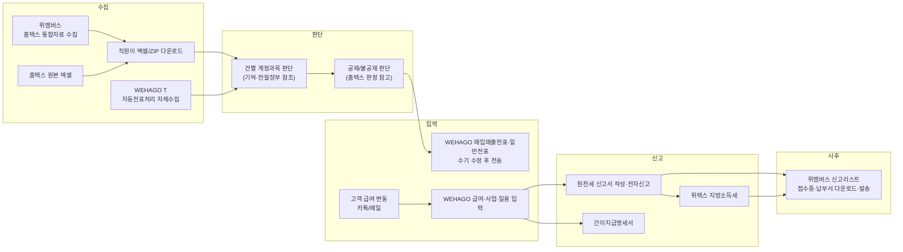
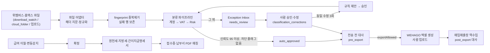

# 01. 업무 프로세스 분석 — 위멤버스 → MIN TAX OPS → WEHAGO

- 작성일: 2026-09-26
- 관점: 세무사무소 업무자동화 컨설팅 (기장·인건비·원천세 월간 루틴)
- 근거 문서: `docs/research/01-wehago.md`(WEHAGO 연동), `02-wemembers.md`(위멤버스·홈택스 수집), `03-hometax-wetax-filing.md`(원천세·간이지급명세서·지방소득세), `04-vat-and-account-rules.md`(공제·불공제·계정 규칙), `packages/core/src/types.ts`, `packages/db/src/schema.ts`
- 본문의 "연구 01~04"는 위 리서치 문서를, `VAT-CARD-09` 같은 3단 ID는 연구 04의 규칙 ID를 뜻한다.
- 표기 규칙
  - **[설정값]**: 코드에 박지 않고 `settings` / `review_rules.params` / `client_business_profiles.rule_params` 로 관리하는 기본값
  - **검증필요**: 세무사 확인 또는 공식 원문 재확인 전에는 확정하면 안 되는 사실(법령 수치·서식 코드·화면 컬럼)
  - **추정**: 표준 거래처 가정에 따른 계산값. 실측(§5.5) 전까지 계획용으로만 사용

---

## 0. 요약

1. **현재 부담**: 표준 거래처 1곳(§1.3)을 처리하는 데 월 **약 414회**의 수작업 터치와 **약 4.6시간(277분)** 이 든다 (추정). 이 중 **약 85%(350회)** 가 매입 증빙과 통장 거래를 건별로 확인하고 수정하는 작업이다(1~6번 업무). 카드매입 한 업무가 124회로 가장 크다.
2. **자동화 여지**: 이 터치의 대부분은 "동일 사업자번호의 과거 처리 반복"이나 "법령상 불공제 업종" 같은 **데이터로 판정할 수 있는 규칙**이다. 도입 3개월 차에는 **186회(−55%)**, 12개월 차에는 **91회(−78%) · 76분**을 목표로 한다.
3. **자동화하지 않는 영역**: 대표자 입출금(가지급금·가수금), 접대·개인사용 여부, 자산 취득, 겸영 안분, 근로·사업소득 구분, 부가세 신고서 최종 검토는 사람이 판단해야 한다. 이 영역에서 MIN TAX OPS의 목표는 판단을 대신하는 것이 아니다. **검토 대상을 좁히고 근거를 붙여 주는 것**이다.
4. **연동의 한계**: WEHAGO와 위멤버스 모두 공개 API가 확인되지 않았다(연구문서 01 §1, 02 §1). 따라서 **WEHAGO 업로드, 전자신고 제출, 위택스 신고는 사람이 수행하는 단계로 구조적으로 남는다.** 이 단계들은 "승인형(B)"이 상한이다.
5. **가장 큰 운영 위험은 이중 기장이다.** WEHAGO T 자동전표처리도 카드, 현금영수증, 세금계산서를 자체 수집한다. 같은 자료를 MIN TAX OPS 엑셀로도 올리면 같은 거래가 두 번 기장된다. WEHAGO 고객센터 문서의 중복전표 의심 기준은 "일자·사업자번호·금액·과세유형"이다. 이 기준이 WEHAGO T와 엑셀 업로드에도 적용되는지는 **[추론]**이다(연구 01 F7). 이 기준이 적용된다면 **과세유형을 51→54(불공)로 바꾼 건은 판정을 통과할 수 있다.** 그래서 증빙 유형마다 반영 경로를 하나로 정해야 한다(§6.2).

---

## 1. 범위와 전제

### 1.1 대상 업무 (14개)

| # | 업무 | 주기 | 성격 |
|---|---|---|---|
| 1 | 카드매입 전표처리 | 월 | 거래 단위 |
| 2 | 현금영수증 매입 전표처리 | 월 | 거래 단위 |
| 3 | 세금계산서 전표처리 (매입·매출, 계산서 포함) | 월 | 거래 단위 |
| 4 | 계정과목 판단 | 월 (1~3·6에 공통으로 걸림) | 판단 |
| 5 | 부가세 공제/불공제 검토 | 월, 분기 신고 전 재검토 | 판단 |
| 6 | 일반전표 처리 (통장·수기·대체) | 월 | 거래 단위 |
| 7 | 급여대장 | 월 | 인건비 |
| 8 | 사업소득 지급대장 | 월 | 인건비 |
| 9 | 일용직 지급대장 | 월 | 인건비 |
| 10 | 원천세 신고 | 월 (반기납부 거래처는 반기) | 신고 |
| 11 | 지방소득세(특별징수) 신고 | 월 | 신고 |
| 12 | 간이지급명세서 (사업·일용·근로) | 월 / 반기 | 신고 |
| 13 | 각종 신고자료 검토 | 월, 부가세는 분기 | 검토 |
| 14 | 신고 후 접수증·납부서 관리 | 월 | 사후관리 |

범위 밖 항목:
- 카드·현금영수증 **매출**: 음식점 등. 월 기장에서 건별로 입력하지 않고 부가세 신고 때 합계로 반영하는 사무소가 많다. 사무소 관행을 확인한 뒤 3번 업무에 편입할지 정한다.
- 결산, 연말정산, 종합소득세·법인세 신고: 연간 업무여서 이번 월간 분석에서는 뺀다.

### 1.2 현재 사용 시스템과 MIN TAX OPS 연동 상태

| 시스템 | 현재 역할 | MIN TAX OPS 연동 상태 (`IntegrationStatus`) | 근거 |
|---|---|---|---|
| 위멤버스 (웹케시) | 수임처 홈택스 자료 자동 수집(매월 지정일 06시 스케줄러), 신고리스트(접수증·신고서·납부서) 일괄 다운로드, 납부서 카카오/문자 발송 | API: **NOT_AVAILABLE** / 엑셀·ZIP: **FILE_BASED** / 웹 RPA: 보류 | 연구 02 §1, §4.1 |
| 홈택스 원본 엑셀 | 전자세금계산서 목록(헤더 6행, 33열), 사업용카드 매입세액 공제확인(14열), 현금영수증 매입내역 | **FILE_BASED** (1순위 파서) | 연구 02 §2.5 |
| WEHAGO T (Smart A 10) | 자동전표처리(자체 수집·분개 추천), 매입매출전표·일반전표 입력, 급여·사업소득·일용직, 원천세 신고서 | 전표 API: **NOT_AVAILABLE** / 엑셀서식 업로드: **FILE_BASED** (서식을 확보하기 전에는 **MOCK**) | 연구 01 §1, §4.1 |
| 홈택스 전자신고 | 원천세·간이지급명세서·일용 지급명세서 제출 (WEHAGO가 만든 변환파일을 사람이 업로드) | 제출 API: **NOT_AVAILABLE** / 집계값 대조: **FILE_BASED** | 연구 03 §1, §4 |
| 위택스 | 지방소득세 특별징수 신고·납부 | **NOT_AVAILABLE** (사람이 직접 신고. 상태만 기록) | 연구 03 U4 |
| 카카오톡·메일 | 고객이 급여 변동과 증빙을 알려 오는 경로 | 해당 없음. 고객이 표준 양식을 업로드하도록 유도 | — |

### 1.3 표준 거래처 가정 (터치 추정 기준)

| 항목 | 월 물량 | 비고 |
|---|---|---|
| 유형 | 개인 일반과세자, 음식점·서비스업 | 사무소 거래처의 중앙값을 가정. **USER_ACTION: 실제 분포로 교체** |
| 카드매입 | 120건 | 사업용카드 2장 |
| 현금영수증 매입(지출증빙) | 25건 | |
| 세금계산서·계산서 | 매입 20건 + 매출 15건 | 계산서(면세) 포함 |
| 통장 거래 (일반전표 대상) | 60건 | 카드대금, 급여, 세금, 거래처 대금, 대표자 입출금 |
| 수기 증빙·대체전표 | 5건 | 간이영수증, 경조사, 조정 |
| 근로자 | 5명 | 월 변동 약 2명 |
| 사업소득자 | 2명 | 프리랜서 |
| 일용직 | 3명 (월 30인일) | |
| 원천세 | 매월 납부 | 반기납부가 아님 |

### 1.4 "터치(touch)"의 정의

터치는 **사람이 데이터 한 단위에 대해 값·상태를 바꾸거나 확인 책임을 지는 조작 1회**를 말한다. `transactions.touch_count`의 증가 규칙(문서 02 §4.4)과 같다.

- 1터치로 세는 조작: 건별 확인 후 승인·전송, 필드 1개 수정(계정 또는 VAT), 제외 또는 복원, 파일 다운로드·업로드 1회, 합계 대조 1회, 신고서 제출 1회
- 0터치로 세는 조작: 화면 조회, 근거 패널 열람
- **일괄 승인은 건별 1터치로 센다.** 사람이 그 건들에 대한 확인 책임을 지기 때문이다.

---

## 2. 현재 업무 흐름 (As-Is)

### 2.1 월간 캘린더

| 시점 | 업무 | 법정 기한 | 비고 |
|---|---|---|---|
| 매월 1~5일 | 고객 급여 변동 수령, 급여대장 작성 | — | 고객 회신 지연이 가장 큰 병목 |
| 매월 06시 스케줄 (지정일) | 위멤버스 홈택스 통합자료 수집 | — | 신고 기간에는 수집이 지연될 수 있음 (연구 02 §4.4) |
| 매월 10일 | 원천세 신고·납부 (전월 지급분) | 지급월 다음 달 10일 | 반기납부 승인 거래처는 7/10·1/10 |
| 매월 10일 | 지방소득세 특별징수 신고·납부 | 원천세와 같은 날 | 세액은 소득세의 10%. 반기납부 거래처는 지방소득세도 반기 납부 가능(연구 03 D2) |
| 매월 15일경 이후 | 전월 사업용카드 매입자료 조회 가능 | — | 홈택스가 익월 15일 이후 제공 (연구 02 §2.5-B) |
| 매월 15일 | 근로내용확인신고 (일용, 고용·산재) | 다음 달 15일 | 일용 지급명세서 제출을 갈음하는 요건은 **검증필요** |
| 매월 말일 | 사업소득 간이지급명세서, 일용근로소득 지급명세서 | 지급월 다음 달 말일 | |
| 반기 (7월 말·1월 말) | 근로소득 간이지급명세서 | 2026년은 반기 제출 | 2027-01-01 지급분부터 매월 제출 예정(2026→2027 유예). 2026년 세법개정에서 재유예되는지 확인 필요(연구 03 U7) |
| 1·4·7·10월 25일 | 부가세 신고 (법인: 4·10월 예정, 7·1월 확정 / 개인 일반과세자: 7·1월 확정, 4·10월은 예정고지 납부) | 과세기간 종료 후 25일 | 신고 전 달에 불공제 재검토. 예정고지 대상 소규모 법인 기준은 **검증필요** |
| 월말~익월 중순 | 전표 처리, 월 장부 검토 | 사무소 내부 SLA | 카드자료가 15일 이후에 들어와 후반부에 몰림 |

### 2.2 흐름도 (현재)



### 2.3 현재 흐름의 구조적 문제

1. **판단 근거가 사람의 기억에 있다.** 계정과목은 담당자가 전월 장부를 찾아보거나 기억에 의존해 정한다. 그래서 담당자가 바뀌면 같은 가맹점이 다른 계정으로 처리된다(전월과 다른 분개). 한 번 고친 판단이 규칙으로 남지 않아 매달 같은 수정을 반복한다.
2. **모든 건이 같은 무게로 검토된다.** 매달 반복되는 통신비 자동이체와 처음 보는 200만원짜리 가전 매입이 똑같이 한 줄로 보인다. 위험 건이 피로 속에 묻힌다.
3. **수집 경로가 둘이다.** 위멤버스와 WEHAGO T가 같은 홈택스 자료를 따로 수집한다. 어느 쪽으로 기장했는지 거래처별 기록이 없어서 이중 기장이나 누락이 생긴다.
4. **합계 대사를 사후에 눈으로 한다.** 원본 합계, 처리 합계, WEHAGO 반영 합계를 1원 단위로 대사하는 절차가 없다. 부가세 신고 직전에야 합계표 차이를 발견한다.
5. **인건비는 "변동이 없는지"를 확인하는 데 시간이 든다.** 직원 대부분은 전월과 같은데 전원을 다시 확인한다. 반대로 퇴사자에게 계속 지급하거나 신규 입사자를 빠뜨리는 오류는 체크리스트가 없어서 놓친다.
6. **신고 후 파일 관리가 수작업이다.** 접수증·납부서를 거래처 폴더에 옮기는 일이 매월 반복된다. 누락되면 고객 클레임으로 이어진다.

---

## 3. 업무별 분석표

범례:
- **자동화 가능 여부**: 상(규칙·이력으로 대부분 판정 가능) / 중(일부만 가능) / 하(사람 판단이 본질)
- **오류 발생 가능성**: 현재 수작업 기준 발생 빈도
- **세무상 위험도**:
  - 상: 오류가 곧 과소신고, 부당공제, 가산세, 기한 도과로 이어짐
  - 중: 장부 왜곡은 생기지만 신고 전에 수정할 수 있음
  - 하: 세액에 영향 없음
- **사람의 최종 확인**: 필수 / 예외만 / 불필요

| # | 업무 | 입력자료 | 사람이 하는 행동 | 사람이 판단하는 항목 | 반복 가능한 규칙 | 자동화 가능 여부 | 오류 발생 가능성 | 세무상 위험도 | 자동화 방식 | 사람의 최종 확인 필요 여부 |
|---|---|---|---|---|---|---|---|---|---|---|
| 1 | 카드매입 전표처리 | 위멤버스 통합자료(사업용카드) 엑셀<br/>홈택스 「매입세액 공제 확인/변경」 엑셀 14열(승인일자·카드번호·가맹점사업자번호·가맹점명·공급가액·세액·비과세·합계·가맹점유형·업종·공제여부결정 등)<br/>사업용카드 목록 | 파일 다운로드<br/>→ WEHAGO T 신용카드 자동전표처리에서 건별 계정 확인·변경<br/>→ 공제여부 변경<br/>→ 전표 전송<br/>→ 매입매출장 합계 대조 | 계정과목<br/>공제·불공제<br/>개인사용·접대 여부<br/>차량 관련 여부<br/>자산 여부<br/>취소·재승인 중복 | 동일 가맹점사업자번호는 과거와 같은 계정<br/>가맹점유형이 면세·간이(영수증)이면 면세·불공제<br/>여객운송·목욕·이미용은 불공제<br/>해외결제는 매입세액 없음<br/>차량 전용카드의 주유는 차량유지비 | 상 | 상 (월 100건 이상 반복으로 피로, 부분취소) | 중 (불공제를 놓치면 추징과 가산세) | 파일 어댑터(헤더 앵커)<br/>→ 정규화·fingerprint<br/>→ 분류 파이프라인<br/>→ VAT·Risk 규칙<br/>→ 신뢰도 정책(95/80)<br/>→ WEHAGO 매입매출 엑셀(57 카과·58 카면)<br/>→ 매입매출장 역수입 대사 | 예외만 (신규 가맹점, 저신뢰, 위험 플래그) + 월 합계 확인 |
| 2 | 현금영수증 매입 전표처리 | 위멤버스 통합자료(현금영수증)<br/>홈택스 현금영수증 매입내역(지출증빙) 엑셀 — 헤더 원문 **검증필요** | 다운로드<br/>→ 승인·취소 상계<br/>→ 건별 계정 지정<br/>→ 공제여부 지정<br/>→ WEHAGO 입력(61 현과·62 현면)<br/>→ 전송 | 계정과목<br/>공제여부<br/>지출증빙용 여부(소득공제용 혼입)<br/>취소건 매칭 | 승인번호 + 거래구분으로 취소 상계<br/>매입금액 = 공급가액 + 부가세 + 봉사료 검증<br/>동일 가맹점 이력 | 상 | 중 (취소 누락, 봉사료) | 중 | 카드와 같은 파이프라인 + 취소 상계 규칙 | 예외만 |
| 3 | 세금계산서 전표처리 | 홈택스 전자세금계산서 목록 엑셀(헤더 6행, 33열, 승인번호)<br/>전자계산서<br/>종이 세금계산서 | 매입·매출 목록 다운로드<br/>→ 매출 유형(11 과세·12 영세·13 면세) 확인<br/>→ 매입 계정·공제(51)/불공(54) 판단<br/>→ 수정세금계산서를 원본에 연결<br/>→ 전송<br/>→ 세금계산서합계표 대조 | 매입 계정(원가·판관비·자산)<br/>불공제 사유<br/>수정세금계산서 처리<br/>의제매입 대상<br/>영세율 요건 | 승인번호는 전국 유일<br/>동일 공급자 사업자번호 이력<br/>매출은 거래처별 매출계정 고정<br/>음수 금액은 수정분 | 상 (매출·반복 매입)<br/>중 (고액·자산) | 중 (WEHAGO 자체수집분과 이중 기장, 수정분 누락) | 상 (매출 누락과 합계표 불일치는 과소신고) | 승인번호 fingerprint<br/>매출 고정 규칙<br/>매입 분류 파이프라인<br/>54 불공 + 사유 텍스트<br/>업로드 전 WEHAGO 매입매출장과 중복키(일자·사업자번호·금액·과세유형) 대조 | 불공제·고액·자산·수정분은 필수<br/>나머지는 예외만 |
| 4 | 계정과목 판단 | 정규화 거래<br/>수임처 계정과목표(3/5자리)<br/>과거 처리 이력(WEHAGO 매입매출장·계정별원장)<br/>거래처 업종 | 가맹점명·적요를 보고 계정 선택<br/>전월 장부 검색<br/>담당자 기억에 의존 | 비용 vs 자산<br/>원가(5xx·6xx) vs 판관비(8xx)<br/>복리후생비 vs 접대비<br/>소모품비 vs 비품 | 동일 사업자번호 + 과거 동일 계정 N회<br/>시스템 사전(통신사 → 통신비, 주유소 → 차량유지비)<br/>같은 수정 3회 → 규칙 제안 | 중~상 (이력이 쌓일수록 높아짐) | 상 (담당자별 편차) | 중 (접대비 한도 계산에 영향이 있으면 상) | 판단 출처 우선순위: user_rule → exact_history → name_history → correction_memory → industry_pattern → system_rule → AI(상한 85)<br/>대안 후보 비교(account_conflict) | 예외만 (신뢰도 95 미만, 계정 충돌, 전월과 다른 분개) |
| 5 | 부가세 공제/불공제 검토 | 거래 + 분류된 계정<br/>가맹점 과세유형<br/>홈택스 공제여부결정(참고)<br/>거래처 프로필(과세유형·불공제 차량·의제매입 대상) | 홈택스 판정 확인<br/>불공제 건 유형 변경(51→54 등)<br/>불공제사유 선택<br/>공제받지못할매입세액명세서 확인 | 사업 관련성<br/>접대 관련<br/>비영업용 소형승용차<br/>면세사업 관련(겸영 안분)<br/>사업자등록 전 매입 | 부가세법 제39조 불공제 사유 중 데이터로 식별 가능한 것: 면세 가맹점, 영수증 발급 대상 업종, 등록된 불공제 차량, 접대비 계정 | 중 | 중 | 상 (부당공제는 추징과 가산세, 과다 불공제는 고객 손실) | `vat_rules`(근거조문 + 결과 deductible / non_deductible / review)<br/>계정 힌트(`vatNonDeductibleHint`)<br/>홈택스 힌트와 불일치하면 검토 | 불공제 확정과 review 결과는 필수<br/>면세·영수증 업종은 자동 |
| 6 | 일반전표 처리 | 통장 거래(위멤버스 통장 수집 / WEHAGO T edge)<br/>급여대장<br/>납부서<br/>대출 상환표<br/>수기 증빙 | 통장 건별 계정 지정(카드대금·급여·세금·거래처 대금)<br/>대표자 입출금 확인<br/>수기 전표 입력 | 거래 상대 식별<br/>외상 상계 대상<br/>가지급금·가수금·인출금<br/>원금·이자 분리 | 카드사 출금 → 미지급금(카드 청구액과 매칭)<br/>세금 출금 ↔ 납부서 금액<br/>급여일 출금 합계 ↔ 차인지급액<br/>4대보험 공단 출금 ↔ 고지액 | 중 | 중 | 중 (법인 가지급금 인정이자·상여처분은 상) | 적요 규칙(DSL)<br/>금액 매칭(카드 청구액·납부서·급여대장·외상 잔액)<br/>WEHAGO 일반전표 엑셀(필수 7항목: 월·일·구분·계정코드·계정명·차변·대변) | 대표자·차입 관련은 필수<br/>매칭 성공 건은 자동 |
| 7 | 급여대장 | 고객 급여 변동 통보(카톡·메일·엑셀)<br/>전월 급여대장<br/>사원 마스터(입·퇴사, 부양가족)<br/>4대보험 고지 | 전월 복사<br/>→ 변동분 수정<br/>→ 소득세 확인<br/>→ 급여대장·임금명세서 출력·발송<br/>→ WEHAGO 급여자료입력 | 변동 사유의 타당성<br/>비과세 요건(식대·자가운전보조금)<br/>입·퇴사 처리<br/>간이세액 비율(80·100·120%) | 전월 이월<br/>변동률 ±20% 경보 [설정값]<br/>식대 비과세 월 20만원 [설정값]<br/>간이세액표 조회<br/>지방소득세 = 소득세 × 10% | 중~상 (변동 없는 월이 대부분) | 중 (변동 누락, 퇴사자 지급 지속) | 상 (원천세 과소, 비과세 요건 오류) | Payroll Wizard 이월<br/>`PayrollChangeKind` 변동 감지<br/>세액 계산<br/>WEHAGO 급여 엑셀(서식 확보 전에는 MOCK) | 필수 (월 1회 확정, 상세 확인은 변동 건만) |
| 8 | 사업소득 지급대장 | 프리랜서 지급 내역(지급일·지급액)<br/>소득자 정보(주민번호)<br/>업종코드 | 지급액 입력<br/>3.3% 계산<br/>WEHAGO 사업소득자료입력 | 근로·사업·기타소득 구분<br/>업종코드(예: 940909) | 소득세 = 지급액 × 3% (10원 미만 절사)<br/>지방소득세 = 소득세 × 10%<br/>인적용역 사업소득은 2024-07-01 지급분부터 소액부징수 배제(연구 03 G5) | 상 | 하 | 중 (소득 구분이 틀리면 상) | 계산 엔진 + 소득자 마스터<br/>신규 소득자만 검토 | 예외만 (신규 소득자, 소득 구분 변경) |
| 9 | 일용직 지급대장 | 근무기록(성명·주민번호·근무일·일당)<br/>현장·사업장 | 근무일수·일당 입력<br/>일용 소득세 계산<br/>WEHAGO 일용직급여 입력<br/>근로내용확인신고 작성 | 일용 요건(동일 고용주 3개월 미만, 건설공사 1년 미만)<br/>신규 인원 확인 | (일당 − 150,000원 [설정값]) × 6% × (1 − 55%), 실효 2.7%(연구 03 G3)<br/>소액부징수(일괄지급이면 합계 기준)<br/>지방소득세 10% | 중 (근무기록 입력에 의존) | 중 (주민번호 오기, 근무일 누락) | 중 (계속고용 요건을 넘겼는데 상용 전환을 놓치면 상) | 근무기록 엑셀 파서<br/>계산 엔진<br/>계속고용 기간 경보<br/>신고 데이터 생성 | 필수 (월 확정) |
| 10 | 원천세 신고 | 확정된 급여·사업·일용 지급 데이터<br/>전월 미환급세액<br/>반기납부 여부 | 원천징수이행상황신고서 작성(WEHAGO)<br/>인원·지급액·세액 대조<br/>전자신고 제출<br/>납부서 출력 | 귀속·지급 시기<br/>환급 조정<br/>수정신고 여부 | 지급월 다음 달 10일<br/>반기납부(`withholding_semiannual`)<br/>급여대장 합계 = 신고서 합계 | 상 (집계·검증)<br/>제출은 사람 | 하 | 상 (기한 도과·과소는 가산세) | `FilingStep` 체크리스트<br/>급여대장 ↔ 신고서 ↔ 이체 3자 대사<br/>기한 알림 | 필수 (제출 전 1클릭 확정) |
| 11 | 지방소득세 신고 | 원천세 신고 결과(소득세액)<br/>사업장 소재지 | 위택스 특별징수 신고(홈택스에서 연계 이동)<br/>납부서 출력 | 납세지<br/>원천세 수정 시 연동 | 세액 = 원천 소득세 × 10%<br/>기한은 원천세와 같음 | 상 | 하 (주된 오류는 누락) | 중 | 원천세 확정값에서 자동 산출<br/>미신고 알림 | 필수 (제출 전 확인) |
| 12 | 간이지급명세서 | 확정된 사업·일용·근로 지급 데이터 | 명세서 작성·전자제출<br/>원천세 신고와 인원·금액 대조 | 제출 대상 기간<br/>누락 인원 | 사업소득·일용은 매월(다음 달 말일)<br/>근로는 2026년 반기, 2027-01-01 지급분부터 매월 예정(연구 03 §2.5.2, 재유예 여부 확인 필요)<br/>같은 지급기간의 원천세 신고서 인원·지급액과 대사(차이는 사유 설명 필요, §4.12) | 상 | 중 (누락, 불일치) | 중 (미제출 지급금액의 0.25%. 지연제출 0.125%는 사업·일용 1개월 내, 근로 2026년 지급분 3개월 내 — 연구 03 §2.5.1·E5, 소득세법 제81조의11) | 신고 데이터 자동 생성<br/>원천세와 교차 검증<br/>기한 알림 | 필수 (제출 전 확인) |
| 13 | 각종 신고자료 검토 | 월 장부(매입매출장·계정별원장)<br/>부가세·원천세 신고서 초안<br/>전월·전년 동월 비교 | 홈택스 ↔ WEHAGO 증빙 합계 대조<br/>계정별 증감 검토<br/>이상거래 확인<br/>누락 증빙 요청 | 이상 증감의 원인<br/>누락·과다<br/>세무 리스크(가지급금, 접대비 한도, 복리후생비 과다) | 단계별 합계가 1원 단위까지 일치<br/>계정이 3개월 평균 대비 ±X% [설정값]<br/>미검토 0건 | 중 (탐지는 자동, 해석은 사람) | 중 | 상 | Reconciliation(source / processed / export / wehago)<br/>`LedgerAnomaly`(AI Review)<br/>spike 규칙 | 필수 (최종 책임 영역) |
| 14 | 신고 후 접수증·납부서 관리 | 위멤버스 신고리스트 일괄 다운로드 ZIP·PDF(접수증·신고서·납부서)<br/>홈택스·위택스 PDF | 거래처별 파일 정리<br/>고객 발송(카톡·문자)<br/>납부 여부 확인 | 파일 ↔ 거래처 ↔ 세목 매칭<br/>납부 확인 | PDF 본문의 사업자번호·세목·귀속·접수번호로 매칭<br/>납부세액 = 신고세액 | 상 (수집·매칭)<br/>발송은 위멤버스 기능 | 중 (파일 혼동, 누락) | 중 (납부 누락은 납부지연가산세, 고객 클레임) | download_watch / cloud_folder 어댑터<br/>PDF 텍스트 추출 매칭<br/>→ `filing_results`<br/>미수집 알림 | 예외만 (매칭 실패) |

---

## 4. 업무별 상세

> 계정코드(811·813·822·830 등)는 **예시**다. 수임처마다 계정과목표가 다르다(3자리/5자리, 사용자 추가). 실제 매핑은 수임처별 `account_codes`를 기준으로 한다(연구 01 §2.7).
> DSL 예시의 `merchantCategory` 값은 홈택스 엑셀 `업종` 컬럼의 원문이다. 실제 표기는 **검증필요**다.

### 4.1 카드매입 전표처리

**현재 절차**
1. 매월 15일 이후 위멤버스 통합자료나 홈택스 공제확인 엑셀을 내려받는다.
2. WEHAGO T 자동전표처리 > 신용카드에서 WEHAGO가 추천한 계정을 한 줄씩 확인한다.
3. 계정을 바꿀 건과 공제여부를 바꿀 건을 수정한 뒤 전송한다.
4. 매입매출장 카드 합계를 홈택스 합계와 눈으로 대조한다.

**대표 오류 사례**
- 같은 날, 같은 금액의 승인 → 취소 → 재승인이 3행으로 들어온다. 이때 취소 행을 빠뜨리면 이중 계상된다.
- 대표자 가족이 쓴 마트·학원 결제가 사업용카드에 섞여 복리후생비로 공제된다.
- 차량 전용카드의 주유비는 해당 차량이 개별소비세 과세대상 승용차이면 불공제인데, 공제로 처리된다.
- 200만원 노트북을 소모품비로 처리한다(자산 가능성).

**반복 규칙 예시**

카드·현금영수증 공제 제외 업종 불공제 (`vat_rules`, outcome = `non_deductible`, 근거: 부가세법 제46조③·시행령 제88조⑤, 연구 04 VAT-CARD-02~08). 법정 업종은 목욕·이발·미용, 여객운송(전세버스 제외), 입장권 발행, 과세 미용성형·동물진료, 무도학원·자동차운전학원이다. 아래 키워드는 연구 04 §4.4 신호표를 따른 **[추론]**이며, 홈택스 `업종` 원문에 맞춰 조정해야 한다:

```json
{ "all": [
  { "field": "direction", "op": "eq", "value": "purchase" },
  { "field": "evidenceType", "op": "in", "value": ["card", "cash_receipt"] },
  { "field": "merchantCategory", "op": "contains", "value": ["택시", "고속버스", "시외버스", "철도", "코레일", "항공", "여객선", "목욕", "사우나", "찜질방", "이발", "이용원", "미용실", "헤어", "영화관", "극장", "놀이공원", "테마파크", "무도학원", "운전학원"] },
  { "field": "merchantCategory", "op": "not_contains", "value": ["전세버스", "화물", "도매", "소매", "제작"] }
] }
```

- `contains`는 부분 문자열 일치다. 그래서 `이용`, `미용`, `영화`처럼 짧은 키워드는 쓰지 않는다. 예를 들어 `미용`은 "미용재료 도매"에, `영화`는 "영화 제작업"에도 걸린다. 공제 대상을 불공제로 잘못 판정하면 고객이 손해를 본다.
- 성형(과세분)과 동물병원(과세분)은 `vatAmount > 0` 조건을 붙여 별도 규칙으로 둔다. 네일·피부관리, 골프장, 주차료는 법정 업종에 해당하는지 해석이 확인되지 않았다(연구 04 U6). 그래서 이들은 `review`로 둔다.
- 사무소 실데이터의 `업종` 값 목록을 뽑아 키워드별 적중 건을 사람이 확인하기 전까지 이 규칙은 B(승인형)로 운영한다(문서 02 VAT-03).

차량 전용카드 주유 (`mapping_rules`, 계정 822 차량유지비 예시, `vatOverride.deductible = false`. 불공제 차량으로 등록된 경우에만):

```json
{ "all": [
  { "field": "cardNumberMasked", "op": "eq", "value": "9410-****-****-1234" },
  { "field": "merchantCategory", "op": "contains", "value": ["주유", "충전"] }
] }
```

**To-Be**
- `download_watch` 어댑터가 파일을 감지하면 헤더 지문을 판별하고 정규화한다.
- fingerprint로 중복을 제거한다. 홈택스 사업용카드 엑셀에는 승인번호 컬럼이 없다(연구 02 §2.5-B). 연구 02 §4.2-5는 이때 `승인일자 + 카드번호 + 가맹점사업자번호 + 합계 + 동일키 내 순번`을 키로 쓰라고 권고했다.
  - `computeFingerprint`의 `row` 경로(계약)에는 순번이 없다. 이 경로를 그대로 타면 같은 날, 같은 카드로, 같은 가맹점에서 같은 금액을 두 번 정당하게 결제한 건(커피 2잔, 주차 2회 등)이 **중복으로 판정되어 제외된다.**
  - 앞의 "승인 → 취소 → 재승인" 사례는 더 나쁘다. 재승인 행이 승인 행과 같은 키가 되어 중복 처리되고, 취소 행만 남는다. 그 결과 순액이 0원이 되어 **실제 매입이 통째로 누락된다.** `detectDuplicates`로 재현해 확인했다.
  - 계약 파일을 바꾸지 않는 해결책: 승인번호 없는 카드 행의 `originalSourceId`에 `card|승인일자|카드번호|가맹점사업자번호|합계#동일키 내 순번`을 채우면 `src` 경로를 탄다. 순번은 한 파일 안에서 같은 키가 몇 번째로 나왔는지다. 같은 파일을 다시 올려도 같은 값이 나오므로 재수집 중복은 그대로 걸러진다.
  - 파일 어댑터(`adapters/normalize/normalize-rows.ts`)는 이 방식을 이미 적용했다. 2번째 이상 행에는 중복 의심 경고도 붙인다. **구현 요구**: Desktop Bridge, 수기 입력 등 이 어댑터를 거치지 않는 경로도 같은 키 형식을 써야 한다. 그래야 경로가 달라도 같은 거래가 같은 fingerprint를 받는다. 순번 없이 `row` 경로로 들어온 중복은 A(자동 확정)가 아니라 중복 의심(B)으로 보낸다(문서 02 CARD-03).
- 분류, VAT, Risk 판정을 거친 뒤 신뢰도 95 이상이고 차단 플래그가 없으면 `auto_approved`가 된다.
- 나머지는 Exception Inbox 버킷으로 간다: `new_merchant`, `personal_use`, `entertainment`, `vehicle`, `possible_asset`, `duplicate`.
- 검토가 끝나면 WEHAGO 매입매출 엑셀(유형 57/58, 분개유형 4 카드)을 만들고, 사람이 업로드한다.
- 업로드 후 매입매출장 export를 역수입해 `post_export` 대사를 한다.

**사람 확인 지점**: 예외함의 버킷 건, WEHAGO 업로드 확인 1클릭(`export_jobs.upload_confirmed_at`)

### 4.2 현금영수증 매입 전표처리

**현재 절차**: 홈택스 매입내역(지출증빙)을 다운로드하고, 취소거래를 눈으로 상계한 뒤, 건별 계정을 지정하고 61 현과·62 현면으로 입력한다.

**대표 오류 사례**
- 승인과 취소가 서로 다른 달에 걸치면 상계를 빠뜨린다.
- 봉사료를 공급가액에 섞는다.
- 대표자 개인 소득공제용 현금영수증을 지출증빙으로 오인한다. 소득공제용 발급분을 사업용으로 용도 변경할 수 있는지와 그 절차는 **검증필요**다.

**규칙**
- 승인번호와 거래구분(승인·취소)으로 상계한다. 연구 02 §4.2-5는 멱등키에 거래구분을 넣기를 권고했다.
- `매입금액 = 공급가액 + 부가세 + 봉사료`가 맞지 않으면 경고를 붙이고 적재는 한다. 이 등식은 **[추론]**이다. 커뮤니티 코드는 이 합을 매입금액이 비었을 때의 대체값으로만 쓴다(연구 02 X4). 그래서 불일치를 차단 사유로 쓰지 않는다.

**To-Be**: 카드와 같은 파이프라인을 쓴다. 면세 가맹점은 62 현면으로 자동 처리한다. 지출증빙 여부를 판단할 수 없는 건은 `vat_review` 버킷으로 보낸다.

### 4.3 세금계산서 전표처리

**현재 절차**
- 홈택스 목록조회 엑셀(매입·매출)을 받는다. WEHAGO T에서는 자동전표처리의 전자세금계산서 수집분에 계정을 확인한 뒤 전송한다.
- 종이 세금계산서는 사진을 보고 수기로 입력한다.
- 분기 말에는 세금계산서합계표와 대조한다.

**대표 오류 사례**
- WEHAGO T 자동수집분을 전송한 뒤, 같은 건을 엑셀로 한 번 더 업로드한다. **불공(54)으로 바꾼 건은 과세유형이 달라 WEHAGO 중복 판정을 통과한다.**
- 수정세금계산서(음수)를 당초분과 연결하지 않아 매입이 과대·과소 계상된다.
- 목록 엑셀에서 헤더명이 중복된다(`상호`/`상호.1`). 이 때문에 공급자와 공급받는자가 뒤바뀌어 매입·매출 방향이 틀린다(연구 02 §4.2-2).

**규칙**
- 승인번호로 중복을 판정한다(`computeFingerprint`의 `inv` 경로).
- 매출은 거래처별 매출계정을 고정한다(예: 음식점은 401 상품매출이 아니라 수임처가 쓰는 매출계정).
- 방향은 공급받는자 사업자번호 = 거래처 사업자번호로 판정한다.

**To-Be**: 파싱할 때 헤더를 **위치 + 앞 컬럼 문맥**으로 매핑한다. 업로드 파일을 만들기 전에 WEHAGO 매입매출장 export(역수입 `source = 'wehago'`)와 중복키를 대조해 이미 반영된 건을 제외한다. 54 불공 건은 사유 텍스트를 붙여 항상 사람 승인(B)을 거친다. WEHAGO 불공제사유 번호표가 확인되지 않았기 때문이다(연구 01 U6).

### 4.4 계정과목 판단

**현재**: 판단 근거가 개인 기억에 있다. 수정 이력이 남지 않는다.

**To-Be 판단 순서**: `ClassificationSource` 우선순위와 `CONFIDENCE_LADDER`를 따른다.

| 순위 | 출처 | 기본 신뢰도 | 자동승인(95) 가능 여부 |
|---|---|---|---|
| 1 | `user_rule` (Rule Studio 승인 규칙) | 99 | 가능 |
| 2 | `exact_history` (동일 사업자번호, 과거 동일처리 10회 이상) | 99 | 가능 |
| 3 | `name_history` (동일 상호 반복) | 97 | 가능 |
| 4 | `correction_memory` (최근 직원 수정) | 이력에 따라 | 조건부 |
| 5 | `industry_pattern` (동일 업종 타 거래처) | 93 | **불가** (빠른검토) |
| 6 | `system_rule` (기본 사전) | 규칙별 | 조건부 |
| 7 | `ai` | 상한 85 | **불가** |

**학습 루프**: 사람이 수정하면 `classification_corrections`에 1행이 쌓인다. 같은 (거래처, 상호키, 필드, 수정값)이 3회 쌓이면 `mapping_rules(status = 'suggested', origin = 'system_suggested')`가 제안된다. 관리자가 승인(`rules.approve`)하면 `active`가 되고, 다음 달부터 `user_rule`로 자동승인된다.

**사람 확인 지점**
- `low_confidence`, `account_conflict`(1·2순위 후보의 신뢰도 차이가 작음 [설정값]), `changed_from_history`, `possible_asset`
- 비용·자산을 가르는 금액 기준은 [설정값]이다. 기본 100만원이며 거래단위별 100만원 이하 즉시상각 규정(법인세법 시행령 제31조, 소득세법 시행령 제67조)을 따랐다(연구 04 §1-8). 다만 PC·주변기기·공구·가구 등은 금액과 관계없이 즉시상각할 수 있고, 대량 보유·사업 확장용 자산은 예외라서 이 판단은 C로 남긴다.

### 4.5 부가세 공제/불공제 검토

**현재**: 홈택스의 `공제여부결정` 값을 대체로 그대로 따른다. 담당자가 기억하는 불공제 대상만 수정한다. 분기 신고 전에 몰아서 재검토한다.

**불공제 사유별 자동화 가능성** (부가세법 제39조 제1항 계열):

| 사유 (근거, 연구 04 규칙 ID) | 식별 데이터 | 판정 |
|---|---|---|
| 세금계산서 미수취·필요적 기재사항 하자 (1·2호, VAT-TI-*) | 작성일자·공급시기·수취일 | **검토가 기본**. 시행령 제75조 공제 예외 12개가 있어 자동 불공제하지 않음 |
| 면세 가맹점·계산서 (VAT-CARD-01) | 가맹점유형, `evidenceType = invoice_exempt` | 자동 (면세매입 처리) |
| 영수증 발급 대상 간이과세자 (직전연도 공급대가 4,800만원 미만 또는 신규. 법 제46조③, VAT-CARD-09) | 가맹점유형 + 홈택스 공제여부결정 | 기본은 검토. 홈택스 가맹점유형이 두 간이과세자를 구분하는지 미확인(연구 04 U5). 두 신호가 3개월간 일치하면 자동 |
| 카드 공제 제외 업종 (시행령 제88조⑤, VAT-CARD-02~08) | `merchantCategory` | 자동 (규칙) |
| 개별소비세 과세 자동차 구입·임차·유지 (5호, VAT-CAR-*) | `nonDeductibleVehicles` + 카드-차량 매핑 | 전용카드는 자동, 그 외에는 검토. 불공제 대상은 정원 8명 이하 승용이다. 경차(1,000cc 이하, 길이 3.6m 이하, 폭 1.6m 이하)는 제외된다(개별소비세법 시행령 별표 1 제5호, 연구 04 U1·U2 팩트체크. law.go.kr 원본 대조는 남음). 규격값은 [설정값]으로 둔다. 차종 이름으로 판정하지 않고, 담당자가 등록증 제원을 보고 차량 마스터에 지정한다 |
| 기업업무추진비(접대비) 관련 (6호, VAT-ENT-01) | 확정된 계정(`vatNonDeductibleHint`) | 계정이 확정되면 자동 |
| 사업과 직접 관련 없는 지출 (4호, VAT-BIZ-01) | 없음 (정황만 있음) | **전문가 검토** |
| 면세사업 관련·토지 관련 (7호, VAT-EXM-*, VAT-LAND-01) | 거래처 과세유형 `mixed`, 계정 | **전문가 검토** (신고 때 안분. 면세비율 5% 미만이고 500만원 미만이거나, 5만원 미만이면 안분 생략) |
| 사업자등록 신청 전 매입 (8호, VAT-REG-01) | 개업일 (현재 계약 필드 없음) | **전문가 검토** (과세기간 종료 후 20일 내 신청분은 공제) |

**위험**
- 불공제 대상을 공제하면 추징과 가산세로 이어진다.
- 반대로 공제 대상을 불공제하면 고객이 손해를 본다. 양방향 오류가 모두 문제다.
- 따라서 `deductible = null`(판단불가)을 명시적으로 허용하고 `vat_review`로 보낸다.
- 차량(5호)·기업업무추진비(6호) 불공제 매입세액은 `135 부가세대급금`으로 잡지 않고 해당 비용·자산 원가에 더한다(연구 04 §1-10). WEHAGO에서는 51→54로 바꾸면 이 합산이 자동으로 된다(연구 01 §2.5).

### 4.6 일반전표 처리

**현재**
- 통장 거래가 WEHAGO T edge 통장정리나 위멤버스 통장 수집으로 들어오면, 직원이 건별로 계정을 지정한다.
- 대표자 입출금은 고객에게 전화로 확인한다.

**규칙 예시** (금액 매칭 우선, 적요 규칙은 보조):

| 통장 패턴 | 처리 | 매칭 조건 |
|---|---|---|
| 카드사 출금 (적요에 카드사명) | 미지급금(카드대금) 상계 | 해당 카드의 결제 청구액(카드사 청구서·결제예정금액)과 1원 단위 일치. 청구 데이터가 없으면 카드별 미지급금 잔액 이하인지만 확인하고 검토로 보낸다 |
| 국세·지방세 출금 | 세금과공과 또는 예수금 상계 | `filing_results(kind = 'payment_slip').amount`와 일치 |
| 급여일 다건 출금 | 미지급급여 또는 급여 | 급여대장 `net_pay` 합계와 일치 |
| 공단 출금 | 예수금(4대보험) + 사업자부담분 | 고지액과 일치. 고지 내역을 받는 경로와 저장 위치가 아직 없다(문서 02 §3.5) |

- 카드대금 출금액은 **전월 이용 합계와 원래 다르다.** 결제일 기준 이용기간(예: 전전월 13일~전월 12일), 할부, 연회비, 해외 수수료, 취소, 사업용카드에 섞인 개인사용분 때문이다. 그래서 전월 이용 합계를 매칭 기준으로 쓰면 매달 불일치가 나거나, 허용오차를 넓히다 오류를 놓치게 된다.
| 거래처 이체 | 외상매입금 상계 | 거래처 잔액 ≥ 금액이고 거래처명 일치 |
| 대표자 명의 입출금 | 가지급금·가수금·인출금 | **항상 전문가 검토** |

수기 증빙(간이영수증 등)이 건당 3만원(VAT 포함)을 넘으면 적격증빙 미수취 가산세(2%) 대상인지 표시한다. 택시·철도·유료도로 등 예외 거래는 제외한다(연구 04 ACC-EVD-01·02). 기업업무추진비는 3만원 초과(경조금 20만원 초과)면 적격증빙이 없을 때 손금 불산입 대상이다(ACC-ENT-01).

**To-Be**: WEHAGO 일반전표 엑셀을 만든다. 양식은 자유 양식이며 필수 7항목에 거래처코드·거래처명·적요를 더한다(연구 01 §2.3). 구분 코드는 1 출금, 2 입금, 3 차변, 4 대변이다.

### 4.7 급여대장

**현재**
- 고객이 카톡으로 "이번 달 ○○ 씨 연장수당 30만원, △△ 씨 퇴사"처럼 알려 온다.
- 직원은 WEHAGO에서 전월 급여를 복사하고, 변동분을 입력하고, 세액을 확인한 뒤 급여대장과 임금명세서를 발송한다.

**대표 오류 사례**
- 퇴사자가 전월 복사로 계속 지급된다.
- 신규 입사자의 주민번호가 빠져 신고 오류가 난다.
- 식대 비과세 한도를 넘긴다.
- 자가운전보조금을 차량 요건 없이 비과세로 처리한다.

**To-Be**: Payroll Wizard 7단계(`payroll_months.wizard_step`)로 처리한다.
1. 전월 이월(`origin = 'carried_forward'`)
2. 변동 감지(`PayrollChangeKind`: `new_hire`, `missing_this_month`, `pay_changed_large` ±20% [설정값], `zero_pay`, `missing_id`, `income_type_changed`)
3. 변동 건만 `needs_review`
4. 세액 계산
5. 확정(`confirmed_by`)
6. WEHAGO 급여 엑셀 생성
7. 원천세로 연결

**사람 확인 지점**: 변동 건 검토와 월 1회 확정. 이 확정은 법적 책임이 따르는 행위라서 등급 상한이 B다.

### 4.8 사업소득 지급대장

**To-Be**: 기존 소득자에게 반복 지급하는 건은 계산을 자동으로 확정한다(3%, 지방 0.3%, 10원 미만 절사 `truncateTo10`). 인적용역 사업소득은 2024-07-01 지급분부터 소액부징수를 적용하지 않는다(연구 03 G5). 그래서 소액 지급이라도 세액을 징수한다. 신규 소득자는 등록(주민번호 암호화, 업종코드) 후 검토한다.

**전문가 판단**: 근로·사업소득 구분(종속성, 계속·반복성)은 자동화하지 않는다. 판단이 틀리면 4대보험과 원천세가 모두 바뀐다.

### 4.9 일용직 지급대장

**현재**: 현장에서 받은 근무표(종이·엑셀)를 보고 인원별 근무일과 일당을 입력한다.

**규칙**
- 일용 소득세 = (일당 − 1일 공제액) × 6% × (1 − 55% 세액공제). 1,000원 미만은 소액부징수한다.
- 근거 조문은 소득세법 제47조②(1일 150,000원), 제129조①4호(6%), 제59조③(55%), 제134조③(계산 방법)이다(연구 03 G3, 법령 미러 원문). 세법 개정을 따라가야 하므로 공제액·세율·공제율은 [설정값]으로 두고 코드에 고정하지 않는다.
- 여러 날 임금을 한 번에 지급하면 일별 세액을 **합계한 금액**으로 소액부징수를 판단한다(연구 03 G6).
- 일용근로자 요건은 동일 고용주에게 3개월 미만 계속 고용된 경우다(건설공사 종사자는 1년 미만. 소득세법 시행령 제20조).

**To-Be**
- 고객 표준 근무기록 양식을 업로드받는다.
- 계속고용 기간 경보를 띄운다. 기간은 사원별 최초 근무일부터 계산한다.
- 근로내용확인신고와 일용 지급명세서 데이터를 만든다.
- **상용 전환 판단은 전문가가 한다.**

### 4.10 원천세 신고

**현재**: WEHAGO에서 원천징수이행상황신고서를 작성하고, 급여대장과 인원·지급액·세액을 대조한 뒤 전자신고 파일을 홈택스에 제출한다.

**To-Be**
- `filing_jobs(kind = 'withholding')`가 `FilingStep`을 추적한다: `payroll_input` → `earned_confirmed` / `business_confirmed` / `daily_confirmed` → `withholding_ready` → `filed` → `receipt_collected` → `payment_slip_collected`.
- 3자 대사로 급여대장 합계, 신고서 집계, 통장 이체를 맞춘다. 신고서 집계는 소득종류별 코드 기준이다(A01 간이세액, A03 일용, A25 사업소득 등 — **코드 검증필요**).
- 반기납부 거래처(`client_business_profiles.withholding_semiannual`)는 반기 말 다음 달 10일에 신고한다.
- 전월 미환급세액 이월은 사람이 확인한다.

### 4.11 지방소득세 신고

**To-Be**: 원천세를 확정하면 `filing_jobs(kind = 'local_income_tax')`를 자동 생성한다. 세액은 소득세 × 10%다. 원천세를 수정하면 지방소득세 작업이 다시 열린다(`local_tax_ready`로 되돌림). 위택스 제출은 사람이 한다.

### 4.12 간이지급명세서

**To-Be**
- 확정된 급여월 데이터로 사업소득 간이지급명세서(`simplified_statement_business`)와 일용근로소득 지급명세서(`daily_statement`)를 매월 만든다.
- 근로소득(`simplified_statement_earned`)은 시행일별 주기 설정에 따라 만든다. 2026년은 반기이고, 2027-01-01 지급분부터 매월로 바뀔 예정이다. 2027년분은 종전 반기 기한까지 내면 미제출가산세를 면제하는 한시 특례가 있다(연구 03 E3).
- **원천세 신고서와 대사하고, 설명되지 않은 차이가 0이어야 제출 단계로 넘어간다.** 대사 단위는 명세서마다 다르다.
  - 사업소득·일용: 같은 지급월의 원천세 신고서 해당 행(사업소득·일용근로)과 인원·지급액을 1원 단위로 비교한다.
  - 근로(반기): 반기 6개월 신고서 지급액의 **합계**와 비교한다. 인원은 월별 인원을 더하지 않고 **중복을 제거한 소득자 수**로 비교한다. 매월 같은 직원이 잡히므로 월별 인원을 더하면 부풀려진다.
  - 비과세 포함 범위, 중도퇴사 정산, 귀속·지급 시기 차이처럼 **사유가 설명된 차이는 차단하지 않는다.** 신고서 총지급액과 명세서 지급액의 비과세 포함 범위는 **검증필요**다. 확인 전에 무조건 1원 일치를 요구하면 정상 건까지 막힌다.
- 가산세율은 소득세법 제81조의11 기준이다(연구 03 §2.5.1·E5, 법령 미러 원문).
  - 미제출: 지급금액의 0.25%
  - 지연제출 0.125%: 사업·일용은 기한 후 1개월 이내, 근로는 2026년 지급분까지 3개월 이내(2027년 지급분부터 1개월)
  - 요율과 기간은 [설정값]으로 두고, 코드에서는 알림 문구에만 쓰고 계산에는 쓰지 않는다.

### 4.13 각종 신고자료 검토

**To-Be**: 사람의 검토를 "탐지된 이상"으로 좁힌다.
1. 4단계 대사: `ReconciliationReport`의 source → processed → export → wehago. `balanced = true`이고 blocking 0건이어야 전송할 수 있다(`exportAllowed`).
2. 계정 급증: `review_rules.kind = 'account_spike'`. 예: 접대비 3개월 평균 240만원이 이번 달 890만원이면 `LedgerAnomaly`를 만든다.
3. AI Review(`ai_reviews.kind = 'ledger'`): 이상징후 카드를 보여 주고, 사람이 확인(acknowledged)한다.
4. **전문가 전속 영역**: 가지급금 잔액, 접대비 한도, 부가세 신고서 최종 검토.

### 4.14 신고 후 접수증·납부서 관리

**현재**: 위멤버스 신고리스트에서 일괄 ZIP을 받아 거래처 폴더로 옮긴다. 발송은 위멤버스 카톡·문자 기능으로 한다.

**To-Be**
- ZIP 파일명 규칙이 확인되지 않았다(연구 02 U5). 그래서 **PDF 본문**에서 사업자번호, 세목, 귀속기간, 접수번호를 추출해 `filing_results(kind = 'receipt' | 'payment_slip')`와 매칭한다.
- 매칭에 실패하면 수동 매핑 큐로 보낸다.
- 납부세액은 신고세액과 대조하고, 납부 여부는 통장 출금과 매칭해 확인한다.
- 고객 발송은 위멤버스 기능을 계속 쓴다. 중복 구현하지 않는다(연구 02 §4.1).

---

## 5. 월간 수작업 터치 추정 (현재 vs 목표)

### 5.1 산정 방법

- 현재 터치 = 건별 확인(1터치/건) + 필드 수정(수정률 × 건수) + 배치 조작(다운로드·업로드·대조)
- 목표 터치 = 검토로 라우팅된 건(1터치) + 수정(목표 수정률 × 건수) + 남는 배치 조작
- **현재 수정률 가정**: 카드 계정 30%, 현금영수증 계정 25%, 세금계산서 계정 10%, 카드 공제여부 15%, 현금영수증 공제여부 10%, 통장은 건당 1.2터치
- **목표 자동승인률 가정**: 카드 60%(3개월)·85%(12개월), 현금영수증 55%·80%, 세금계산서 70%·90%, 통장 50%·75%
- **목표 수정률 가정** (증빙 180건 기준): 계정 10%(3개월)·3%(12개월), 공제여부 10%(3개월)·5%(12개월). 문서 02 KPI 4(Correction Rate) 목표의 근거다.
- 시간은 건별 확인 12~15초, 계정 수정 40초, VAT 수정 45초, 통장 20초로 잡았다. 인건비·신고는 업무 단위 실소요로 추정했다.

### 5.2 표준 거래처 1곳 기준

| # | 업무 | 월 물량 | 현재 터치 산식 | 현재 터치 | 현재 시간(분) | 3개월 목표 터치 | 12개월 목표 터치 | 12개월 시간(분) | 터치 감축(12개월) |
|---|---|---|---|---|---|---|---|---|---|
| 1 | 카드매입 전표처리 | 120건 | 120 × 1 + 배치 4 | 124 | 34 | 50 (120 × 40% + 2) | 20 (120 × 15% + 2) | 7 | −84% |
| 2 | 현금영수증 매입 | 25건 | 25 × 1 + 배치 3 | 28 | 10 | 13 (25 × 45% + 2) | 7 (25 × 20% + 2) | 3 | −75% |
| 3 | 세금계산서 전표처리 | 35건 | 35 × 1 + 배치 4 | 39 | 15 | 13 (35 × 30% + 2) | 6 (35 × 10% + 2) | 3 | −85% |
| 4 | 계정과목 판단 | 증빙 180건 (카드 120 + 현금 25 + 세금계산서 35) | 카드 36 + 현금 6 + 세금계산서 4 + 거래처 등록 5 | 51 | 36 | 21 (180 × 10% + 3) | 7 (180 × 3% + 2) | 5 | −86% |
| 5 | 부가세 공제/불공제 | 증빙 180건 | 카드 18 + 현금 3 + 세금계산서 2 + 사유 선택 2 + 명세서 1 | 26 | 20 | 20 (180 × 10% + 2) | 11 (180 × 5% + 2) | 8 | −58% |
| 6 | 일반전표 처리 | 통장 60 + 수기 5 | 60 × 1.2 + 5 × 2 | 82 | 34 | 35 (60 × 50% + 5) | 20 (60 × 25% + 5) | 7 | −76% |
| 7 | 급여대장 | 5명 | 수령 1 + 확인 5 + 변동 4 + 복사 1 + 계산 1 + 발송 2 | 14 | 30 | 7 | 4 (변동 2 + 확정 1 + 업로드 1) | 10 | −71% |
| 8 | 사업소득 지급대장 | 2명 | 등록 확인 1 + 2 × 3 | 7 | 10 | 3 | 2 (확정 1 + 업로드 1) | 3 | −71% |
| 9 | 일용직 지급대장 | 3명·30인일 | 등록 1 + 3 × 3 + 신고 1 | 11 | 15 | 6 | 4 (근무표 업로드 1 + 예외 1 + 확정 1 + 업로드 1) | 7 | −64% |
| 10 | 원천세 신고 | 1건 | 집계 1 + 대조 2 + 제출 2 | 5 | 15 | 3 | 2 (확정 1 + 제출 1) | 5 | −60% |
| 11 | 지방소득세 신고 | 1건 | 입력·확인 2 + 납부서 1 | 3 | 8 | 2 | 1 (제출) | 2 | −67% |
| 12 | 간이지급명세서 | 사업·일용 매월 + 근로 반기 | 사업 2 + 일용 2 + 근로(월 환산) 1 | 5 | 10 | 3 | 2 (제출) | 3 | −60% |
| 13 | 각종 신고자료 검토 | 월 1회 | 합계 대조 3 + 증감 3 + 이상거래 2 + 가지급·가수 2 | 10 | 25 | 6 | 3 (이상징후 확인) | 10 | −70% |
| 14 | 접수증·납부서 관리 | 원천·지방·간이 | 정리 4 + 발송 2 + 납부 확인 2 + 보관 1 | 9 | 15 | 4 | 2 (ZIP 업로드 1 + 매칭 실패 1) | 3 | −78% |
| | **합계** | | | **414** | **277** | **186** | **91** | **76** | **−78%** |

- 4·5번의 수정 터치는 1~3번에서 검토한 **같은 거래**에 더해지는 터치다. `transactions.touch_count`는 승인 1과 필드 수정을 각각 센다.
- 12개월 차 시간(76분)은 남은 터치가 어려운 판단 위주라서 터치당 시간이 늘어난 것(40초 → 50초)을 반영했다.

### 5.3 거래처 규모별 추정 (추정 ±30%)

| 규모 | 가정 | 현재 터치/월 | 12개월 목표 터치/월 |
|---|---|---|---|
| 소형 | 개인 서비스업. 카드 40, 현금 10, 세금계산서 10, 통장 25, 근로자 1, 사업·일용 없음 | 약 160 | 약 40 |
| 표준 | §1.3 | 414 | 91 |
| 대형 | 법인 제조·건설. 카드 300, 현금 40, 세금계산서 120, 통장 200, 근로자 20, 사업 5, 일용 15 | 약 1,110 | 약 215 |

### 5.4 사무소 단위 환산 (가정: 거래처 100곳 = 소형 40 + 표준 45 + 대형 15)

| 지표 | 현재 | 12개월 목표 |
|---|---|---|
| 월 수작업 터치 | 약 41,700 | 약 8,900 (−79%) |
| 월 처리 시간 (터치당 40초 / 50초, 1 FTE = 월 160시간) | 약 463시간 (약 2.9 FTE) | 약 124시간 (약 0.8 FTE) |

- 상담, 결산, 신고 시즌의 추가 업무는 제외했다.
- 절감된 시간은 인원 감축이 아니라 **C 등급(전문가 검토) 품질과 거래처 수 확대**에 재배치하는 것을 전제로 한다.

### 5.5 실측 계획 (추정치 교체)

- 도입 전 2주간 담당자 2명을 대상으로 표준·대형 거래처 각 3곳의 타임스터디를 한다. 업무별 시작·종료 시각과 수정 건수를 기록한다.
- 도입 후에는 `system_metrics.manual_touches`와 `processing_seconds`로 대체한다(정의는 문서 02 §4).
- WEHAGO·홈택스·위택스 안에서의 작업 시간은 시스템으로 측정할 수 없다. 분기 1회 타임스터디로 보정 계수를 갱신한다.

---

## 6. To-Be 흐름 (MIN TAX OPS 도입 후)

### 6.1 흐름도



상태 매핑:

| 흐름 | 상태 전이 |
|---|---|
| 거래 | `imported` → `classified` → `auto_approved` 또는 `needs_review` → `approved` → `exported` → `reconciled` |
| 거래처 파이프라인 (`ClientPipelineStage`) | `collected` → `auto_classified` → `needs_review` → `reviewed` → `export_ready` → `exported` → `reconciled` |
| 신고 (`FilingStep`) | `payroll_input` → 소득별 `*_confirmed` → `withholding_ready` / `simplified_statement_ready` / `local_tax_ready` → `filed` → `receipt_collected` → `payment_slip_collected` |

### 6.2 증빙별 WEHAGO 반영 경로 단일화 (이중 기장 방지)

거래처 온보딩 때 증빙 유형마다 경로를 **하나만** 정한다. 이 값은 `client_business_profiles.rule_params`에 저장한다(예: `path_card = 'mintax_upload'`).

| 증빙 | 경로 A: MIN TAX OPS 엑셀 업로드 (권장) | 경로 B: WEHAGO T 자동전표처리 전송 |
|---|---|---|
| 카드매입 | MIN TAX OPS가 판단한 결과를 57/58 엑셀로 업로드한다. WEHAGO 신용카드 자동전표처리의 **전송은 쓰지 않는다**(수집은 대사용으로 유지) | WEHAGO 추천을 전송하고, MIN TAX OPS는 검토 엑셀(`review_excel`)만 제공한다. 터치 감축 효과가 작다 |
| 현금영수증 | 경로 A 권장 | 같음 |
| 세금계산서 | 경로 A. 업로드 전에 WEHAGO 매입매출장과 중복키를 대조한다 | WEHAGO 자체 수집 품질이 높으면 B도 가능하다. 이 경우 MIN TAX OPS는 대사와 검토만 한다 |
| 통장 | 경로 A (일반전표 엑셀) | T edge 통장정리 |

**통제**
1. 업로드 파일을 만들기 전에 역수입한 WEHAGO 매입매출장(`source = 'wehago'`)과 대조한다. 중복키는 `transactionDate + merchantBusinessNumber + totalAmount + 과세유형`이다.
   - 대조는 **건수 기준(멀티셋)**으로 한다. 같은 키가 MIN TAX OPS에 2건, WEHAGO에 1건이면 1건만 "기반영 의심"이다. 같은 날 같은 금액의 정당한 반복 거래를 한꺼번에 빼면 매입이 누락된다.
   - 일치한 건을 **조용히 제외하지 않는다.** 업로드 대상에서 보류하고 `duplicate` 버킷으로 사람이 확인한다(문서 02 INV-03, 도입 시 B). 확인 결과는 `status = 'duplicate'`(사유 기록) 또는 업로드로 남는다.
2. **유형을 전환한 건(51↔54)은 과세유형이 달라 WEHAGO 중복 판정을 통과할 수 있다([추론], §0-5).** 그래서 과세유형을 뺀 키로 한 번 더 대조한다. 이 키로만 일치한 건은 오탐 가능성이 더 크므로 항상 사람이 확인한다.
3. `post_export` 대사는 **경로 A로 지정한 증빙 유형 범위에서만** 한다. 경로 B 증빙까지 비교하면 WEHAGO 자체 전송분이 모두 `extra_in_wehago`로 잡힌다.
   - `missing_in_wehago`는 blocking이며 알림(`recon_mismatch`)을 보낸다.
   - 경로 A 범위의 `extra_in_wehago`는 이중 기장이나 WEHAGO 직접 입력의 신호다. 담당자 확인을 필수로 한다.
   - **구현 요구**: 현재 `core/engine/reconcile.ts`는 `extra_in_wehago`를 `blocking = false`로 만든다. 따라서 대사 결과만으로는 경로 A 범위의 이중 기장이 차단되지 않는다. 경로 A 범위에서는 blocking으로 올리거나 별도 알림을 보내도록 대사·서버 담당과 합의해야 한다.

---

## 7. 세무 위험과 통제

| 위험 | 발생 경로 | 통제 (MIN TAX OPS) |
|---|---|---|
| 이중 기장 | WEHAGO 자동수집 전송과 엑셀 업로드를 병행 | §6.2 경로 단일화, 전·후 대사 |
| 정당한 반복 거래의 중복 오판정 (매입 누락) | 승인번호가 없는 카드 행에서 같은 날·같은 가맹점·같은 금액 결제가 같은 fingerprint를 받음 | 동일키 내 순번을 `originalSourceId`에 넣음(§4.1, 파일 어댑터 적용됨). 순번이 없는 경로의 일치는 중복 의심(B)으로 사람이 확인 |
| 불공제 누락(부당공제) | 개인사용·접대·차량을 놓침 | Risk 규칙이 자동승인을 차단(`blocksAutoApproval`). C 등급 버킷은 사람이 확인 |
| 매출 누락 | 매출 세금계산서 수집 누락 | 원본 건수·합계와 처리 건수·합계를 1원 단위로 대사(source stage) |
| 조용한 데이터 유실 | 파싱 실패 행을 버림 | `transaction_sources.outcome = 'failed'`로 보존하고 사유를 한국어로 표시 |
| 원천세 과소·기한 도과 | 급여 변동 누락, 반기납부 착오 | 변동 감지, 3자 대사, 기한 알림 |
| 간이지급명세서 불일치 | 원천세와 인원·금액 차이 | 제출 전 교차 검증 게이트 |
| 자동화 과신 | 자동승인 오분류가 누적 | 자동승인 건 표본감사, 사후 수정률로 강등(문서 02 §3.2) |
| 개인정보 | 주민번호가 파일·로그에 노출 | `*_enc` 암호화, 마스킹, `scrubSensitive`, 다운로드 감사로그 |
| 서식 변경 | WEHAGO·홈택스 엑셀 컬럼 변경 | 헤더 지문·서식 해시가 바뀌면 출력 차단 |

---

## 8. 확인이 필요한 사항

| 구분 | 항목 | 이유 |
|---|---|---|
| USER_ACTION | 실제 WEHAGO 엑셀서식 확보: 매입매출전표, 급여자료입력(1줄·2줄), 사업소득, 일용직, 사원등록 | 열 구성 미확인(연구 01 U2·U7). 확보 전 출력은 MOCK |
| USER_ACTION | 위멤버스 통합자료 엑셀과 신고리스트 ZIP 샘플을 각 1개씩 확보(마스킹 후) | 컬럼·파일명 규칙 미확인(연구 02 U2·U5) |
| USER_ACTION | WEHAGO 불공제사유 번호표 전체 | 3번(비영업용 소형승용차)만 확인됨(연구 01 U6) |
| USER_ACTION | 거래처별 증빙 반영 경로(§6.2) 결정 | 이중 기장 방지 |
| USER_ACTION | 표준 거래처 가정(§1.3)과 현재 수정률(§5.1)을 사무소 실측값으로 교체 | 추정치이기 때문 |
| 검증필요 | 근로소득 간이지급명세서 2027-01-01 매월 전환이 2026년 세법개정에서 재유예되는지(연구 03 U7. 2026-09-08 공포본 기준으로는 재유예 없음) | 제출 주기 설정값에 반영 |
| 검증필요 | 원천세 신고서 총지급액과 간이지급명세서 지급액의 비과세 포함 범위 | 4.12 대사 규칙 |
| 검증필요 | 원천징수이행상황신고서 소득종류 코드(A01·A03·A25 등) | 집계 매핑 |
| 검증필요 | WEHAGO 중복전표 기준(일자·사업자번호·금액·과세유형)이 WEHAGO T와 엑셀 업로드에도 적용되는지(연구 01 F7) | §6.2 통제 설계 |
| 검증필요 | 현금영수증 소득공제용 발급분의 사업용 전환 절차와 공제 요건 | 4.2 규칙 |
| 검증필요 | 홈택스 `업종`·`가맹점유형` 원문 표기, 영수증 발급 대상 간이과세자 구분 여부(연구 04 U5), 네일·피부관리·골프장이 법정 업종인지(연구 04 U6) | 4.1 DSL 값, 4.5 판정 |
| 검증필요 | 차량 경차 규격·정원 기준의 law.go.kr 원본 대조(연구 04 U1·U2는 미러 기준 해소) | 차량 마스터 기본값 |
| 구현 요구 | 파일 어댑터 외 경로(Desktop Bridge·수기)의 카드 순번 키 통일(§4.1), 경로 A 범위 `extra_in_wehago` 처리(§6.2) | 매입 누락·이중 기장 방지 |
