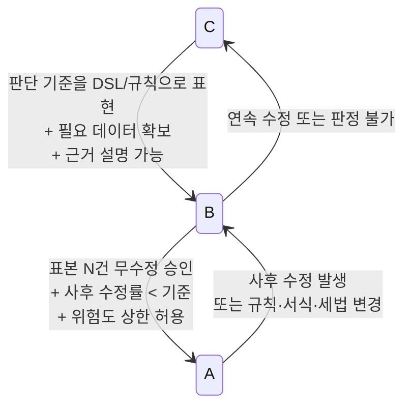

# 02. 자동화 매트릭스 (A/B/C) · 승격 경로 · KPI 정의

- 작성일: 2026-09-26
- 선행 문서: `docs/01-business-process-analysis.md`(업무 분석, 터치 추정), `docs/research/01~04`(연동·신고·공제 규칙 조사)
- 계약 기준: `packages/core/src/types.ts`(`ReviewLevel`, `ExceptionBucket`, `ClassificationSource`), `packages/core/src/policy.ts`(`DEFAULT_CONFIDENCE_POLICY` 95/80/3), `packages/db/src/schema.ts`
- 표기: **[설정값]** = `settings` 또는 `review_rules.params`로 조정 가능한 기본값. **검증필요** = 세무사 확인 또는 원문 확인 전에는 확정하지 않는다.

---

## 0. 요약

- **세부 작업 120개**를 A(완전자동) / B(승인형 자동화) / C(전문가 검토)로 분류했다.
  - 도입 시점: **A 27 · B 68 · C 25**
  - 12개월 목표: **A 69 · B 38 · C 13**
- 거래 건수 기준 12개월 목표 비중은 A 약 80% · B 약 15% · C 약 5%다.
- **B에서 더 올라가지 못하는 작업**: 법적 책임이 따르는 행위(급여 확정, 전자신고 제출)와 API가 없는 반영(WEHAGO 업로드, 위택스 신고)이다. 이 작업들은 자동화 수준이 올라가지 않고, 1클릭으로 끝나도록 **준비 작업을 모두 자동화**하는 것이 목표다.
- **C에 영구히 남는 작업**: 대표자 입출금, 결산 분개, 겸영 안분, 근로·사업 소득구분, 비과세 요건 판단, 수정·기한후신고 판단, 부가세 신고서 최종 검토, 세무 리스크 판단.
- KPI 9종은 모두 `transactions`, `classification_corrections`, `reconciliation_jobs`, `payroll_*`, `audit_logs`에서 계산한다. 8종은 `system_metrics` 컬럼에 저장하고, Auto Classification Rate는 저장 컬럼이 없어 조회할 때 계산한다(§4). 참조 SQL 4개는 실제 스키마(`0000_init.sql`)에서 실행해 검증했다. **No-touch Rate는 항상 "자동승인 사후 수정률"과 함께 본다.** 자동승인 문턱을 낮춰 No-touch Rate를 부풀리는 것을 막기 위해서다.

---

## 1. 등급 정의

### 1.1 A / B / C

| 등급 | 정의 | 시스템 동작 | 사람 역할 | `ReviewLevel` / 상태 | 사후 통제 |
|---|---|---|---|---|---|
| **A 완전자동** | 규칙이나 이력으로 판정이 결정적이고, 틀려도 전송 전 대사나 사후 표본에서 잡힌다 | 판정하고 확정하며 다음 단계까지 진행 | 없음 (표본감사만) | `auto` → `auto_approved` → `exported` → `reconciled` | 표본감사 [설정값: 도입 3개월 5%, 이후 2%], 사후 수정률 감시 |
| **B 승인형 자동화** | 시스템이 판정하거나 초안을 만들고 근거를 제시하며, 사람은 1클릭으로 승인하거나 1필드를 수정한다 | 판정, 근거, 대안 후보를 미리 채움 | 확인·승인 (건별 또는 일괄) | `quick_review` → `needs_review` → `approved` | 수정이 곧 학습 데이터(`classification_corrections`) |
| **C 전문가 검토** | 판단이 사실관계, 목적, 법 해석에 달려 있어 데이터만으로 확정할 수 없다 | 탐지, 자료 수집, 근거 제시만 함. 판정을 제안하지 않거나 "판단불가"로 둠 | 판단하고 확정하며 사유를 기록 | `must_review` → `needs_review` → `approved` 또는 `excluded` | 사유 필수 입력. severity `high`는 관리자(manager) 확인을 권장 |

- 거래가 아닌 작업(급여 확정, 신고 제출 등)도 같은 정의를 쓴다.
  - A는 시스템이 상태를 전이한다.
  - B는 사람이 확정 버튼을 누른다.
  - C는 사람이 내용을 판단한다.

### 1.2 거래 단위 등급 결정 순서

```
1) Risk 플래그 중 bucket ∈ C_BUCKETS 이고 severity = 'high'  → must_review (C)
      C_BUCKETS [설정값] = possible_asset, personal_use, entertainment, unclassified
2) 거래처 섀도 기간(온보딩 후 N개월 [설정값: 2]) 이면, A 후보도 → quick_review (B)
      단, 과거 이력 역수입(source='wehago')으로 만든 exact_history 99는 예외로 A를 허용한다
3) reviewLevelFor(confidenceScore, policy, blockedByRisk)
      auto → A,  quick_review → B,  must_review → C
4) 해당 세부 작업의 상한(ceiling, §2)을 적용한다: 최종 등급 = min(3의 결과, 상한)
```

- **주의 (구현 요구)**: 현재 `core/policy.reviewLevelFor`는 차단 플래그가 있어도 신뢰도가 80 이상이면 `quick_review`(B)를 돌려준다.
  - 그래서 접대·개인사용·자산처럼 C여야 하는 건이 B로 내려갈 수 있다.
  - 계약 파일은 바꾸지 않는다. **분류 파이프라인 모듈이 1)번 상향 규칙을 `reviewLevelFor` 앞에 적용**한다.
- `CONFIDENCE_LADDER`를 기본 문턱 95와 함께 보면, 자동승인(A)에 도달하는 출처는 `user_rule`(99), `exact_history`(99), `name_history`(97)뿐이다. `industry_pattern`(93)과 `ai`(상한 85)는 설계상 B까지만 간다.

### 1.3 Exception 버킷별 기본 등급

| 버킷 | 기본 등급 | B로 내려가는 조건 | 비고 |
|---|---|---|---|
| `low_confidence` | 신뢰도 80 이상이면 B, 미만이면 C | — | `quickReviewMin` 80 |
| `new_merchant` | B | — | 첫 거래 1회 검토가 원칙 |
| `vat_review` | B | — | `deductible = null` 포함 |
| `account_conflict` | C | 두 후보 중 하나가 거래처 규칙에 있으면 B | 후보 간 신뢰도 차이 < 10점 [설정값] |
| `changed_from_history` | B | — | 전월과 다른 분개 |
| `high_amount` | C | 거래처 규칙상 정상 고액 거래처(원재료 등)면 B | 금액 기준은 거래처별 `rule_params` |
| `duplicate` | B | — | 의심 중복만. 확정 중복은 A(`status = 'duplicate'`) |
| `unclassified` | C | — | |
| `possible_asset` | C | 소모성 거래처 규칙이 있으면 B | 기준 100만원 [설정값](연구 04 ACC-AST-01) |
| `personal_use` | C | 거래처가 지정한 제외 카드나 가맹점이면 B | |
| `entertainment` | C | 거래처가 등록한 접대 가맹점이면 B | 계정이 확정되면 VAT는 A |
| `vehicle` | B | — | 전용카드와 차량 매핑이 있으면 A |
| `foreign` | B | 반복 해외 SaaS면 A | 매입세액 없음 |
| `spike` | B | — | 해석은 사람 |
| `export_error` | C | — | 시스템 오류, 원인 분석 필요 |

---

## 2. 세부 작업 매트릭스

열 설명:
- **ID**: 세부 작업 ID(`VAT-02` 같은 2단 형식)다. 연구 04의 **규칙 ID**(`VAT-CARD-09`, `ACC-AST-01` 같은 3단 형식)와는 다른 체계다. 규칙 ID는 "시스템 판정 근거" 열에 적었다.
- **도입**: 거래처 온보딩 후 1~2개월 등급
- **목표**: 12개월 목표 등급
- **상한**: 도달할 수 있는 최고 등급. 이 등급을 넘으려면 새 데이터나 연동이 필요하다

### 2.1 카드매입 전표처리 (CARD)

| ID | 세부 작업 | 도입 | 목표 | 상한 | 시스템 판정 근거 | 사람 역할 | 관련 데이터·버킷 |
|---|---|---|---|---|---|---|---|
| CARD-01 | 파일 수집, 형식 판별 | B | A | A | 헤더 앵커(`승인일자`+`가맹점사업자번호`+`공제여부결정`)와 레이아웃 지문 | 모르는 지문의 레이아웃 등록 승인 | `import_jobs.format_profile` |
| CARD-02 | 정규화 (일자·금액·사업자번호 체크섬·카드 마스킹) | A | A | A | `normalizeDate`, `parseWon`, `isValidBusinessNumber`, `maskCardNumber` | 실패 행 사유 확인 | `transaction_sources.outcome = 'failed'` |
| CARD-03 | 확정 중복 제거 | A | A | A | `computeFingerprint`가 같으면 중복 | — | `status = 'duplicate'`, `duplicate_of_id` |
| CARD-04 | 중복 의심 (승인번호가 다르고 같은 날·같은 금액) | B | B | B | `possibleDuplicateKey` | 중복 여부 확정 | `duplicate` |
| CARD-05 | 취소·부분취소 상계 | B | A | A | 음수 금액과 같은 카드·가맹점·금액 매칭 | 매칭 실패 건 | — |
| CARD-06 | 사업용카드 여부 | B | A | A | `client_business_profiles.business_cards[].masked`와 대조 | 미등록 카드 처리 결정 | `personal_use` |
| CARD-07 | 계정 분류: 반복 가맹점 | A | A | A | `exact_history` 99 / `user_rule` | — | `classification_source` |
| CARD-08 | 계정 분류: 신규 가맹점 | B | B | B | `industry_pattern`, `system_rule`, `ai` | 1회 확인 후 이력화 | `new_merchant` |
| CARD-09 | 공제여부: 면세·간이(영수증)·영수증 발급 업종 | B | A | A | 가맹점유형, 홈택스 `공제여부결정`, `vat_rules` | 두 값이 다른 건 | `vat_review` |
| CARD-10 | 공제여부·계정: 접대·개인사용 가능성 | C | B | B | 업종·요일·금액 Risk 규칙(ACC-PER-01, VAT-CARD-11·12), 거래처 지정 가맹점 | 사용 목적 판단 | `entertainment`, `personal_use` |
| CARD-11 | 업무용승용차 관련 (주유·정비·주차·통행료) | C | B | A | `non_deductible_vehicles`, 카드-차량 매핑(VAT-CAR-01·05) | 차량 귀속 확인 | `vehicle` |
| CARD-12 | 해외결제 | B | A | A | `isForeign`이면 매입세액 없음, 계정만 판정 | — | `foreign` |
| CARD-13 | 고액·자산 가능성 | C | B | B | 금액 기준 + 자산성 업종 + `account_codes.is_fixed_asset`(ACC-AST-01~03) | 자산·비용 판단 | `high_amount`, `possible_asset` |
| CARD-14 | WEHAGO 매입매출 엑셀 생성 (57 카과 / 58 카면, 분개유형 4) | B | A | A | 서식 버전·해시 검증, 사전검증(합계, 세액 규칙, 거래처코드) | 서식 확보 전에는 출력 대조 | `export_jobs.template_version` |
| CARD-15 | WEHAGO 업로드 | B | B | B | FILE_BASED이며 API 없음(연구 01 U1) | 업로드 후 확인 1클릭 | `export_jobs.upload_confirmed_at` |
| CARD-16 | 사후 대사 (매입매출장 역수입) | B | A | A | `ReconciliationReport.balanced` | 불일치하면 원인 분석(C) | `reconciliation_jobs.phase = 'post_export'` |

### 2.2 현금영수증 매입 전표처리 (CASH)

| ID | 세부 작업 | 도입 | 목표 | 상한 | 시스템 판정 근거 | 사람 역할 | 관련 데이터·버킷 |
|---|---|---|---|---|---|---|---|
| CASH-01 | 수집, 정규화, 승인번호 중복 제거 | A | A | A | fingerprint `apv` 경로 | — | — |
| CASH-02 | 승인·취소 상계 (거래구분) | B | A | A | 승인번호 + 거래구분 | 월을 넘긴 취소 매칭 | — |
| CASH-03 | 금액 검증 (매입금액 = 공급가액 + 부가세 + 봉사료) | A | A | A | 산식 불일치면 경고하고 적재 | — | `serviceCharge` |
| CASH-04 | 계정 분류 | B | A | A | 카드와 같은 파이프라인 | 신규·저신뢰 | `new_merchant`, `low_confidence` |
| CASH-05 | 지출증빙 여부 (소득공제용 혼입) | C | B | B | 발급수단·사용구분 필드(원문 **검증필요**) | 사업 관련성 판단 | `vat_review` |
| CASH-06 | 공제여부 (면세 가맹점은 62 현면) | B | A | A | 가맹점 과세유형, `vat_rules` | — | — |
| CASH-07 | WEHAGO 61 현과 / 62 현면 엑셀 생성 | B | A | A | 서식 검증 | — | `export_jobs` |

### 2.3 세금계산서 전표처리 (INV)

| ID | 세부 작업 | 도입 | 목표 | 상한 | 시스템 판정 근거 | 사람 역할 | 관련 데이터·버킷 |
|---|---|---|---|---|---|---|---|
| INV-01 | 목록 엑셀 파싱 (헤더 자동탐지, 중복 헤더를 위치로 매핑) | A | A | A | 앵커 `작성일자`+`승인번호`+`공급가액` | — | 연구 02 §4.2 |
| INV-02 | 승인번호 중복 제거 | A | A | A | fingerprint `inv` 경로 | — | — |
| INV-03 | WEHAGO 기반영분 중복 차단 | B | A | A | 역수입 매입매출장과 키 대조(과세유형 포함 키와 제외 키 두 번) | 불일치 건 | `extra_in_wehago` |
| INV-04 | 매출 전표 (11 과세 / 13 면세) | B | A | A | 거래처 매출계정 고정 규칙. **12 영세는 B 유지**(내국신용장 등 서류 필요) | 영세율 건 | — |
| INV-05 | 매입 계정: 반복 공급자 | A | A | A | `exact_history` 99 | — | — |
| INV-06 | 매입 계정: 신규 공급자 | B | B | B | 업종 패턴, AI | 1회 확인 | `new_merchant` |
| INV-07 | 매입 공제(51) / 불공(54) 판정 | B | B | B | `vat_rules`(VAT-TI-01~07). 세금계산서 하자는 시행령 제75조 예외가 있어 기본 "검토". **54는 불공제사유 선택이 필요해 항상 B** | 불공 확정 | `vat_review` |
| INV-08 | 수정세금계산서 (음수, 당초분 연결) | C | B | B | 같은 공급자와 금액이 상쇄되는 쌍 매칭 | 연결 확인 | — |
| INV-09 | 면세 계산서(53), 의제매입세액 대상 식별 | B | A | A | `deemed_input_tax_eligible` 업종 + 반복 공급자(VAT-DEEM-01). 간이과세 거래처는 제외(VAT-DEEM-02) | — | 공제율·한도는 신고 때 |
| INV-10 | 고정자산 취득 (건물·기계·차량·비품) | C | C | B | 금액, `is_fixed_asset` 계정 후보(ACC-AST-01~04) | 자산 계상, 감가상각 판단 | `possible_asset` |
| INV-11 | 종이(수기) 세금계산서 입력 | C | B | B | 이미지 보관, 입력값 체크섬·합계 검증 | 입력·확인 | `source = 'manual'` |

### 2.4 계정과목 판단 (ACC)

| ID | 세부 작업 | 도입 | 목표 | 상한 | 시스템 판정 근거 | 사람 역할 | 관련 데이터·버킷 |
|---|---|---|---|---|---|---|---|
| ACC-01 | 사용자 승인 규칙 적용 | A | A | A | `mapping_rules.status = 'active'` (`user_rule` 99) | — | `applied_count` |
| ACC-02 | 사업자번호 이력 일치 (10회 이상, 일치율 100%) | A | A | A | `exact_history` 99 | — | `evidence.historyCount` |
| ACC-03 | 상호 이력 반복 (사업자번호 없음) | B | A | A | `name_history` 97 | — | `merchant_key` |
| ACC-04 | 직원 수정 이력 반영 | B | A | A | `correction_memory`. 3회가 쌓이면 규칙으로 승격해 ACC-01에 편입 | 규칙 승인 | `classification_corrections` |
| ACC-05 | 업종 패턴 | B | B | B | `industry_pattern` 93 (정책상 95 미만) | 확인 | `evidence.peerClientCount` |
| ACC-06 | 시스템 기본 사전 | B | A | A | `system_rule`. 거래처 적용 후 3개월 무수정이면 A | — | `origin = 'system_default'` |
| ACC-07 | AI 추론 | B | B | B | `ai` (상한 85). **AI 단독으로는 자동승인하지 않는다** | 확인·수정 | `evidence.aiModel` |
| ACC-08 | 계정 충돌 (후보 간 근접) | C | B | B | `alternatives[]`와 신뢰도 차이 | 선택 | `account_conflict` |
| ACC-09 | 전월과 다른 분개 | B | B | B | 이력 최빈 계정 ≠ 이번 판정 | 의도된 변경인지 확인 | `changed_from_history` |
| ACC-10 | 비용 vs 자산 | C | C | B | 거래단위 100만원 [설정값](ACC-AST-01), 금액 무관 즉시상각 품목(ACC-AST-02), 수선비 600만원(ACC-AST-04) | 판단 | `possible_asset` |
| ACC-11 | 원가(5xx·6xx) vs 판관비(8xx) | B | A | A | 거래처 업종별 계정 대역 규칙 | — | 연구 01 §2.7 [추론] |
| ACC-12 | 규칙 제안 승인 | B | B | B | 같은 수정 `ruleSuggestionThreshold`(3)회 | `rules.approve` | `mapping_rules.status = 'suggested'` |

### 2.5 부가세 공제/불공제 검토 (VAT)

| ID | 세부 작업 | 도입 | 목표 | 상한 | 시스템 판정 근거 | 사람 역할 | 관련 데이터·버킷 |
|---|---|---|---|---|---|---|---|
| VAT-01 | 면세 가맹점·계산서 → 면세매입 | A | A | A | `merchantTaxType = exempt`, `evidenceType = invoice_exempt`(VAT-CARD-01) | — | `vatType = purchase_*_exempt` |
| VAT-02 | 간이과세자(영수증 발급 대상) 카드·현금영수증 → 불공제 | B | A | A | 가맹점유형과 홈택스 `공제여부결정`이 **일치할 때만**(VAT-CARD-09, 기본값 검토) | 불일치 건 | `sourceDeductibleHint` |
| VAT-03 | 영수증 발급 대상 업종 (여객운송·목욕·이미용 등) → 불공제 | B | A | A | `vat_rules` DSL (`merchantCategory`, VAT-CARD-02~08). 근거는 법 제46조③·시행령 제88조⑤ | — | 홈택스 업종 표기 **검증필요** |
| VAT-04 | 비영업용 소형승용차 구입·유지·임차 → 불공제 | C | B | A | `non_deductible_vehicles` + 카드-차량 매핑(VAT-CAR-01~05) | 차량 귀속 | `vehicle` |
| VAT-05 | 기업업무추진비(접대비) 관련 → 불공제 | A | A | A | 확정된 계정의 `vatNonDeductibleHint`에서 파생(VAT-ENT-01). 판단 자체는 CARD-10·ACC | — | — |
| VAT-06 | 사업무관·개인사용 → 불공제 | C | C | B | 정황 Risk 규칙만 있음(VAT-BIZ-01, ACC-PER-01) | 판단 | `personal_use` |
| VAT-07 | 겸영사업자 공통매입 안분 | C | C | C | 거래처 `vat_type = mixed` 탐지(VAT-EXM-02). 안분 생략 조건(면세비율 5% 미만이고 500만원 미만, 또는 5만원 미만)을 자료로 제시 | 신고 때 안분 계산 | — |
| VAT-08 | 사업자등록 전 매입 | C | C | B | 개업일 필드가 없음(§3.5, VAT-REG-01) | 판단 | — |
| VAT-09 | 홈택스 `공제여부결정`과 엔진 판정 불일치 | B | B | B | 두 값 비교(VAT-CARD-16) | 채택 값 결정 | `vat_review` |
| VAT-10 | 의제매입세액 공제 대상 식별 | B | A | A | 업종 적격 + 면세 농축수산물 계산서 반복 공급자(VAT-DEEM-01·03) | — | 공제율·한도는 신고 때 사람이 판단 |
| VAT-11 | WEHAGO 불공제사유 선택 (54) | B | B | A | `nonDeductibleReasonCode`를 사유 텍스트로 제공 | WEHAGO에서 사유 선택 | 사유 번호표 미확보(연구 01 U6, 연구 04 U3) |
| VAT-12 | 공제받지못할매입세액명세서 합계 검증 | B | A | A | 54 전표 합계 = 명세서 합계 | — | — |

### 2.6 일반전표 처리 (GJ)

| ID | 세부 작업 | 도입 | 목표 | 상한 | 시스템 판정 근거 | 사람 역할 | 관련 데이터·버킷 |
|---|---|---|---|---|---|---|---|
| GJ-01 | 카드대금 출금 → 미지급금 상계 | B | A | A | 적요의 카드사명 + 전월 이용 합계와 일치 | 불일치 건 | — |
| GJ-02 | 급여 이체 ↔ 급여대장 차인지급액 | B | A | A | `payroll_items.net_pay` 합계와 일치 | 불일치 건 | — |
| GJ-03 | 세금·4대보험 출금 ↔ 납부서·고지 | B | A | A | `filing_results.amount`와 일치 | 불일치 건 | — |
| GJ-04 | 거래처 대금 지급·수령 (외상 상계) | B | A | A | 거래처명·사업자번호 일치, 잔액 ≥ 금액 | 부분 지급 | — |
| GJ-05 | 대표자 입출금 (가지급금·가수금·인출금) | C | C | C | 탐지만 함 (대표자명·본인계좌) | 판단 | — |
| GJ-06 | 차입·상환·이자 | C | B | B | 상환 스케줄 등록 시 원금·이자 분리 | 확인 | — |
| GJ-07 | 결산성 분개 (감가상각·선급·미지급) | C | C | C | — | 판단 | 월 기장 범위 밖 |
| GJ-08 | 수기 전표 입력 | C | B | B | 입력 양식 검증(차대 일치), 3만원 초과 비적격증빙 가산세 표시(ACC-EVD-01·02) | 입력·확인 | `source = 'manual'` |
| GJ-09 | 일반전표 엑셀 생성 (필수 7항목) | B | A | A | 월·일·구분(1~4)·계정코드·계정명·차변·대변 | — | 연구 01 §2.3 |
| GJ-10 | WEHAGO 일반전표 업로드 | B | B | B | FILE_BASED | 업로드 후 확인 | `export_jobs.kind = 'wehago_general_journal'` |

### 2.7 급여대장 (PAY)

| ID | 세부 작업 | 도입 | 목표 | 상한 | 시스템 판정 근거 | 사람 역할 | 관련 데이터·버킷 |
|---|---|---|---|---|---|---|---|
| PAY-01 | 전월 급여 이월 | A | A | A | `payroll_items.origin = 'carried_forward'` | — | — |
| PAY-02 | 변동 감지 | A | A | A | `PayrollChangeKind` 전 종류 | — | `change_kinds` |
| PAY-03 | 변동 없는 직원 확정 | B | A | A | `unchanged`가 3개월 연속이고 고객이 "변동 없음" 회신 | — | `needs_review = false` |
| PAY-04 | 변동 건 검토 (±20%, 입·퇴사, 0원, 주민번호 누락) | C | B | B | 고객 변동 통보(표준 양식)와 자동 대조 | 사유 확인 | `needs_review = true` |
| PAY-05 | 비과세 한도 검증 (식대 등) | A | A | A | 한도 [설정값: 식대 월 20만원] | — | `non_taxable` |
| PAY-06 | 비과세 요건 판단 (자가운전보조금 등) | C | C | C | 요건 체크리스트 제시 | 판단 | — |
| PAY-07 | 근로소득 간이세액 계산 | B | A | A | 연도별 간이세액표 버전, 부양가족 수, 원천징수 비율(80/100/120%) | — | 세액표 버전 **검증필요** |
| PAY-08 | 4대보험 공제액 | B | B | B | 요율 [설정값]. 고지액과 대조 | 차이 확인 | — |
| PAY-09 | 급여월 확정 | B | B | B | 모든 `needs_review` 해소가 전제 | 확정(법적 책임) | `payroll_months.confirmed_by` |
| PAY-10 | WEHAGO 급여자료 엑셀 생성 | B | A | A | 서식 확보 후 템플릿으로 생성(그 전에는 MOCK) | — | `export_jobs.kind = 'payroll_earned'` |
| PAY-11 | 임금명세서·급여대장 발송 | B | B | B | 파일 생성 | 발송 | — |

### 2.8 사업소득 지급대장 (BIZ)

| ID | 세부 작업 | 도입 | 목표 | 상한 | 시스템 판정 근거 | 사람 역할 | 관련 데이터·버킷 |
|---|---|---|---|---|---|---|---|
| BIZ-01 | 세액 계산 (3%, 지방 10%, 10원 미만 절사) | A | A | A | `truncateTo10`. 인적용역 사업소득은 2024-07-01 지급분부터 소액부징수 배제(연구 03 G5) | — | — |
| BIZ-02 | 기존 소득자 반복 지급 | B | A | A | 같은 소득자·같은 업종코드, 금액 변동 ±20% 이내 | — | — |
| BIZ-03 | 신규 소득자 등록 (주민번호, 업종코드 예: 940909) | B | B | B | 주민번호 형식 검증, 암호화 저장 | 등록 확인 | `employees.business_income_code` |
| BIZ-04 | 근로 vs 사업 vs 기타소득 구분 | C | C | C | — | 판단 | — |
| BIZ-05 | WEHAGO 사업소득 자료 생성 | B | A | A | 템플릿(그 전에는 MOCK) | — | `payroll_business` |

### 2.9 일용직 지급대장 (DAY)

| ID | 세부 작업 | 도입 | 목표 | 상한 | 시스템 판정 근거 | 사람 역할 | 관련 데이터·버킷 |
|---|---|---|---|---|---|---|---|
| DAY-01 | 근무기록 수집 | B | A | A | 고객 표준 근무표 파서 | 비표준 양식 | `work_days` |
| DAY-02 | 일용 소득세 계산 | A | A | A | (일급 − 150,000원) × 6% × (1 − 55%) [설정값](연구 03 G3). 일괄지급이면 일별 세액 합계로 소액부징수 판단(G6) | — | — |
| DAY-03 | 계속고용 기간 경보 (3개월, 건설 1년) | A | A | A | 사원별 최초 근무일부터 누적 | — | 경보만 발생 |
| DAY-04 | 상용 전환 판단 | C | C | C | — | 판단 | — |
| DAY-05 | 신규 일용직 등록 | B | B | B | 주민번호 검증, 중복 해시(`id_number_hash`) | 확인 | — |
| DAY-06 | 근로내용확인신고·일용 지급명세서 데이터 생성 | B | A | A | 확정 데이터에서 생성 | — | 서식 **검증필요** |
| DAY-07 | 월 확정 | B | B | B | 예외 해소 전제 | 확정 | `daily_confirmed` |

### 2.10 원천세 신고 (WHT)

| ID | 세부 작업 | 도입 | 목표 | 상한 | 시스템 판정 근거 | 사람 역할 | 관련 데이터·버킷 |
|---|---|---|---|---|---|---|---|
| WHT-01 | 신고서 집계 (소득종류별) | B | A | A | 확정된 `payroll_items` 합계. 코드(A01·A03·A25 등) **검증필요** | — | `filing_jobs.payload` |
| WHT-02 | 반기납부 적용 | A | A | A | `withholding_semiannual` | — | `due_date` |
| WHT-03 | 3자 대사 (급여대장·신고서·이체) | B | A | A | 금액 일치 | 불일치 원인 | — |
| WHT-04 | 전월 미환급세액 이월·조정 | C | B | B | 전월 신고의 차월이월 값을 자동 반영 | 확인 | — |
| WHT-05 | 수정신고·기한후신고 판단 | C | C | C | 탐지(확정 후 변경) | 판단 | — |
| WHT-06 | 전자신고 제출 | B | B | B | 신고 파일 준비 | 제출(법적 책임) | `filed` |
| WHT-07 | 기한 알림, 미신고 탐지 | A | A | A | `due_date`와 `steps` | — | `notifications` |

### 2.11 지방소득세 신고 (LTX)

| ID | 세부 작업 | 도입 | 목표 | 상한 | 시스템 판정 근거 | 사람 역할 | 관련 데이터·버킷 |
|---|---|---|---|---|---|---|---|
| LTX-01 | 특별징수 세액 산출 (소득세 × 10%) | A | A | A | 원천세 확정값 | — | — |
| LTX-02 | 납세지 결정 | A | A | A | 거래처 사업장 주소(프로필) | — | — |
| LTX-03 | 위택스 신고·납부서 출력 | B | B | B | 위택스 연동 없음 | 제출 | `local_tax_ready` → `filed` |
| LTX-04 | 원천세 수정 시 재신고 | B | B | B | 원천세 변경을 감지하면 작업을 다시 열기 | 재제출 | — |

### 2.12 간이지급명세서 (SIS)

| ID | 세부 작업 | 도입 | 목표 | 상한 | 시스템 판정 근거 | 사람 역할 | 관련 데이터·버킷 |
|---|---|---|---|---|---|---|---|
| SIS-01 | 사업소득 간이지급명세서 생성 (매월) | B | A | A | 확정 사업소득 데이터 | — | `simplified_statement_business` |
| SIS-02 | 일용근로소득 지급명세서 생성 (매월) | B | A | A | 확정 일용 데이터 | — | `daily_statement` |
| SIS-03 | 근로소득 간이지급명세서 생성 | B | A | A | 시행일별 제출 주기 [설정값]: 2026년 반기, 2027-01-01 지급분부터 매월 예정(연구 03 §2.5.2, 재유예 여부 확인) | — | `simplified_statement_earned` |
| SIS-04 | 원천세 신고와 인원·지급액 교차검증 | A | A | A | 1원 단위 일치 | — | 불일치하면 제출 차단 |
| SIS-05 | 제출 | B | B | B | — | 제출 | `filed` |

### 2.13 각종 신고자료 검토 (REV)

| ID | 세부 작업 | 도입 | 목표 | 상한 | 시스템 판정 근거 | 사람 역할 | 관련 데이터·버킷 |
|---|---|---|---|---|---|---|---|
| REV-01 | 4단계 합계 대사 (source / processed / export / wehago) | A | A | A | `ReconciliationReport` | — | `reconciliation_jobs` |
| REV-02 | 전송 게이트 (미검토 0, blocking 0) | A | A | A | `exportAllowed` | — | — |
| REV-03 | 계정 급증 해석 | B | B | B | `review_rules.kind = 'account_spike'` | 원인 확인 | `spike` |
| REV-04 | AI 장부 이상징후 확인 | B | B | B | `ai_reviews.findings` (`LedgerAnomaly`) | acknowledge·resolve | `ai_reviews.status` |
| REV-05 | 세무 리스크 판단 (가지급금, 접대비 한도, 복리후생비 과다) | C | C | C | 잔액·한도 계산 자료 제공 | 판단 | — |
| REV-06 | 부가세 신고서 최종 검토 (분기) | C | C | C | 신고서 초안, 불공제 명세, 대사 결과 | 판단·서명 | `filing_jobs.kind = 'vat'` |

### 2.14 신고 후 접수증·납부서 관리 (FIL)

| ID | 세부 작업 | 도입 | 목표 | 상한 | 시스템 판정 근거 | 사람 역할 | 관련 데이터·버킷 |
|---|---|---|---|---|---|---|---|
| FIL-01 | ZIP·PDF 수집 | B | A | A | `download_watch` / `cloud_folder` 어댑터 | — | `files.purpose = 'filing_receipt'` |
| FIL-02 | PDF 본문 추출 → 거래처·세목·귀속 매칭 | B | A | A | 사업자번호·세목·귀속·접수번호 패턴 | — | `filing_results` |
| FIL-03 | 매칭 실패 수동 매핑 | B | B | B | 후보 거래처 제시 | 선택 | — |
| FIL-04 | 납부세액 ↔ 신고세액 대조 | A | A | A | `filing_results.amount` | — | — |
| FIL-05 | 미수집·미납 알림 | A | A | A | `due_date` 경과 + 결과 없음 | — | `notifications` |
| FIL-06 | 고객 발송 | B | B | B | **위멤버스 발송 기능 사용**(중복 구현 금지). 상태만 기록 | 위멤버스에서 발송 | — |
| FIL-07 | 납부 확인 (통장 출금 매칭) | B | A | A | 출금액과 납부서 금액 일치 | — | GJ-03과 연동 |

### 2.15 등급 분포 요약

| 업무 | 세부 작업 수 | 도입 A / B / C | 12개월 A / B / C |
|---|---|---|---|
| 카드매입 | 16 | 3 / 10 / 3 | 10 / 6 / 0 |
| 현금영수증 | 7 | 2 / 4 / 1 | 6 / 1 / 0 |
| 세금계산서 | 11 | 3 / 5 / 3 | 6 / 4 / 1 |
| 계정과목 | 12 | 2 / 8 / 2 | 6 / 5 / 1 |
| 부가세 | 12 | 2 / 6 / 4 | 6 / 3 / 3 |
| 일반전표 | 10 | 0 / 6 / 4 | 5 / 3 / 2 |
| 급여대장 | 11 | 3 / 6 / 2 | 6 / 4 / 1 |
| 사업소득 | 5 | 1 / 3 / 1 | 3 / 1 / 1 |
| 일용직 | 7 | 2 / 4 / 1 | 4 / 2 / 1 |
| 원천세 | 7 | 2 / 3 / 2 | 4 / 2 / 1 |
| 지방소득세 | 4 | 2 / 2 / 0 | 2 / 2 / 0 |
| 간이지급명세서 | 5 | 1 / 4 / 0 | 4 / 1 / 0 |
| 신고자료 검토 | 6 | 2 / 2 / 2 | 2 / 2 / 2 |
| 접수증·납부서 | 7 | 2 / 5 / 0 | 5 / 2 / 0 |
| **합계** | **120** | **27 / 68 / 25** | **69 / 38 / 13** |

- 세부 작업 수 기준 비중과 거래 건수 기준 비중은 다르다.
- 거래 건수의 대부분은 CARD-07, INV-05, ACC-01·02 같은 A 작업을 지난다. 그래서 12개월 차에는 **거래의 약 80%가 A**로 처리된다(문서 01 §5.2의 No-touch 산정과 같다).

---

## 3. C → B → A 이동 경로

### 3.1 공통 승격 조건



**C → B (판단을 1클릭 승인으로 바꾸기)**: 아래 네 가지를 모두 충족해야 한다.
1. **판단 기준을 명문화할 수 있다.** `Condition` DSL, `vat_rules`, `review_rules` 가운데 하나로 표현할 수 있어야 한다.
2. **판정에 필요한 데이터 필드가 있다.** 예: 차량 판정에는 카드-차량 매핑이 필요하다.
3. **근거를 한 줄로 설명할 수 있다.** `AccountClassification.summary`나 `reasons`로 채울 수 있어야 한다.
4. **틀려도 신고 전에 되돌릴 수 있다.** `audit_logs.revertible`로 복구할 수 있어야 한다.

**B → A (승인 없이 확정하기)**: 대상 단위(규칙 1개, 또는 거래처 × 상호키)마다 판정하며 아래 네 가지를 모두 충족해야 한다.
1. 최근 **20건 [설정값] 이상을 무수정으로 승인**했다. 반복 빈도가 낮은 월 1회 작업은 **3개월 연속**이면 된다.
2. 그 대상의 수정률(`classification_corrections` 기준)이 **2% 미만 [설정값]**이다.
3. 세부 작업의 **상한이 A**다. 세무 위험도가 '상'이면서 판정이 정황에 의존하는 작업은 상한이 B다.
4. 전송 전 대사(`pre_export`)나 사후 표본으로 **오류를 검출할 수 있는 경로**가 있다.

### 3.2 강등 조건

| 트리거 | 조치 | 측정 |
|---|---|---|
| A 거래에서 사후 수정 발생(표본감사 또는 자발적 수정) | 해당 규칙이나 이력 키를 B로 강등하고, 20건 무수정 조건을 다시 적용 | `classification_corrections`에서 `before_source ∈ (user_rule, exact_history, name_history)`이고 해당 거래 `review_level = 'auto'` |
| 규칙 수정 (`mapping_rules.updated_at` 변경) | 그 규칙이 적용된 건을 다음 달까지 B로 처리 | `audit_logs.action = 'rule.update'` |
| WEHAGO·홈택스 서식 해시 변경 | 해당 export·import를 B로 처리(사람 대조), 서식 등록 후 복귀 | `export_jobs.status = 'blocked'` |
| 세법·요율 변경 (세액표, 비과세 한도, 공제액) | 관련 계산 작업(PAY-07, DAY-02, BIZ-01)을 1개월간 B로 처리 | `settings` 변경 로그 |
| 거래처 업종·과세유형 변경 | 해당 거래처의 industry_pattern·system_rule 기반 판정을 B로 처리 | `client_business_profiles.updated_at` |
| 자동승인 사후 수정률(사무소 전체) > 2% | 사무소 전체 `autoApproveMin`을 한 단계 올릴지 검토(95 → 97) | §4.5 |

### 3.3 학습 루프 (C → B → A가 실제로 일어나는 경로)

1. 사람이 B·C 건을 수정한다. `classification_corrections`에 1행이 쌓인다(`before_source`, `before_confidence` 포함).
2. 같은 `(client_id, merchant_key, field, after_value)`가 `ruleSuggestionThreshold`(3)회 쌓인다. 그러면 `mapping_rules(status = 'suggested', origin = 'system_suggested', suggestion_reason = '동일 수정 3회')`가 만들어진다. 알림 종류는 `rule_suggested`다.
3. 관리자가 조건과 계정을 확인한 뒤 승인한다. `status = 'active'`, `approved_by`가 기록된다. 이후 해당 거래는 `user_rule` 99로 판정되어 A가 된다.
4. 이 규칙을 적용한 첫 20건은 섀도 판정으로 돌린다. 규칙이 A 판정을 내더라도 B로 보여 준다. 무수정이 확인되면 A로 확정한다.
5. 반대로 active 규칙에서 수정이 나오면 §3.2에 따라 강등하고, 규칙 편집을 제안한다.

### 3.4 항목별 승격 요건 (주요 항목)

| ID | 이동 | 이동에 필요한 데이터 | 이동에 필요한 규칙 | 승격 판정 |
|---|---|---|---|---|
| CARD-01 | B→A | 위멤버스·홈택스 실제 샘플로 등록한 레이아웃 지문 | 헤더 앵커 조합 | 같은 지문으로 2개월 연속 파싱 실패 0건 |
| CARD-05 | B→A | 취소 행 식별 컬럼(음수 금액이나 거래구분) | 같은 카드·가맹점·금액 상쇄 매칭 | 상쇄 후 합계 = 홈택스 순합계, 2개월 연속 |
| CARD-06 | B→A | 사업용카드 목록 전체(`business_cards`) | 마스킹 번호 일치 | 미등록 카드 0건이 2개월 연속 |
| CARD-10 | C→B | 거래처가 지정한 접대 가맹점·제외 카드 목록, 가맹점 업종 | `review_rules`(업종·요일·금액) + 거래처 지정 목록 규칙 | 해당 버킷에서 제안값 채택률 ≥ 90% (3개월) |
| CARD-11 / VAT-04 | C→B→A | `non_deductible_vehicles`, 차량 마스터의 공제 여부(담당자가 등록증을 보고 지정. 경차 규격·정원 기준은 원문 미확인 — 연구 04 U1·U2), 카드-차량 전용 매핑 | 전용카드 + 주유·정비 업종이면 계정과 VAT를 함께 판정(`vatOverride`) | 전용카드 매핑 거래처에서 20건 무수정이면 A |
| CARD-13 | C→B | 거래처별 고액 정상 거래처 목록(원재료·임차료), `is_fixed_asset` 계정표 | 정상 고액 거래처 규칙 | 규칙 대상 건 무수정 20건 |
| CARD-14 / CASH-07 / PAY-10 / BIZ-05 | B→A | **실제 WEHAGO 엑셀서식**(연구 01 U2·U7), 서식 해시 | 템플릿 매핑 | 업로드 1회 성공 + `post_export` 대사 balanced 2회 |
| CARD-16 | B→A | WEHAGO 매입매출장 export(월 1회 역수입) | 과세유형 포함 키와 제외 키 이중 대조 | blocking 0건이 2개월 연속 |
| CASH-05 | C→B | 현금영수증 `발급수단`·`사용구분` 원문 컬럼(**검증필요**) | 지출증빙이 아닌 건을 `vat_review`로 보내는 규칙 | 컬럼 확보가 곧 승격 조건 |
| INV-03 | B→A | 역수입 이력 3개월 | 중복키 대조 | 오탐·미탐 0건이 2개월 연속 |
| INV-08 | C→B | 당초 승인번호(홈택스 XML 원본 필드. 목록 엑셀 포함 여부 **검증필요**) | 음수 쌍 매칭 | 매칭 제안 채택률 ≥ 95% |
| ACC-03 | B→A | 같은 상호키 이력 ≥ 5건 [설정값] | `name_history` | 최근 20건 무수정 |
| ACC-06 | B→A | 거래처별 적용 이력 | `system_rule` | 거래처 적용 후 3개월 무수정 |
| ACC-08 | C→B | 두 후보 중 하나에 대한 거래처 규칙 | 규칙 우선 | 충돌 건 중 규칙이 결정한 비율 ≥ 80% |
| ACC-11 | B→A | 거래처 업종(제조·건설 등), 원가 계정 대역 | 업종별 계정 대역 규칙 | 3개월 무수정 |
| VAT-02 | B→A | 가맹점유형 + `sourceDeductibleHint` | VAT 엔진 내장 규칙. **DSL에 `sourceDeductibleHint` 필드가 없다**(§3.5) | 엔진 판정과 홈택스 힌트 일치율 ≥ 99% (3개월) |
| VAT-11 | B→A | WEHAGO 불공제사유 번호표 전체(연구 01 U6) | `nonDeductibleReasonCode` ↔ 사유번호 매핑 템플릿 | 번호표 확보 + 업로드 대사 balanced |
| GJ-01~04 | B→A | 급여대장, 납부서, 카드 이용 합계, 거래처 잔액(WEHAGO 거래처원장 역수입) | 금액 매칭 규칙 | 매칭 건 무수정 20건 |
| GJ-06 | C→B | 대출 상환 스케줄 | 원금·이자 분리 규칙 | 스케줄 등록이 곧 승격 조건 |
| PAY-03 | B→A | 3개월 급여 이력, 고객 "변동 없음" 회신 기록 | `unchanged` 연속 | 3개월 연속 무수정 |
| PAY-04 | C→B | 고객 변동 통보 표준 양식(업로드) | 통보값 = 입력값 대조 | 표준 양식 사용이 곧 승격 조건 |
| PAY-07 | B→A | 연도별 간이세액표(버전), 부양가족 수 | 세액표 조회 | WEHAGO 계산 결과와 3개월 연속 일치 |
| DAY-01 | B→A | 고객 표준 근무표 | 파서 | 2개월 연속 파싱 예외 0건 |
| WHT-01·03 | B→A | 확정 급여월, WEHAGO 신고서 결과 | 집계 규칙 | WEHAGO 신고서와 3개월 연속 1원 단위 일치 |
| WHT-04 | C→B | 전월 신고서의 차월이월환급세액 | 이월 규칙 | 이월 데이터 확보가 곧 승격 조건 |
| FIL-01·02 | B→A | 실제 ZIP·PDF 샘플(연구 02 U5) | 세목별 PDF 텍스트 패턴 | 매칭 정확도 100% (2개월, 전수 확인) |

### 3.5 승격을 막는 계약 공백 (계약 변경 요청 후보)

계약 파일(`types.ts`, `schema.ts`)은 이 문서 범위에서 수정하지 않는다. 아래 항목은 **core 계약 담당자에게 변경을 요청할 후보**다.

| 공백 | 영향 작업 | 현재 우회 방법 |
|---|---|---|
| `ConditionField`에 `sourceDeductibleHint`(홈택스 공제여부결정)가 없다 | VAT-02, VAT-09 | VAT 엔진이 코드로 비교한다(DSL 규칙으로는 쓸 수 없다) |
| 거래 **시각**(야간·심야) 필드가 없다. `weekday`와 `dayOfMonth`만 있다 | CARD-10 (유흥·개인사용) | `rawData`의 승인일시를 Risk 평가기(`review_rules.kind`)가 직접 읽는다 |
| 월 누계·빈도 조건(동일 가맹점 월 N회, 누계 금액)이 없다 | CARD-10, REV-03 | `review_rules.kind = 'account_spike'` / `'repeated_abnormal'` 평가기 |
| 차종·공제 여부 속성이 없다. `nonDeductibleVehicles`는 차량번호 문자열 목록이다 | VAT-04, CARD-11 | 불공제 차량만 등록하는 규약을 두고, 카드-차량 매핑은 `cardNumberMasked` 조건으로 처리 |
| 거래처 개업일(사업자등록일)이 없다 | VAT-08 | `client_business_profiles.notes` / `rule_params` |
| KPI 경보용 알림 종류가 없다(`notifications.kind` 주석에 없음) | §4 경보 | 대시보드에만 표시 |
| `system_metrics`에 Auto Classification 분자 컬럼이 없다 | §4 KPI 2 | 조회할 때 계산(§4.3) |

### 3.6 거래처 단위 롤아웃

| 단계 | 기간 | 활동 | A 허용 범위 | 표본감사 | 다음 단계로 가는 조건 |
|---|---|---|---|---|---|
| M0 온보딩 | 1주 | 계정과목표, 거래처 마스터, 사업용카드, 차량, 업종, 반기납부 여부, 증빙별 반영 경로(문서 01 §6.2) 등록. **과거 12개월 WEHAGO 매입매출장 역수입으로 이력 시드** | 없음 | — | 체크리스트 완료 |
| M1~M2 섀도 | 2개월 | 엔진 판정과 사람의 최종값을 비교. A 후보는 B로 보여 줌(역수입 이력 99는 예외) | 역수입 `exact_history`만 | 10% | 섀도 일치율 ≥ 97% |
| M3 | 3개월 차 | `user_rule`, `exact_history` A 활성 | 1·2순위 출처 | 5% | 자동승인 사후 수정률 < 2% |
| M6 | 6개월 차 | `name_history`, `system_rule` A 활성. 인건비 PAY-03 A | 1~3·6순위 | 3% | 같음 |
| M12 | 12개월 차 | 안정화. 등급 분포 목표(§2.15) 도달 | 상한 A 전체 | 2% | — |

섀도 일치율은 섀도 기간의 거래 가운데 "엔진 판정 계정 = 최종 계정"인 비율이다. 엔진 판정 계정은 `classification_results.account->>'accountCode'`(최초 판정)이고, 최종 계정은 `transactions.account_code`다.

---

## 4. KPI 정의

### 4.1 공통 정의

| 기호 | 정의 | SQL 조건 (`transactions`) |
|---|---|---|
| `TX(c,p)` | 거래처 c, 기간 p의 전체 거래 | `client_id = :c AND period = :p` |
| `E(c,p)` | **KPI 모수** = 중복·정규화 실패를 제외한 거래 | `TX AND status NOT IN ('duplicate','failed')` |
| `C(c,p)` | **분류 모수** = E에서 사용자 제외 건도 뺀 거래 | `E AND status <> 'excluded'` |
| `DONE` | 사람 개입 없이 끝난 상태 | `status IN ('auto_approved','exported','reconciled')` |
| `CORR(c,p)` | 수정이 1회 이상 있는 거래 | `classification_corrections.transaction_id ∈ E` |

- **기간 귀속**: 모든 거래 지표는 거래의 `period`(거래일 기준 YYYY-MM)에 귀속한다. 수정이 다음 달에 일어나도 거래의 기간으로 계산한다. 그래서 스냅샷(`system_metrics`)은 **최근 3개 기간을 매일 다시 계산**한다(`jobs.type = 'kpi_snapshot'`).
- **사무소 합산**: 비율 지표는 거래처별 비율을 평균하지 않는다. **분자 합 ÷ 분모 합**으로 가중 계산한다. 거래처당 지표는 `Σ값 ÷ 해당 기간 활성 거래처 수`다.
- **스키마 유의점**: `system_metrics_client_period_uq`는 `client_id`가 NULL인 사무소 합계 행을 중복으로 막지 못한다(PostgreSQL 기본 NULLS DISTINCT). 그래서 사무소 합계는 **저장하지 않고 조회할 때 집계**한다.

### 4.2 KPI 요약

| # | KPI | 정의 | 공식 | `system_metrics` 매핑 | 방향 | 목표 3개월 / 12개월 | 경보 |
|---|---|---|---|---|---|---|---|
| 1 | **No-touch Rate** | 사람이 한 번도 만지지 않고 끝난 거래 비율 | \|E ∩ DONE ∩ touch_count = 0\| ÷ \|E\| | `no_touch / total_transactions` | ↑ | ≥ 55% / ≥ 80% | 전월 대비 −10%p |
| 2 | **Auto Classification Rate** | 엔진이 정한 계정이 수정 없이 최종값으로 남은 비율 | \|C ∩ 엔진출처 ∩ 계정수정 없음\| ÷ \|C\| | 컬럼 없음(조회 시 계산) | ↑ | ≥ 85% / ≥ 95% | < 80% |
| 3 | **Manual Review Rate** | 엔진이 사람 검토로 보낸 비율 | \|E ∩ review_level ∈ (quick_review, must_review)\| ÷ \|E\| | `reviewed / total_transactions` | ↓ | ≤ 45% / ≤ 20% | 전월 대비 +10%p |
| 4 | **Correction Rate** | 사람이 계정이나 VAT를 1회 이상 고친 거래 비율 | \|CORR\| ÷ \|E\| | `corrected / total_transactions` | ↓ | ≤ 12% / ≤ 4% | > 15% |
| 5 | **Processing Time / Client** | 거래처·월당 사람의 활동 시간(분) | Σ 활동초 ÷ 60 | `processing_seconds / 60` | ↓ | ≤ 140분 / ≤ 80분 (외부 시스템 보정 포함) | 3개월 평균 대비 +30% |
| 6 | **Exceptions / Client** | 거래처·월당 사람이 처리해야 했던 예외 수 | 거래 예외 + 인건비 예외 + 대사 blocking + 수집 실패 행 + 전송 실패 | `exceptions` | ↓ | ≤ 110 / ≤ 50 | 3개월 평균 대비 +50% |
| 7 | **Reconciliation Error** | 최신 대사 보고서의 blocking 불일치 수 | Σ phase별 최신 보고서의 `discrepancies[blocking = true]` | `recon_errors` | = 0 | 전송 시점 0 (게이트) / 사후 0 | **1건 이상이면 즉시 알림** (`recon_mismatch`) |
| 8 | **Payroll Manual Touches** | 인건비(근로·사업·일용) 사람 데이터 변경 횟수 | 급여 관련 `audit_logs` data_change 건수 | `payroll_manual_touches` | ↓ | ≤ 16 / ≤ 10 (표준 거래처) | 전월 대비 2배 |
| 9 | **Manual Touches / Client / Month** | 거래처·월당 사람 조작 총수 | Σ touch_count + 인건비 터치 + 운영 터치 | `manual_touches` | ↓ | ≤ 200 / ≤ 100 (표준 거래처, 현재 추정 414) | 3개월 평균 대비 +30% |

- 목표값은 문서 01 §5.2의 표준 거래처 추정에서 나왔다.
- 대형·소형 거래처는 5·6·8·9번을 **거래 건수로 정규화한 값**(터치 ÷ |E|)으로 함께 본다.

### 4.3 KPI별 산식 (PostgreSQL 참조 구현)

파라미터는 `:client_id`(uuid), `:period`('YYYY-MM')다.

```sql
WITH
tx_all AS (                       -- TX: 전체 거래 (터치 합계용, 상태 무관)
  SELECT * FROM transactions
  WHERE client_id = :client_id AND period = :period
),
e AS (                            -- E: KPI 모수
  SELECT * FROM tx_all WHERE status NOT IN ('duplicate', 'failed')
),
c AS (                            -- C: 분류 모수
  SELECT * FROM e WHERE status <> 'excluded'
),
corr AS (                         -- CORR: 수정된 거래 (필드별 플래그)
  SELECT cc.transaction_id,
         bool_or(cc.field = 'account') AS acct,
         bool_or(cc.field = 'vat')     AS vat
  FROM classification_corrections cc
  JOIN e ON e.id = cc.transaction_id
  GROUP BY cc.transaction_id
)
SELECT
  (SELECT count(*) FROM e)                                                    AS total_transactions,
  (SELECT count(*) FROM e
     WHERE review_level = 'auto'
       AND status IN ('auto_approved','exported','reconciled'))               AS auto_approved,
  (SELECT count(*) FROM e
     WHERE touch_count = 0
       AND status IN ('auto_approved','exported','reconciled'))               AS no_touch,
  (SELECT count(*) FROM e
     WHERE review_level IN ('quick_review','must_review'))                    AS reviewed,
  (SELECT count(*) FROM corr)                                                 AS corrected,
  (SELECT count(*) FROM c
     WHERE account_code IS NOT NULL
       AND coalesce(classification_source, 'none') NOT IN ('manual','none')
       AND NOT EXISTS (SELECT 1 FROM corr
                       WHERE corr.transaction_id = c.id AND corr.acct))      AS auto_classified,
  (SELECT count(*) FROM c)                                                    AS classification_base,
  (SELECT coalesce(sum(touch_count), 0) FROM tx_all)                          AS tx_touches;
```

**KPI 1. No-touch Rate** = `no_touch / total_transactions`
- 아직 `imported`·`classified`·`needs_review`인 건은 분모에는 들어가고 분자에는 들어가지 않는다. 끝나지 않은 일은 No-touch가 아니다.
- `approved` 상태는 정의상 사람이 승인한 것이라 분자에서 빠진다.

**KPI 2. Auto Classification Rate** = `auto_classified / classification_base`
- No-touch와의 차이: 빠른검토에서 **수정 없이 승인한 건**은 이 지표에는 들어가고 No-touch에는 들어가지 않는다.
- 두 지표의 차이는 "맞혔지만 확신하지 못한 비율"을 뜻한다. 이 값이 크면 신뢰도 보정(과소 신뢰)을 검토한다.

**KPI 3. Manual Review Rate** = `reviewed / total_transactions`
- `system_metrics.reviewed`는 "검토 완료"가 아니라 **"검토로 라우팅된 건수"**를 저장한다.
- 검토 완료 잔량은 운영 지표로 따로 본다: `count(*) FROM e WHERE status = 'needs_review'`. 전송 전에는 반드시 0이어야 한다.

**KPI 4. Correction Rate** = `corrected / total_transactions`
- 필드별로 나눠 본다: `acct` 비율과 `vat` 비율.
- 한 거래에서 여러 번 수정해도 1건으로 센다. 필드별 수정 횟수는 `classification_corrections` 행 수로 따로 본다.

**KPI 5. Processing Time / Client** = `processing_seconds / 60`
- `processing_seconds` 산정 규칙: 사람 행위자(`actor_id IS NOT NULL`)의 `audit_logs`(category ∈ `data_change`, `download`)를 행위자별 시간순으로 정렬한다.
  - 직전 이벤트가 **같은 거래처**이면 두 이벤트 사이 간격을 `min(간격, 300초 [설정값])`로 인정한다.
  - 직전 이벤트가 다른 거래처이거나 없으면 **30초**를 인정한다(맥락 전환 기본값).
  - 기간 귀속은 §4.4 터치 귀속 규칙과 같다.

```sql
WITH ev AS (
  SELECT a.actor_id, a.client_id, a.created_at,
         lag(a.created_at) OVER w AS prev_at,
         lag(a.client_id)  OVER w AS prev_client
  FROM audit_logs a
  WHERE a.actor_id IS NOT NULL
    AND a.category IN ('data_change', 'download')
    AND a.created_at >= :from AND a.created_at < :to   -- 귀속 조인은 §4.4 참조
  WINDOW w AS (PARTITION BY a.actor_id ORDER BY a.created_at)
)
SELECT client_id,
       sum(CASE WHEN prev_client = client_id
                THEN least(extract(epoch FROM created_at - prev_at), 300)
                ELSE 30 END)::int AS processing_seconds
FROM ev GROUP BY client_id;
```

- 한계: WEHAGO, 홈택스, 위택스 안의 작업 시간은 측정되지 않는다. 분기 1회 타임스터디로 구한 보정 계수를 곱한 값을 목표와 비교한다.

**KPI 6. Exceptions / Client** = `exceptions`

```
exceptions = tx_exceptions + payroll_exceptions + recon_blocking + import_failed + export_failed
  tx_exceptions      = count(e WHERE jsonb_array_length(buckets) > 0
                                 AND review_level IN ('quick_review','must_review'))
  payroll_exceptions = count(payroll_items pi JOIN payroll_months pm ON pm.id = pi.payroll_month_id
                             WHERE pm.client_id = :c AND pm.period = :p AND pi.needs_review)
  recon_blocking     = recon_errors (KPI 7)
  import_failed      = sum(import_jobs.failed_rows WHERE client_id = :c AND period = :p)
  export_failed      = count(export_jobs WHERE client_id = :c AND period = :p AND status = 'failed')
```

- 자동승인 건에 붙은 info 수준 버킷은 예외로 세지 않는다.
- 버킷별 분해(`jsonb_array_elements_text(buckets)`)는 대시보드에서 따로 본다.

**KPI 7. Reconciliation Error** = `recon_errors`

```sql
SELECT count(*) AS recon_errors
FROM (
  SELECT DISTINCT ON (phase) report
  FROM reconciliation_jobs
  WHERE client_id = :client_id AND period = :period
  ORDER BY phase, created_at DESC            -- phase(pre_export, post_export)별 최신 보고서
) r
CROSS JOIN LATERAL jsonb_array_elements(r.report -> 'discrepancies') d
WHERE (d ->> 'blocking')::boolean;
```

- `reconciliation_jobs.report`에는 `ReconciliationReport`를 그대로 직렬화해 저장한다는 전제다(구현 규약).
- 보조 지표: 불일치 금액 합계 `sum(abs((d->>'amount')::bigint))`, 대사 실패 거래처 수(`balanced = false`인 최신 작업).
- `pre_export`의 blocking이 0이 아니면 `exportAllowed = false`여서 전송할 수 없다. 따라서 운영 목표는 **`post_export` 0건**이다.

**KPI 8. Payroll Manual Touches** = `payroll_manual_touches`

```sql
WITH pm AS (
  SELECT id, period, created_at, coalesce(confirmed_at, 'infinity'::timestamptz) AS closed_at
  FROM payroll_months WHERE client_id = :client_id
)
SELECT count(*) AS payroll_manual_touches
FROM audit_logs a
LEFT JOIN payroll_items pi ON a.entity_type = 'payroll_item'  AND pi.id::text = a.entity_id
LEFT JOIN pm pm_i          ON pm_i.id = pi.payroll_month_id
LEFT JOIN pm pm_m          ON a.entity_type = 'payroll_month' AND pm_m.id::text = a.entity_id
LEFT JOIN LATERAL (                              -- 사원 마스터 수정은 그 시점에 열려 있던 급여월로 귀속
  SELECT p.period FROM pm p
  WHERE a.entity_type = 'employee'
    AND a.created_at >= p.created_at AND a.created_at < p.closed_at
  ORDER BY p.created_at DESC LIMIT 1
) pm_e ON true
WHERE a.client_id = :client_id
  AND a.actor_id IS NOT NULL
  AND a.category = 'data_change'
  AND coalesce(pm_i.period, pm_m.period, pm_e.period) = :period;
```

- 열린 급여월이 없을 때 한 사원 마스터 수정은 온보딩성 작업으로 보고 이 지표에서 뺀다.
- `employee.view_sensitive`(주민번호 열람)는 category가 `access`이므로 세지 않는다.

**KPI 9. Manual Touches / Client / Month** = `manual_touches`

```
manual_touches = tx_touches + payroll_manual_touches + ops_touches
  tx_touches  = Σ transactions.touch_count  (TX 전체, 상태 무관: 사람이 중복 지정·제외한 건도 포함)
  ops_touches = count(audit_logs a WHERE a.client_id = :c AND a.actor_id IS NOT NULL
                      AND a.category IN ('data_change','download')
                      AND a.entity_type IN ('import_job','export_job','filing_job','filing_result')
                      AND <엔티티의 period = :p>)
                -- import_jobs.period / export_jobs.period / filing_jobs.period,
                -- filing_results → filing_jobs.period 로 귀속
```

- `manual_touches`는 `payroll_manual_touches`를 **포함**한 합계다. 인건비 비중은 `payroll_manual_touches / manual_touches`로 본다.
- **규칙 승인·편집(`rule.*`)은 넣지 않는다.** 규칙 작성은 미래 터치를 줄이는 투자이므로 불이익을 주지 않기 위해 "학습 투자 터치"로 따로 집계한다.
- 사무소 기준 값 = `Σ manual_touches ÷ 활성 거래처 수`

### 4.4 계측 계약 (구현 시 지켜야 할 규칙)

KPI가 의미를 가지려면 서버와 웹 구현이 아래 규칙을 지켜야 한다. `audit_logs.action`과 `entity_type` 이름은 schema 주석의 명명(`transaction.approve` 등)을 확장한 **제안**이며, 구현팀과 합의해야 한다.

| 사람 행동 | `touch_count` | `audit_logs.action` (제안) | 비고 |
|---|---|---|---|
| 단건 승인 (`needs_review` → `approved`) | +1 | `transaction.approve` | |
| 일괄 승인 N건 | 건마다 +1 | `transaction.approve` (N행, 공통 `session_id`) | 확인 책임은 건별로 진다 |
| 계정 수정 | +1 | `transaction.correct` | `classification_corrections(field = 'account')` 1행 |
| VAT 수정 | +1 | `transaction.correct` | `field = 'vat'` 1행 |
| 계정과 VAT를 한 번에 저장 | +2 | `transaction.correct` ×2 | 필드 단위로 센다 |
| 제외 / 제외 취소 | +1 | `transaction.exclude` / `transaction.restore` | |
| 중복 지정 / 해제 | +1 | `transaction.mark_duplicate` / `transaction.unmark_duplicate` | |
| 되돌리기 | +1 | `audit.revert` | |
| 조회, 근거 패널 열람, 메모만 작성 | 0 | — | |
| 표본감사 "이상 없음" | 0 | `transaction.sample_ok` | 표본감사 건수는 따로 집계 |
| 표본감사에서 수정 | +1 (수정) | `transaction.correct` | 자동승인 사후 수정으로 집계(§4.5) |
| 규칙 승인으로 인한 재분류 | 0 | `rule.approve` (규칙 1행) | 시스템 행위 |

추가 규약:
- **`transactions.review_level`은 엔진 판정값을 유지한다.** 사람이 수정해도 덮어쓰지 않는다. 덮어쓰면 KPI 1·3과 자동승인 사후 수정률을 계산할 수 없다. 사람의 결과는 `status`, `reviewed_by`, `classification_source = 'manual'`로 표현한다.
- 수정할 때 `classification_corrections.before_source`와 `before_confidence`를 반드시 채운다. §3.2의 강등 판정에 쓰인다.
- 인건비 변경은 `entity_type ∈ ('payroll_item','payroll_month','employee')`로 기록한다.
- 운영 변경은 `('import_job','export_job','filing_job','filing_result')`로 기록한다. 예: 파일 업로드, 다운로드, 업로드 확인, 신고 단계 완료, 접수증 매핑.

### 4.5 보조 지표 (안전장치)

| 지표 | 공식 | 기준 | 용도 |
|---|---|---|---|
| **자동승인 사후 수정률** (Auto-approval Error) | \|CORR ∩ review_level = 'auto'\| ÷ `auto_approved` | < 1% 목표, **2% 초과 시 강등**(§3.2) | No-touch Rate를 부풀리는 것을 막는 짝 지표 |
| 자동승인 후 개입률 | (`auto_approved` − `no_touch`) ÷ `total_transactions` | < 3% | 자동승인했는데 사람이 다시 만지는 비율 |
| 규칙 커버리지 | \|E ∩ classification_source = 'user_rule'\| ÷ \|E\| | 12개월 ≥ 40% | 학습 루프가 도는지 확인 |
| 섀도 일치율 | 최초 `classification_results.account.accountCode` = 최종 `transactions.account_code` 비율 | ≥ 97%이면 A 활성 | 롤아웃 게이트(§3.6) |
| 미검토 잔량 | \|E ∩ status = 'needs_review'\| | 전송 시점 0 | 운영 |
| 리드타임 | `import_jobs.created_at`(최초 수집) → 해당 기간 `reconciliation_jobs`(post_export, balanced) 생성까지 | 월 말일 + 20일 이내 [설정값] | 마감 지연 탐지 |

### 4.6 해석 주의

1. **No-touch Rate만 보지 않는다.** `autoApproveMin`을 95에서 90으로 낮추면 No-touch는 바로 오르지만, 자동승인 사후 수정률과 세무 위험도 함께 오른다. 문턱 변경은 `settings` 변경 감사로그를 남기고 관리자 권한(`settings.write`)으로만 한다.
2. **Correction Rate가 0이면 오히려 의심한다.** 검토자가 모든 건을 무조건 승인하고 있을 수 있다. 빠른검토 건의 평균 처리 시간이 3초 미만 [설정값]이면 경보를 낸다.
3. **거래처 규모의 편향을 보정한다.** 대형 거래처는 절대 터치가 크다. 사무소 비교나 담당자 비교에는 터치 ÷ |E|를 쓴다.
4. **기간을 다시 계산하면 수치가 바뀐다.** 지난달 거래를 이번 달에 수정하면 지난달 KPI가 나빠진다. 보고서에는 `system_metrics.computed_at`을 함께 표시한다.

---

## 5. 확인이 필요한 사항

| 구분 | 항목 |
|---|---|
| USER_ACTION | 실제 WEHAGO 엑셀서식(매입매출, 일반전표 매칭 설정, 급여 1줄·2줄, 사업소득, 일용). CARD-14·PAY-10 등의 B→A 승격 조건 |
| USER_ACTION | WEHAGO 불공제사유 번호표. VAT-11 B→A 조건 |
| USER_ACTION | 위멤버스 통합자료·신고리스트 ZIP 실제 샘플. CARD-01·FIL-01·FIL-02 조건 |
| USER_ACTION | [설정값] 기본값 승인: 자동승인 95, 빠른검토 80, 규칙 제안 3회, B→A 무수정 20건, 사후 수정률 2%, 자산 기준 100만원, 급여 변동 ±20%, 표본감사 5%→2% |
| USER_ACTION | §3.5 계약 공백을 core 계약 담당자에게 변경 요청할지 결정 |
| USER_ACTION | §4.4 계측 계약(`review_level` 보존, audit action 명명)을 서버·웹 구현팀과 합의 |
| 검증필요 | 근로소득 간이지급명세서 2027 매월 전환의 재유예 여부, 간이지급명세서 가산세율(보도 기반), 원천세 신고서 소득종류 코드, 현금영수증 용도 구분 컬럼, 차량 경차 규격·정원 기준, 홈택스 가맹점유형의 간이과세자 구분 여부 |
