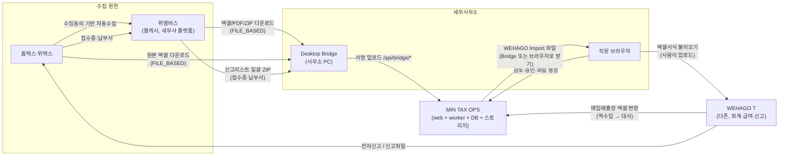
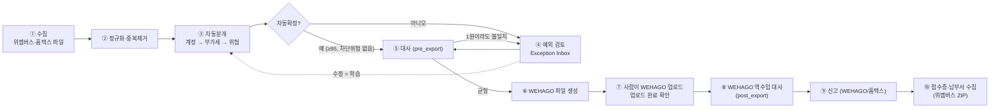
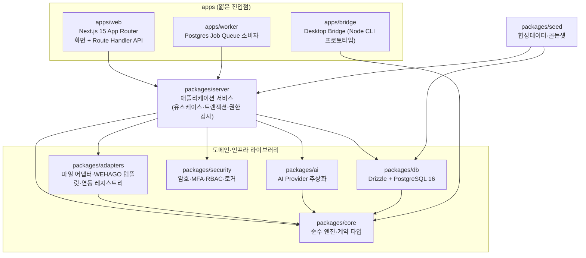
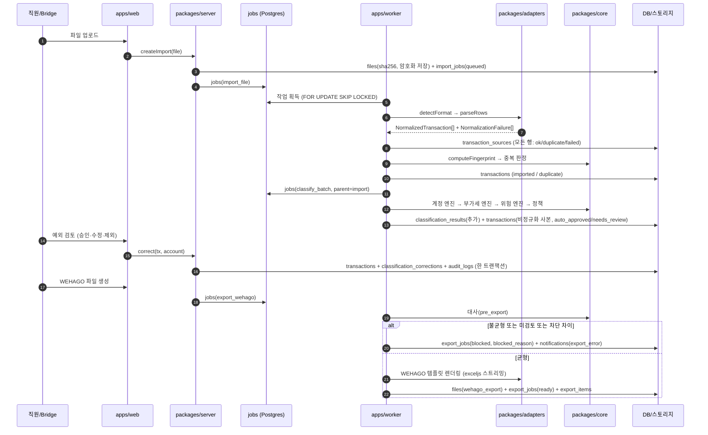
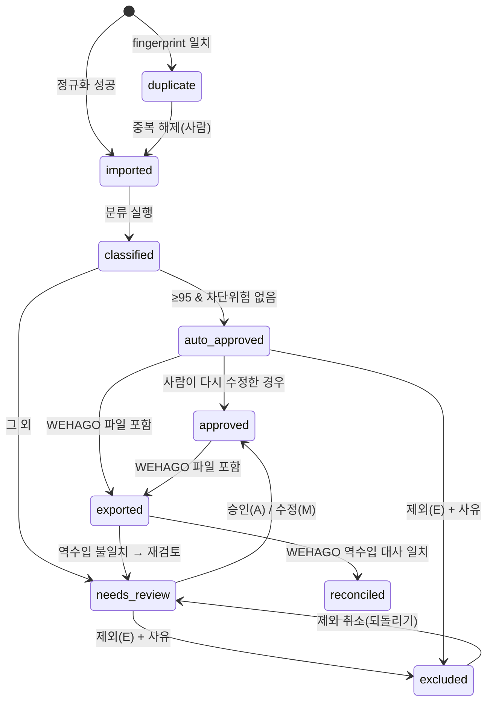
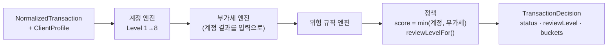
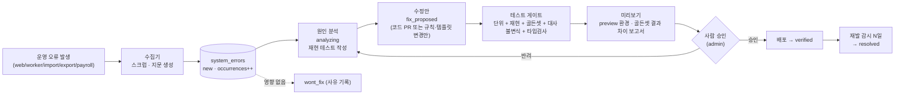
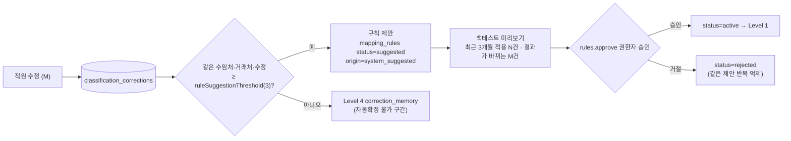
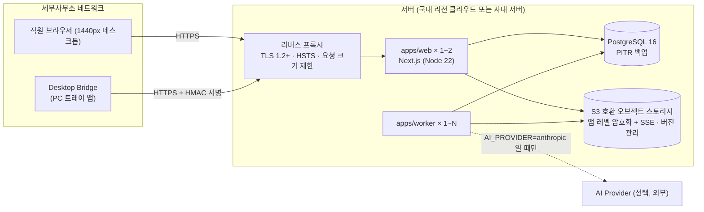

# 03. 시스템 아키텍처 — MIN TAX OPS

- 문서 상태: 설계 기준선 v1 (2026-09-26)
- 기준 계약: `packages/core/src/types.ts`, `policy.ts`, `dsl.ts`, `money.ts`, `fingerprint.ts`, `packages/db/src/schema.ts`
  - 이 문서와 계약 파일이 다르면 **계약 파일이 기준**이다. 이 문서를 고친다.
- 관련 문서: [04-erd](./04-erd.md) · [05-screen-ia](./05-screen-ia.md) · [06-mvp-plan](./06-mvp-plan.md) · [integration-architecture](./integration-architecture.md) · [desktop-bridge-design](./desktop-bridge-design.md) · 조사: [research/01-wehago](./research/01-wehago.md), [research/02-wemembers](./research/02-wemembers.md), [research/03-hometax-wetax-filing](./research/03-hometax-wetax-filing.md), [research/04-vat-and-account-rules](./research/04-vat-and-account-rules.md)
- 표기: **검증필요** = 외부 사실(법령·서식·코드값)을 아직 원문으로 확인하지 못한 값. 모두 설정값(DB `settings`/규칙 테이블/템플릿)으로 두고 코드에 박지 않는다.

---

## 0. 용어

| 용어 | 뜻 | 코드/테이블 |
|---|---|---|
| 수임처 | 세무사무소의 고객사. 화면에서는 WEHAGO T 관례에 맞춰 "수임처"로 부른다 | `clients`, `ClientProfile` |
| 거래처 | 거래의 **상대방**(가맹점·공급자·공급받는자) | `transactions.merchant_*` |
| 원천(Source) | 증빙 종류: 세금계산서, 카드, 현금영수증, 통장 등 | `TransactionSource`, `EvidenceType` |
| 채널(Channel) | 자료가 들어온 경로: Adapter A~E, 홈택스 파일, 수동 업로드 | `IngestChannel` |
| 확정 | 자동승인(`auto_approved`) 또는 사람 승인(`approved`) | `TransactionStatus` |
| 전송 | WEHAGO에 올릴 **파일을 만들고 사람이 업로드하는 것**. WEHAGO 전표 API는 확인되지 않았다(NOT_AVAILABLE) | `export_jobs` |
| 대사 | 원천 합계와 전송·WEHAGO 반영 합계를 1원 단위까지 맞추는 검증 | `reconciliation_jobs` |

> 코드·스키마 주석 일부는 수임처를 "거래처"라고 적는다. 화면 문구는 위 표를 따른다.

---

## 1. 설계 원칙

1. **1원 차이도 전송하지 않는다.** 대사 등식이 모든 차원(건수·공급가액·부가세·합계)에서 0으로 닫히지 않으면 WEHAGO 파일 생성을 막는다.
2. **데이터를 지우지 않는다.** 중복·제외·실패 행도 상태만 바꿔 남긴다. 원본 행은 `transaction_sources`에 전부 남는다.
3. **사람에게는 예외만 보여 준다.** 자동확정 기준(기본 신뢰도 95 이상 + 차단 위험 없음)을 넘은 거래는 사람 화면에 올라오지 않는다.
4. **판단에는 근거가 붙는다.** 모든 분류 결과는 출처(Level)·신뢰도·근거 문장·대안 후보를 가진다(`AccountClassification`).
5. **학습은 통제한다.** 직원 수정은 학습 데이터가 되지만, 영구 규칙은 사람이 승인해야 켜진다(`suggested → active`). AI 신뢰도는 상한 85로 잘려서 혼자서는 자동확정을 만들 수 없다.
6. **연동 상태를 속이지 않는다.** 모든 외부 연동은 `LIVE / FILE_BASED / RPA / MOCK / NOT_AVAILABLE` 중 하나와 그 근거를 가진다. 확인되지 않은 API를 있는 것처럼 설계하지 않는다.
7. **금액은 원 단위 정수, 날짜는 `YYYY-MM-DD`.** DB는 `bigint`, JS는 safe integer(`assertWon`). 부동소수 금액을 쓰지 않는다.
8. **모든 사람 행동은 감사로그에 before/after로 남고, 되돌릴 수 있는 것은 되돌릴 수 있다.**

---

## 2. 시스템 컨텍스트와 업무 루프

### 2.1 컨텍스트



- 실선은 모두 오늘 확인된 경로다. 자동 API 경로는 없다. 근거는 [integration-architecture](./integration-architecture.md) §7에 있다.
- **역할 분리 원칙**: WEHAGO T도 홈택스에서 세금계산서·카드·현금영수증을 직접 수집한다(research/01 §2.9). 같은 자료를 MIN TAX OPS가 전표 파일로 다시 넣으면 이중 기장이 된다. 그래서 MIN TAX OPS가 전송 대상을 정하는 기준은 **수임처별 설정**이다. 이 설정은 온보딩 체크리스트에서 확정한다. WEHAGO가 이미 수집하는 원천은 "분류·검토·대사만" 하고 파일로 내보내지 않는다.

### 2.2 월간 업무 루프



화면의 파이프라인 단계(`ClientPipelineStage`)는 위 루프와 다음처럼 대응한다.

| 단계 | `ClientPipelineStage` | 판정 기준 (수임처 × 월) |
|---|---|---|
| 수집완료 | `collected` | 해당 월 `import_jobs`가 1건 이상 `succeeded/partial` |
| 자동분개완료 | `auto_classified` | `status in (imported)`인 거래 0건 |
| 예외검토필요 | `needs_review` | `status = needs_review` 거래 1건 이상 |
| 검토완료 | `reviewed` | `needs_review` 0건 |
| 전송준비 | `export_ready` | 최신 `reconciliation_jobs(phase=pre_export).export_allowed = true` 이고 `export_jobs.status = ready` |
| 전송 | `exported` | `export_jobs.status in (downloaded, uploaded_confirmed)` |
| 대사완료 | `reconciled` | `reconciliation_jobs(phase=post_export).balanced = true` |

---

## 3. 레이어 구조

### 3.1 패키지 의존 그래프



### 3.2 패키지 책임과 금지 사항

| 패키지 | 책임 | 금지 |
|---|---|---|
| `core` | 계약 타입, 금액·날짜·상호 정규화, DSL 평가, fingerprint, 신뢰도 정책. 분류(Level 1~8)·부가세·위험·대사·인건비 변동 엔진은 **순수 함수**로 둔다(입력: 미리 조회한 이력 배열, 출력: 판단). | I/O, DB, 시간(`Date.now`) 직접 호출, 외부 패키지 의존 |
| `adapters` | 파일 형식 감지(헤더 앵커·지문), 행 파싱 → `NormalizedTransaction`/`NormalizationFailure`, WEHAGO 템플릿(열 매핑·유형코드 매핑·버전), 연동 레지스트리(`IntegrationDescriptor`) | DB 쓰기, 분류 판단 |
| `ai` | `classifyTransaction / reviewLedger / detectAnomaly / explainClassification / suggestRule`. 기본은 로컬 휴리스틱 Provider이고, Anthropic Provider는 선택이다. | 개인식별정보 전송, 신뢰도 상한 무시 |
| `security` | scrypt 해시, AES-256-GCM 필드 암호화(키 버전), HMAC blind index, TOTP, RBAC 권한표, 민감정보 제거 로거 | 키를 코드·DB에 저장 |
| `db` | 스키마·마이그레이션·커넥션(`bigint → number` 안전 파서, `date → 문자열`) | 비즈니스 로직 |
| `server` | 유스케이스(가져오기, 분류 배치, 승인/수정/제외, 규칙 승인, 전송파일 생성, 대사, 인건비, 신고, 감사, 알림, KPI). 권한 검사와 감사로그 기록은 **여기서 강제**한다. | UI 문구 의존, 요청 객체 의존 |
| `web` | 화면, Route Handler(`/api/*`), 입력 검증(zod), 세션 쿠키 | DB 직접 쿼리(반드시 `server` 경유) |
| `worker` | 작업 획득·실행·재시도·스케줄 | 도메인 로직 복제 |
| `bridge` | 사무소 PC 폴더 감시·업로드·결과 받기 | 파싱 판정의 최종 권한(서버가 재판정) |
| `seed` | 합성 수임처·거래·직원, 골든 데이터셋(정답 계정·부가세) | 실데이터 |

**의존 규칙**: `core`는 아무것도 의존하지 않는다. `web`과 `worker`는 같은 `server` 서비스를 호출한다. 그래서 동기 요청 경로와 백그라운드 작업 경로의 동작이 같다.

### 3.3 API 표면 (제안, Route Handler)

구현된 Route Handler가 기준이다. 아래는 책임 경계를 정하기 위한 목록이다.

| 경로 | 용도 | 권한 |
|---|---|---|
| `POST /api/imports` | 파일 업로드 → `files` + `import_jobs` + `jobs(import_file)` | `imports.create` |
| `GET /api/transactions` | 예외함 목록(커서 페이징, 버킷·신뢰도·상태 필터) | `transactions.read` |
| `POST /api/transactions/{id}/approve · correct · exclude` | 단건 처리 | `transactions.review` |
| `POST /api/transactions/bulk` | 일괄 승인·제외(행별 결과 반환) | `transactions.review` |
| `GET/POST /api/rules`, `POST /api/rules/{id}/approve`, `POST /api/rules/preview` | 규칙 조회·작성·승인·백테스트 | `rules.*` |
| `POST /api/exports`, `GET /api/exports/{id}/file`, `POST /api/exports/{id}/confirm-upload` | 전송파일 생성·다운로드·업로드 확인 | `export.*` |
| `POST /api/reconciliations` · `GET /api/reconciliations/{id}` | 대사 실행·조회 | `transactions.read` |
| `/api/payroll/*`, `/api/filings/*` | 인건비 마법사, 신고 단계 | `payroll.*`, `filing.write` |
| `GET /api/jobs/{id}` | 작업 진행률(폴링) | 작업 생성자 또는 `audit.read` |
| `GET /api/audit`, `POST /api/audit/{id}/revert` | 감사로그, 되돌리기 | `audit.read`, `audit.revert` |
| `GET /api/search` | Ctrl+K 통합검색 | 결과별 권한 필터 |
| `/api/integrations/*` | 연동 상태·설정 | `settings.write`, `integrations.developer` |
| `/api/bridge/*` | Desktop Bridge 전용(서명 토큰) | 기기와 연결된 사용자 권한 |
| `GET /api/health` | 헬스체크(DB·스토리지·큐 지연) | 공개(민감정보 없음) |

---

## 4. 데이터 흐름

### 4.1 수집 → 확정 → 전송 시퀀스



### 4.2 거래 상태 기계



- `failed`는 정규화 단계에서 거래를 만들 수 없는 행이다. 이런 행은 `transaction_sources.outcome = 'failed'`로만 남고 `transactions`에는 없다. 사람이 원본을 고쳐 재업로드하거나 "제외 확인"을 해야 대사 등식에서 설명된다.
  - `TransactionStatus`의 `failed`는 거래 생성 후 후처리에서 실패한 경우(예: 필수 매핑 누락)를 위해 남겨 둔다.
- **재분류는 사람 확정을 덮어쓰지 않는다.** `classify_batch`는 `imported / classified / needs_review` 상태만 갱신한다. `approved / auto_approved / exported`는 새 `classification_results`를 참고용으로만 추가한다. 예외가 하나 있다. 새로 승인된 규칙을 "기존 자동확정분에도 적용"할 때는 사람이 미리보기를 보고 승인해야 한다.

---

## 5. 분류 파이프라인 (계정 엔진)

### 5.1 단계 (Level) — 먼저 결정한 단계가 이긴다

| # | `ClassificationSource` | 조회 키 / 데이터 | 채택 조건 (기본값, `settings`로 조정) | 신뢰도 (기본) | `evidence` |
|---|---|---|---|---|---|
| 1 | `user_rule` | `mapping_rules` where `status='active'` and `client_id = 수임처` (origin `user` 또는 승인된 `system_suggested`) | DSL 조건 일치. `priority` 내림차순으로 첫 일치 | `rule.confidence` (기본 99) | `ruleId, ruleName` |
| 2 | `exact_history` | 확정 거래 `client_id + merchant_business_number` (`tx_client_merchant_bizno_idx`) | 이력 ≥ 3건 & 동일 계정 비율 ≥ 90% | 10건 이상 & 100% → 99, 그 외 95~98 구간 | `historyCount, consistentCount, lastUsedDate, averageAmount` |
| 3 | `name_history` | 확정 거래 `client_id + merchant_key` (`tx_client_merchant_key_idx`) | L2 미결일 때. 이력 ≥ 3건 & 일관성 ≥ 90% | 최대 97 | 위와 같음 |
| 4 | `correction_memory` | `classification_corrections` `client_id + merchant_key + field='account'` 최근 180일 | L2·L3 미결 또는 이력보다 수정이 최신일 때 | 수정 1회 90, 2회 93, 3회 이상 94 (**자동확정 불가 구간**). 같은 수정이 3회 쌓이면 규칙 제안 | `correctionCount` |
| 5 | `industry_pattern` | 같은 업종 다른 수임처의 확정 거래 `merchant_key` (`tx_merchant_key_global_idx`) | 참조 수임처 ≥ 3곳 & 일관성 ≥ 90% | 최대 93 | `peerClientCount, historyCount` |
| 6 | `system_rule` | `mapping_rules` where `origin='system_default'` and `client_id is null` (예: KT → 통신비) | DSL 조건 일치 | `rule.confidence` (기본 90) | `ruleId, ruleName` |
| 7 | `ai` | `packages/ai` Provider (기본 휴리스틱) | 후보 계정 목록 안에서만 추천 | 유사 이력이 있으면 **상한 85**, AI 추론만 있으면 70 | `aiProvider, aiModel` |
| 8 | `none` | — | 모든 단계 미결 | 0 → `unclassified` 버킷 | — |

- 신뢰도 구간 문구는 `CONFIDENCE_LADDER`(99/97/93/85/70)와 같게 유지한다. 설명 패널이 이 문구를 쓴다.
- **수정 우선 원칙**: L2·L3에서 같은 거래처의 가장 최근 사람 수정이 과반 이력과 다르면, 일관성은 **그 수정일 이후 이력만**으로 다시 계산한다. 옛 이력이 새 수정을 이겨서 같은 실수를 반복하는 일을 막는다.
- **대안 후보(`alternatives`)**: 이긴 단계 외의 단계도 모두 평가해서 후보를 모은다. 다른 계정 후보의 신뢰도가 (1순위 − 10) 이상이면 `account_conflict` 버킷을 붙인다.
- **AI 입력 최소화**: `AIClassificationInput`에는 상호·업종·적요·금액·증빙·방향·업종키·후보 계정·유사 예시만 들어간다. 적요는 `scrubSensitive`를 거친다. 카드 전체번호·주민번호·계좌는 넣지 않는다.

### 5.2 한 거래의 판단 순서



- `confidence_score = min(account.confidence, vat.confidence)` 이다(`transactions.confidence_score`).
- `reviewLevelFor(score, policy, blockedByRisk)`:
  - 차단 위험이 없고 `score ≥ autoApproveMin(95)` 이면 `auto`. 상태는 `auto_approved`.
  - `score ≥ quickReviewMin(80)` 이면 `quick_review`. 빠른 검토 화면으로 간다.
  - 그 외는 `must_review`. 예외함에서 개별 검토한다.
  - `quick_review`와 `must_review`의 상태는 모두 `needs_review`다.
- 저장: `classification_results`에 **추가만** 한다(엔진 원판단, `engine_version` 포함). `transactions`에는 최신 판단의 비정규화 사본을 둬서 목록 조회를 빠르게 한다.

---

## 6. 부가세 엔진 (계정 엔진과 분리)

**분리 이유**: 계정과목과 매입세액 공제 여부는 서로 다른 축이다.

- 같은 "차량유지비"라도 비영업용 소형승용차면 불공제, 화물차면 공제다.
- 같은 "소모품비"라도 간이과세자 카드매입, 면세사업자, 영수증 수취분이면 결과가 다르다.
- 계정은 맞고 공제만 틀린 수정이 흔하다. 두 축을 섞으면 학습이 오염된다(`CorrectionRecord.field`가 `account | vat`로 분리된 이유).

| 입력 | 출처 |
|---|---|
| 거래 필드 | `NormalizedTransaction` (증빙, 상대방 과세유형, 원천 공제 힌트 `sourceDeductibleHint`) |
| 계정 결과 | 계정 엔진 출력 `accountCode` (DSL 필드 `accountCode`로 규칙이 참조) |
| 수임처 | `client_business_profiles`: `vat_type`(일반/간이/면세/겸영), `non_deductible_vehicles`, `deemed_input_tax_eligible` |
| 규칙 | `vat_rules`(DSL 조건 → `non_deductible / deductible / review`, `reason_text`, `legal_basis`, 수임처별 override) |
| 규칙 우선 지정 | `mapping_rules.vat_override` (사람이 승인한 규칙이 공제 여부까지 정한 경우) |

출력은 `VatClassification`이다.

- `vatType`: 매입/매출 × 증빙 조합(`purchase_card`, `purchase_non_deductible` 등).
- `deductible`: `true / false / null`. `null`이면 `vat_review` 버킷으로 간다.
- WEHAGO 매입매출 **유형코드(51 과세, 54 불공, 57 카과 등)로 바꾸는 매핑은 엔진이 아니라 `adapters`의 WEHAGO 템플릿**이 가진다.
  - 코드값은 research/01 §2.5의 [공식, 스니펫] 수준이다. 템플릿 데이터로 두고 실제 서식으로 확정한다(검증필요).
  - 코드 범위(11~24 / 51~62)도 닫지 않는다. 25·63·64 같은 추가 코드가 있을 수 있다.
- 불공(54) 전표는 사유 **텍스트**만 기록하고 **사람 검토 필수**로 표시한다(research/01 U6).
  - WEHAGO 화면의 불공제사유 **번호**(확인된 것은 3번 비영업용 소형승용자동차뿐)는 법 조문의 **호** 번호와 다르다. 두 값을 따로 매핑한다.
- 근거 조문은 `vat_rules.legal_basis`에 데이터로 둔다. research/04 §2.2의 [법령 미러 원문] 기준으로 불공제 사유는 부가가치세법 제39조① 1·2·4~8호다(3호 삭제).
  - 예: 차량(개별소비세 과세 자동차)은 5호, 기업업무추진비는 6호
  - 운영 반영 전에 law.go.kr 원문과 한 번 대조한다.

**평가 순서** (research/04 §4.2 권고, 앞 단계에서 결론이 나면 뒤 단계는 플래그만 추가):

1. 데이터 사실: 세액 0, 면세 가맹점, 해외결제, 수임처가 간이과세자
2. 증빙 요건: 세금계산서 하자, 카드 공제 제외 업종(시행령 제88조⑤), 영수증 발급 대상 간이과세자
3. 용도: 기업업무추진비, 차량, 사업무관, 면세사업, 토지, 사업자등록 전
4. 금액 위험: 적격증빙 3만원 초과, 경조금 20만원, 즉시상각 100만원, 수선비 600만원 (모두 `params`)
5. 원천 힌트 충돌: 홈택스 `공제여부결정`과 엔진 판단이 다르면 `vat_review`

- **근거 등급이 자동 판정 수위를 정한다.**
  - 조건과 결과가 모두 법령 사실에 기대는 규칙(세액 0, 면세)만 자동 확정 신뢰도를 준다.
  - 업종 문자열 키워드에 기대는 규칙은 신뢰도를 낮게 둔다. 원천 힌트와 일치할 때만 자동확정 구간에 들어간다.
- **세금계산서 하자는 "불공제"가 아니라 "검토"가 기본값이다.** 시행령 제75조에 하자가 있어도 공제되는 예외가 11가지 있기 때문이다.
- **불공제면 분개도 바뀐다.** 불공제 매입세액은 `부가세대급금`으로 분리하지 않고 비용·자산 원가에 합산한다(research/04 §1.10). `JournalLine` 생성 규칙이 `deductible`을 입력으로 받는다.
- **시한이 있는 기준값**(예: 의제매입 9/109는 2026-12-31까지)은 `effective_from / effective_to`와 후속값을 함께 저장한다. 과세기간 기준일로 적용한다. 현재 `vat_rules`에는 효력일 컬럼이 없다 → §14 G5.

---

## 7. 위험 규칙 엔진

`review_rules`를 평가해 `RiskFlag[]`를 만든다. **금액 기준 같은 파라미터는 전부 `params`에 둔다.** 수임처별 값은 `review_rules.client_id` 또는 `client_business_profiles.rule_params`로 덮어쓴다.

| `kind` | 판정 | 대표 버킷 | 기본 파라미터 (예시, 설정값) |
|---|---|---|---|
| `condition` | DSL 조건 (예: 적요에 "골프" → 개인사용 가능성) | `personal_use`, `entertainment`, `vehicle`, `foreign` 등 | 조건 자체 |
| `high_amount` | 합계 ≥ 기준 | `high_amount` | `threshold` (수임처 업종별) |
| `new_merchant_high_amount` | 처음 보는 거래처 & 합계 ≥ 기준 | `new_merchant` | `threshold` |
| `duplicate_amount` | `possibleDuplicateKey` 일치(승인번호가 달라도 같은 날·상대방·금액) | `duplicate` | 기간 창 |
| `changed_from_history` | 전월과 다른 계정으로 분개 | `changed_from_history` | 비교 개월 수 |
| `account_spike` | 계정 월합계 급증 | `spike` | `ratio`, `minAmount` |
| `unbalanced` | 공급가액 + 부가세 + 봉사료 ≠ 합계 | `vat_review` | — |
| `repeated_abnormal` | 같은 이상 패턴 반복 | 규칙별 | `count`, `window` |

- `blocks_auto_approval = true`인 플래그가 하나라도 있으면 신뢰도와 상관없이 자동확정하지 않는다.
- 자산 가능성(`possible_asset`)은 계정 `is_fixed_asset` 또는 금액 기준으로 판정한다. 접대 관련(`entertainment`)은 계정 `vat_non_deductible_hint`와 조건 규칙으로 판정한다.
- 법정 금액 기준의 기본값과 근거는 research/04 §1(법령 미러 원문)을 따른다. 모두 `params` 기본값이며 운영 전 law.go.kr 대조가 필요하다.
  - 적격증빙 없는 기업업무추진비: 1회 3만원 초과(경조금 20만원 초과)
  - 즉시상각 검토: 거래단위 100만원
  - 수선비 비용 인정: 600만원 미만
- 규칙 적용 통계(`applied_count`, `last_applied_at`)를 남긴다. 한 번도 걸리지 않는 규칙과 너무 자주 걸리는 규칙은 Rule Studio에서 정리 대상으로 표시한다.

---

## 8. 대사 (Reconciliation)

### 8.1 등식

수임처 C, 기간 P, 차원 d ∈ {건수, 공급가액, 부가세, 합계}에 대해 다음이 성립해야 한다.

```
source_d = export_d + duplicate_d + excluded_d + failed_d + pending_d
residual_d = source_d − (export_d + duplicate_d + excluded_d + failed_d + pending_d)
balanced ⇔ 모든 d에서 residual_d = 0   (1원도 허용하지 않음)
exportAllowed ⇔ balanced ∧ 미검토(pending_review) = 0 ∧ blocking 차이 = 0
```

| 항 | 정의 | 데이터 |
|---|---|---|
| source | 해당 기간 가져오기의 **원본 행 전체** | `transaction_sources`, 검산용 `import_jobs.source_*_amount` |
| export | 전송파일에 들어간 행 | `export_items` |
| duplicate | 중복으로 판정된 행(삭제 아님) | `transactions.status='duplicate'` ↔ `transaction_sources.outcome='duplicate'` |
| excluded | 사람이 사유와 함께 제외 | `transactions.status='excluded'`, `excluded_reason` |
| failed | 정규화 실패 행 | `transaction_sources.outcome='failed'` |
| pending | 유효하지만 아직 전송파일에 없는 거래(미검토 포함) | `status in (imported, classified, needs_review, approved)` 중 export 미포함 |

- 금액을 파싱할 수 없는 실패 행은 금액 차원을 닫을 수 없다. 그래서 `parse_failed`를 **blocking**으로 둔다. 사람이 원본을 고쳐 다시 가져오거나 "금액 확인 후 제외"로 처리해야 풀린다.
- 설명된 차이(`duplicate_excluded`, `user_excluded`)는 `blocking=false`다. 설명되지 않은 잔차는 `unexplained`이며 **blocking**이다.
- 증빙유형별(`byEvidenceType`)과 계정별(`byAccount`) 소계도 각각 닫혀야 한다. 전체 합계가 우연히 상쇄되어 맞는 경우를 잡기 위해서다.
- 계산은 전부 정수 합산(`sumWon`, `totalsEqual`)으로 한다. DB 집계는 `bigint`로 하고, JS로 옮길 때 safe integer인지 검사한다.

예시 (수임처 1곳, 9월 카드):

| 항 | 건수 | 합계 |
|---|---:|---:|
| source | 512 | 38,452,100 |
| export | 500 | 37,980,000 |
| duplicate | 7 | 312,400 |
| excluded | 3 | 120,000 |
| failed | 2 | 39,700 |
| pending | 0 | 0 |
| **residual** | **0** | **0** → 균형 |

### 8.2 단계와 시점

| 단계 `ReconStage` | 내용 | 시점 |
|---|---|---|
| `source` | 원본 합계 | 가져오기 직후 |
| `processed` | 거래로 만들어진 행(중복·실패 제외) | 분류 후 |
| `export` | 전송파일 행 | `export_wehago` 작업 안에서, 파일을 쓰기 **전**에 (`phase=pre_export`) |
| `wehago` | WEHAGO 매입매출장 엑셀 변환 파일(역수입) | 사람이 WEHAGO 업로드 후 (`phase=post_export`) |

- 역수입 대사는 WEHAGO 중복전표 기준과 같은 키로 맞춘다. 키는 **일자 + 사업자번호 + 금액 + 과세유형**이다(research/01 §2.9 [공식]).
  - 이 기준의 출처는 WEHAGO(Smart A 10) 도움말이다. WEHAGO T에도 같은지는 추론이므로 파일럿에서 확인한다.
  - 결과는 `missing_in_wehago`, `extra_in_wehago`, `amount_mismatch`로 분류한다.
- 원본 한 거래가 여러 행으로 들어오는 서식(예: 전자세금계산서 다중 품목 행 가능성, research/02 U6)은 어댑터가 묶음 키(승인번호)로 한 거래를 만든다. 이때 source **건수** 차원은 묶은 뒤 거래 단위로 센다. 묶음 규칙은 형식 프로파일에 명시한다.
- `extra_in_wehago`는 WEHAGO T가 직접 수집한 전표일 수 있다. 이 경우 막지는 않고 알림(`recon_mismatch`)과 설명을 남긴다.
- 파일을 생성한 뒤에도 파일에서 **다시 읽은** 합계와 `export_items` 합계를 비교한다. 템플릿 렌더링 버그로 생기는 차이를 막는다.

---

## 9. Job Queue (PostgreSQL, 별도 브로커 없음)

### 9.1 작업 종류

| `JobType` | payload (요지) | 멱등성 | 비고 |
|---|---|---|---|
| `import_file` | `fileId, clientId?, channel, formatProfile?` | 같은 `files.sha256` + 수임처면 기존 import로 연결. 행 단위는 fingerprint | 자식: `classify_batch` |
| `classify_batch` | `clientId, importJobId \| transactionIds, engineVersion` | 사람 확정 상태는 덮어쓰지 않음(§4.2) | 500건 단위 청크, 진행률 갱신 |
| `export_wehago` | `clientId, period, kind, templateKey` | 수임처·기간·종류별 advisory lock. 새로 만들 때마다 새 `export_jobs` 버전 | 내부에서 `pre_export` 대사 선행 |
| `reconcile` | `clientId, period, phase, exportJobId?` | 결과를 추가 기록(이력 보존) | |
| `payroll_prepare` | `payrollMonthId` | 월·직원 유일키(`payroll_items_month_emp_uq`) | 변동 분류, 신고 작업 생성 |
| `ai_review` | `clientId, period, kind` | 같은 기간 재실행 시 새 행 | 선택 기능 |
| `kpi_snapshot` | `period` | `system_metrics_client_period_uq` upsert | 야간 스케줄 |

### 9.2 획득·실행·재시도

```sql
-- 작업 획득 (jobs_queue_idx(status, run_after) 사용)
UPDATE jobs SET status = 'running', locked_by = $worker, locked_at = now(),
       started_at = coalesce(started_at, now()), attempts = attempts + 1
WHERE id IN (
  SELECT id FROM jobs
  WHERE status = 'queued' AND run_after <= now()
  ORDER BY run_after, created_at
  LIMIT $batch
  FOR UPDATE SKIP LOCKED
)
RETURNING *;
```

- **동시성**: 워커 프로세스마다 `WORKER_CONCURRENCY`(기본 2)개를 실행한다. 대기 중이면 `WORKER_POLL_MS`(기본 1000ms)마다 폴링한다. `LISTEN/NOTIFY`로 즉시 깨우는 것은 최적화이며 필수가 아니다.
- **하트비트**: 실행 중인 작업은 진행률을 갱신할 때 `locked_at`도 갱신한다(최소 30초마다). 리퍼는 1분마다 돌며, `running`이고 `locked_at`이 10분 넘게 갱신되지 않은 작업을 되돌린다. `attempts < max_attempts`면 `queued`, 아니면 `failed`다.
- **재시도**: 일시 오류는 `run_after = now() + 30s × 2^(attempts−1)`(상한 15분)로 재시도한다. 사용자가 고쳐야 하는 오류(서식 불일치, 계정코드 없음)는 재시도하지 않고 바로 `failed` 또는 `partial`로 끝낸다. 이때 `error_message`에 **한국어 원인 + 다음 행동**을 적는다.
- **부분 성공**: 가져오기는 행 단위 실패가 있어도 나머지를 적재하고 `partial`로 끝낸다. 실패 행은 `transaction_sources`에 남는다.
- **직렬화**: 같은 수임처·기간의 전송·대사는 `pg_advisory_xact_lock`으로 한 번에 하나만 실행한다.
- **취소**: 청크 사이마다 `status = 'cancelled'`인지 확인한다.
- **종료**: SIGTERM을 받으면 새 작업 획득을 멈추고, 현재 청크를 끝낸 뒤 잠금을 푼다.
- **스케줄**: 워커 안의 간단한 스케줄러가 `pg_try_advisory_lock`으로 리더를 뽑아 실행한다.
  - `kpi_snapshot`: 매일 02:00 KST
  - 클라우드 폴더 폴링: 5분
  - 알림 자동 해소 점검: 5분
- **실패 전파**: 최종 실패 시 두 가지를 기록한다.
  - `notifications(kind='job_failed', dedupe_key='job:{type}:{clientId}:{period}')`
  - `system_errors` (§11)
- **진행 표시**: 화면은 `GET /api/jobs/{id}`를 1~2초 간격으로 폴링한다. 표시 값은 `progress`, `processed_items / total_items`, `error_message`다.

**Redis/BullMQ를 쓰지 않는 이유**: 작업 수는 월 수천~수만 건 규모다. 작업 상태와 업무 데이터를 같은 트랜잭션으로 커밋할 수 있다는 점(예: 가져오기 완료와 분류 작업 등록을 원자적으로 처리)이 운영 부품 하나를 줄이는 것보다 더 중요하다.

---

## 10. 보안 아키텍처

### 10.1 계층별 통제

| 영역 | 통제 | 구현 위치 |
|---|---|---|
| 비밀번호 | scrypt (`scrypt$N$r$p$salt$hash`), 평문 저장 금지. 로그인 실패 누적 시 잠금(`failed_login_count`, `locked_until`, 기본 5회/15분, 설정값) | `security`, `users` |
| MFA | TOTP. 관리자는 필수(`MFA_REQUIRED_FOR_ADMIN=true`). 비밀은 암호화 저장(`mfa_secret_enc`) | `security` |
| 세션 | 무작위 토큰은 쿠키(HttpOnly, Secure, SameSite=Lax)에만 둔다. DB에는 SHA-256만 저장(`sessions.token_hash`). 유휴 30분 / 절대 12시간(`SESSION_IDLE_MINUTES`, `SESSION_ABSOLUTE_HOURS`). 즉시 폐기 가능(`revoked_at`) | `web`, `sessions` |
| 접근 위치 | 사용자별 허용 CIDR(`users.allowed_ip_ranges`). 차단 결과는 `login_history.result='ip_blocked'`로 기록 | `server` |
| 권한 | RBAC. 역할 4개 × 권한 19개. **서버 서비스에서 강제**하고, 화면은 숨김 처리만 한다 | `security`, `server` |
| 필드 암호화 | AES-256-GCM, 키 버전 접두사 포함. 대상: `employees.id_number_enc`, `employees.bank_account_enc`, `users.mfa_secret_enc`, `integration_connections.config_enc`. 화면에는 마스킹 컬럼만 쓴다 | `security` |
| 키 관리 | `MINTAX_DATA_KEY`(현재), `MINTAX_DATA_KEYS_PREVIOUS`(복호화 전용 이전 키). 키를 교체하면 재암호화 작업으로 옮긴다. 키는 환경변수 또는 비밀 관리자에만 둔다 | 운영 |
| 검색용 해시 | 주민번호 중복·검색은 HMAC blind index(`id_number_hash`, `MINTAX_INDEX_KEY`)로 한다. 복호화하지 않는다 | `security` |
| 파일 | 모든 업로드·생성 파일은 암호화 저장(`files.encrypted=true`)하고 `sha256`으로 무결성을 확인한다. S3는 서버측 암호화도 함께 쓴다 | `server`, 스토리지 |
| 로그 | 민감정보 제거 로거: 키 이름 기반 차단(password, token, secret, idNumber, bankAccount 등) + 패턴 기반 `scrubSensitive`. `system_errors.message`도 스크럽 후 저장 | `security` |
| 감사 | 모든 사람 행동을 `audit_logs`에 before/after로 남긴다. 분류: `data_change / access / download / security / system`. 주민번호 열람은 `employee.view_sensitive`, 파일 다운로드는 `export.download`로 남긴다 | `server` |
| 웹 | zod 입력 검증, 상태 변경 요청은 `Origin` 검사(CSRF), CSP, `frame-ancestors 'none'`, 로그인·Bridge 엔드포인트 요청 속도 제한 | `web` |
| AI | 기본은 로컬 휴리스틱(외부 전송 없음). Anthropic은 `AI_PROVIDER=anthropic`일 때만 쓰고, 개인식별정보는 넣지 않는다. 국외 전송 고지 필요 여부는 검증필요 | `ai` |
| Bridge | 기기별 페어링 토큰, 요청 HMAC 서명 + 타임스탬프 + nonce, OS 키체인 보관 | [desktop-bridge-design](./desktop-bridge-design.md) |
| 외부 인증정보 | 세무대리인 인증서, 홈택스·위멤버스 비밀번호는 **저장하지 않는다.** 로그인은 사람이 한다 | 정책 |

### 10.2 역할별 기본 권한 (제안 — `packages/security` 구현이 기준)

| 권한 | admin | manager | staff | viewer |
|---|:-:|:-:|:-:|:-:|
| `transactions.read` | ● | ● | ● | ● |
| `transactions.review` | ● | ● | ● | |
| `rules.read` | ● | ● | ● | ● |
| `rules.write` (초안·제안) | ● | ● | ● | |
| `rules.approve` | ● | ● | | |
| `export.create` / `export.download` | ● | ● | ● | |
| `payroll.read` / `payroll.write` | ● | ● | ● | |
| `payroll.sensitive` | ● | ● | | |
| `filing.write` | ● | ● | ● | |
| `clients.read` | ● | ● | ● | ● |
| `clients.write` | ● | ● | | |
| `imports.create` | ● | ● | ● | |
| `audit.read` | ● | ● | | |
| `audit.revert` | ● | ● | | |
| `settings.write` / `users.manage` / `integrations.developer` | ● | | | |

- 담당 수임처 제한(`clients.assignee_id`)은 권한과 별개인 **행 수준 필터**다. staff는 기본적으로 담당 수임처만 보고, 설정으로 풀 수 있다.

### 10.3 데이터 분류와 보존

| 등급 | 예 | 저장 | 보존 (기본, 설정값·검증필요) |
|---|---|---|---|
| 극비 | 주민(외국인)등록번호, 계좌번호, MFA 비밀, 외부 연동 비밀 | 필드 암호화 + 마스킹 컬럼 | 수임 계약 종료 후 법정 보존기간 이후 파기 |
| 민감 | 카드 사용내역, 급여 | DB(접근통제) + 암호화 파일 | 장부 보존기간(검증필요) |
| 내부 | 규칙, KPI, 감사로그 | DB | 감사로그는 삭제하지 않음 |

---

## 11. Controlled Self-Improvement Loop

두 가지 루프가 있다. 둘 다 **"자동으로 제안하고, 사람이 승인해야 반영"** 한다는 점이 같다.

### 11.1 운영 오류 루프 (`system_errors.loop_status`)



- **지문(fingerprint)** = hash(영역 + 오류 종류 + 숫자·ID를 지운 메시지 + 최상위 스택 프레임). 같은 원인은 한 행으로 묶고 `occurrences`, `last_seen_at`만 늘린다.
- 사용자 화면에는 `user_message`(다음 행동 포함)만 보여 준다. 스택은 개발자 모드에서만 보인다.
- **AI의 역할 범위**: 원인 요약, 재현 테스트 초안, 수정안 초안까지다. 아래는 AI가 **할 수 없다**.
  - 운영 DB 수정
  - 규칙 활성화
  - 신뢰도 정책 변경
  - 배포
  - 테스트 우회
- **게이트 기준**
  1. 새 재현 테스트가 수정 전에는 실패하고 수정 후에는 통과한다.
  2. 골든셋 정확도가 떨어지지 않는다(계정·부가세 각각).
  3. 대사 불변식 테스트가 전부 통과한다.
  4. 마이그레이션이 있으면 사람이 따로 검토한다.

### 11.2 도메인 학습 루프 (규칙)



- 제안 근거는 `mapping_rules.suggestion_reason`(예: "동일 수정 3회: 소모품비 → 사무용품비")에, 연결은 `classification_corrections.suggested_rule_id`에 남긴다.
- 규칙이 활성화되면 **다음 분류부터** 적용된다. 이미 확정된 거래에 소급할지는 미리보기 화면에서 따로 선택한다.

---

## 12. 배포 토폴로지



| 항목 | 기준 |
|---|---|
| 배포 단위 | `web`, `worker`는 같은 저장소·같은 이미지이고 시작 명령만 다르다. 스키마 마이그레이션은 배포 파이프라인에서 한 번(`pnpm db:migrate`) 실행한 뒤 애플리케이션을 교체한다 |
| 스토리지 | `STORAGE_DRIVER=local`(개발) / `s3`(운영: AWS S3, NCP Object Storage, 사내 MinIO 등 S3 호환이면 된다) |
| 초기 규모 (추정) | 수임처 100~300곳, 월 거래 5만~20만 건 기준. web 1~2 vCPU/2GB, worker 2 vCPU/4GB, PostgreSQL 2 vCPU/8GB/100GB SSD |
| 백업 | PostgreSQL 일 1회 전체 백업 + WAL 보관(PITR 7일 이상), 오브젝트 버전 관리, 월 1회 복구 리허설. **암호화 키는 데이터와 다른 곳에 따로 백업한다**(키를 잃으면 암호문을 복구할 수 없다) |
| 환경 | dev(로컬, MOCK 연동, 합성데이터) → preview/staging(합성데이터·골든셋만, 실데이터 금지) → production |
| 관측 | 구조화 로그(스크럽), `/api/health`(DB·스토리지·큐 지연 시간), 큐 적체·실패율·대사 차단 수 지표 |
| 사내 설치 대안 | 인터넷 반출이 부담되는 사무소는 사내 미니서버 1대에 `docker compose`(web, worker, postgres, minio)로 설치한다. 백업 매체는 외부에 둔다 |

---

## 13. 기술 선택과 근거

| 영역 | 선택 | 근거 | 트레이드오프 |
|---|---|---|---|
| 언어 | **TypeScript 단일 언어** (Node 22, strict) | 계약 타입(`NormalizedTransaction`, `TransactionDecision` 등)을 파서·엔진·API·그리드·Bridge가 **그대로 공유**한다. 테스트 러너(vitest)와 CI가 하나다. 프로세스 사이 직렬화 계층이 없다 | 데이터 분석 생태계(pandas)가 약하다 → 분석은 SQL로 한다 |
| 엑셀 | **exceljs** (+ iconv-lite, papaparse) | 스트리밍 읽기·쓰기(`WorkbookReader/WorkbookWriter`)로 수만 행을 메모리 부담 없이 다룬다. 서식·숫자형식·열 너비를 지정할 수 있다. CP949 CSV는 iconv-lite, CSV 파싱은 papaparse | **`.xls`(BIFF, Excel 97-2003) 읽기·쓰기를 지원하지 않는다.** 아래 대응 참고 |
| 웹 | Next.js 15 App Router + Route Handler | 화면과 API를 한 배포 단위로 둔다. 서버 컴포넌트로 조밀한 표를 빠르게 첫 렌더링한다 | 장기 작업은 반드시 worker로 넘긴다(요청 안에서 처리하지 않음) |
| UI | Tailwind 3 + Radix + shadcn 스타일, TanStack Table/Virtual, cmdk | 엑셀처럼 조밀한 가상화 그리드, 접근성 있는 기본 부품, Ctrl+K 팔레트 | 디자인 시스템을 직접 유지해야 한다 |
| DB | PostgreSQL 16 + Drizzle | `jsonb`(원본 행, DSL 조건, 판단 근거), GIN 인덱스(버킷), `FOR UPDATE SKIP LOCKED` 큐, 부분 유일 인덱스(알림 중복 방지). Drizzle은 SQL에 가깝고 마이그레이션이 SQL 파일로 남아 검토하기 쉽다 | ORM 추상화 수준이 낮아 쿼리를 직접 다뤄야 한다 |
| 큐 | PostgreSQL `jobs` 테이블 | §9 | 초당 수천 건 규모에는 맞지 않는다(해당 없음) |
| AI | Provider 추상화, 기본은 로컬 휴리스틱, Anthropic은 선택 | 외부 전송 없이도 전체 흐름이 돈다. 공급자를 바꿔도 엔진 계약은 같다 | 휴리스틱은 신규 거래처 정확도가 낮다 → 신뢰도 70 이하로 두고 검토로 보낸다 |
| Bridge | Tauri (Rust 코어 + 시스템 WebView), 현재는 Node CLI 프로토타입 | 설치 크기가 작다. 파일 감시·키체인·자동 업데이트·코드 서명을 지원한다 | Rust 코드가 따로 생긴다 → 형식 감지 규칙은 서버가 주는 **데이터(JSON 프로파일)** 로 공유한다 |
| 테스트 | vitest(unit/integration 프로젝트 분리), 골든셋, Playwright(e2e) | §06 완료 기준(DoD)과 연결 | — |

### 13.1 왜 Python(openpyxl)이 아니라 TypeScript(exceljs)인가

- **한 코드베이스**: 파서 출력 타입이 곧 DB 입력 타입이고 화면 그리드 타입이다. Python 파서를 두면 스키마를 두 번(pydantic + TS) 관리해야 하고, 경계에서 금액(정수)·날짜 직렬화 버그가 생길 여지가 커진다.
- **스트리밍**: exceljs 스트리밍 writer로 대용량 WEHAGO 파일을 행 단위로 쓴다. openpyxl에도 `write_only / read_only` 모드가 있으므로 이것은 **동등 조건**이지 우위는 아니다.
- **운영 단순성**: 런타임이 하나(Node)여서 컨테이너 이미지와 의존성 취약점 관리 대상이 하나다. Bridge 프로토타입도 같은 `core`(정규화·fingerprint)를 재사용한다.
- **불리한 점과 대응**
  1. `.xls`(BIFF) 입력: Python은 `xlrd`로 읽을 수 있지만 exceljs는 읽지 못한다. 위멤버스·홈택스 파일 확장자는 아직 확인되지 않았다(research/02 U4). 대응 순서는 다음과 같다.
     - HTML 표를 `.xls`로 위장한 파일은 HTML로 파싱한다.
     - 진짜 BIFF 파일은 Tauri Bridge에서 Rust `calamine`으로 읽거나, worker 컨테이너에서 LibreOffice 헤드리스로 xlsx 변환한다(검증필요).
     - 둘 다 안 되면 "xlsx로 다시 저장해 올려 주세요"라고 안내한다.
  2. `.xls` 출력: WEHAGO 업로드가 xls(97-2003)만 받는지는 확인되지 않았다(research/01 U8). 기본은 xlsx로 내보내고, 실제 서식으로 확인한 뒤 필요하면 LibreOffice 변환 단계를 추가한다.
  3. 수식 계산: 두 라이브러리 모두 수식을 계산하지 않는다. 어댑터는 캐시된 결과값만 읽고, 값이 없으면 실패 사유로 기록한다.
- **탈출구**: 파일 파싱은 `adapters`의 인터페이스 뒤에 있다. 특정 형식에 한해 Python 사이드카가 필요해져도 도메인·DB·화면은 바뀌지 않는다.

---

## 14. 알려진 계약상 공백 (계약 소유자 결정 필요)

| # | 공백 | 영향 | 제안 |
|---|---|---|---|
| G1 | `account_codes`가 전역 테이블이다(`client_id` 없음). WEHAGO 계정코드는 회사마다 다르다(3/5자리, 사용자 추가; research/01 §2.7) | 수임처별 계정표를 표현할 수 없다 | `client_account_codes(client_id, code, name, …)` 추가, 또는 `account_codes.client_id`(null = 사무소 표준) 추가 |
| G2 | 매입매출 전표에 **거래처코드가 필수**인데(research/01 §2.4) 거래처(사업자번호) → WEHAGO 거래처코드 매핑 테이블이 없다 | 매입매출 파일 생성 시 코드 누락이 차단 사유가 된다 | `wehago_partner_codes(client_id, merchant_business_number, partner_code, partner_name)` 추가, 거래처등록 LIST 엑셀로 채운다 |
| G3 | Desktop Bridge 기기 등록 테이블이 없다 | 기기별 토큰 폐기·감사를 하기 어렵다 | 프로토타입은 `integration_connections(key='desktop_bridge').config_enc`에 기기 목록을 저장한다. 운영 전 `bridge_devices` 테이블을 추가한다 |
| G4 | 레이아웃 지문(형식 프로파일) 레지스트리 테이블이 없다 | 새 서식을 등록하려면 코드를 배포해야 한다 | 초기에는 `adapters` 코드 상수로 둔다. 운영 중 추가가 잦으면 `format_profiles` 테이블을 둔다 |
| G5 | `vat_rules`·`review_rules`에 효력일(`effective_from/to`)·근거 등급·출처 URL 컬럼이 없다. 세법 파라미터(세율·기한·한도)도 효력일 단위로 관리해야 한다(research/03 §4.3, research/04 §4.2) | 시한 있는 기준값(9/109, 의제매입 한도 특례, 근로 간이지급명세서 주기 전환 2027-01-01)을 날짜별로 적용할 수 없다 | 세법 파라미터는 `settings`에 효력일 구간 배열로 저장한다(예: key `tax_params`). 규칙 테이블에는 효력일 컬럼 추가를 계약 소유자와 결정한다. 그 전에는 규칙 `name`·`legal_basis`에 시한을 표기하고 만료 알림을 수동으로 둔다 |
