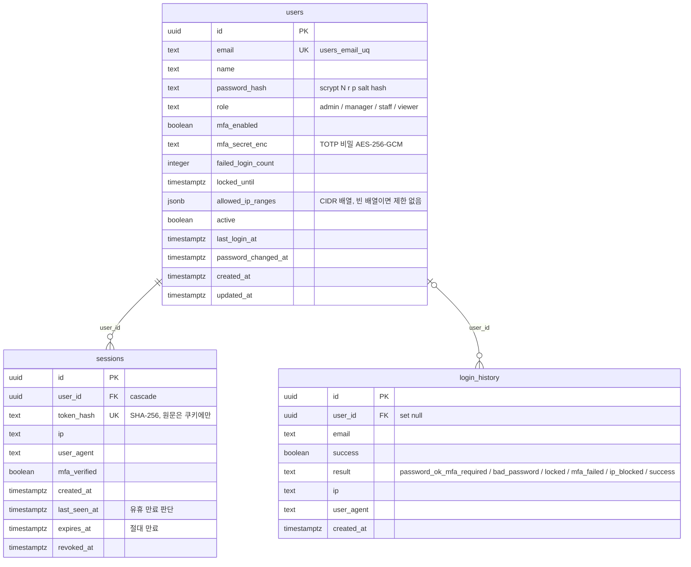
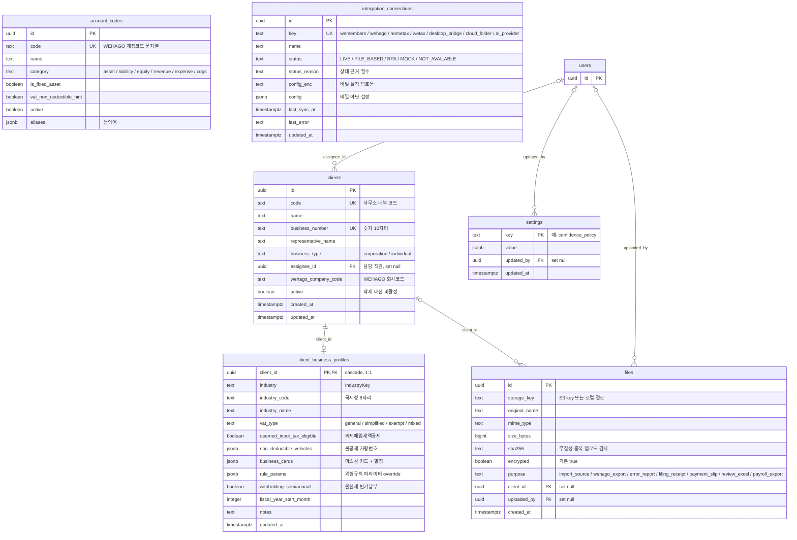
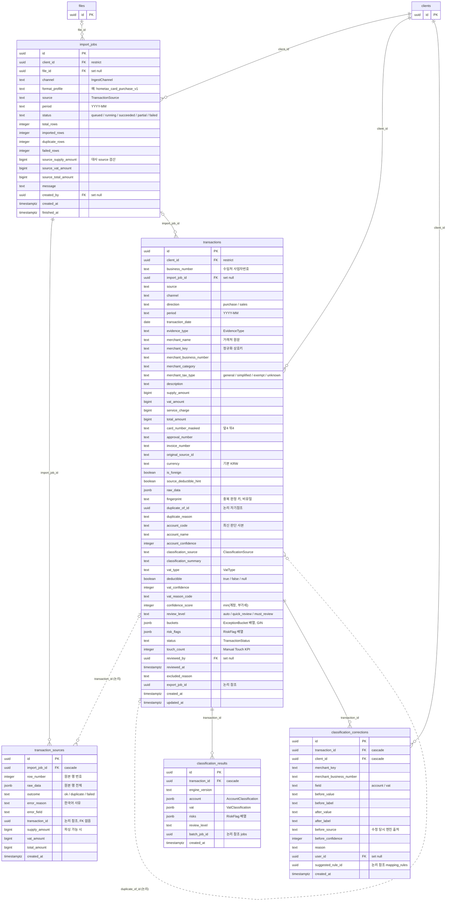
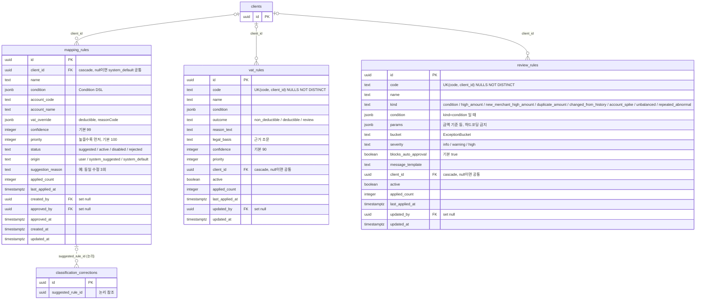
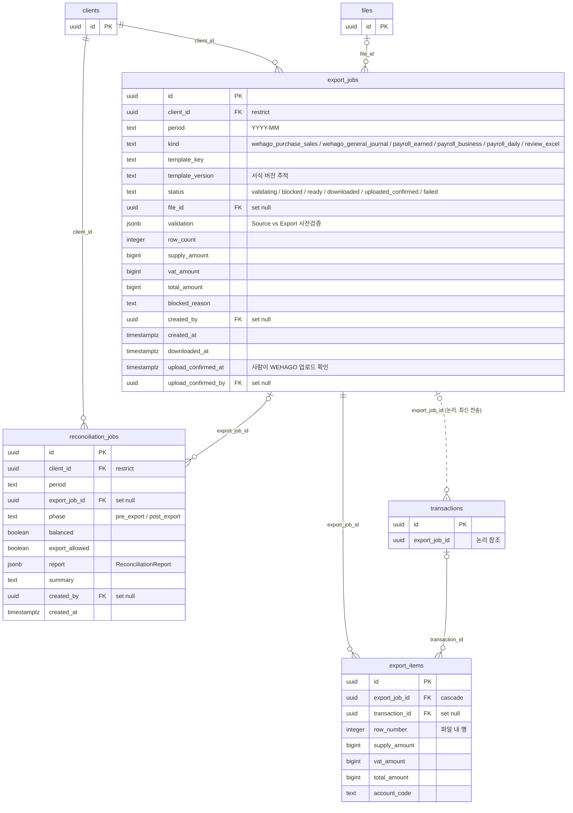
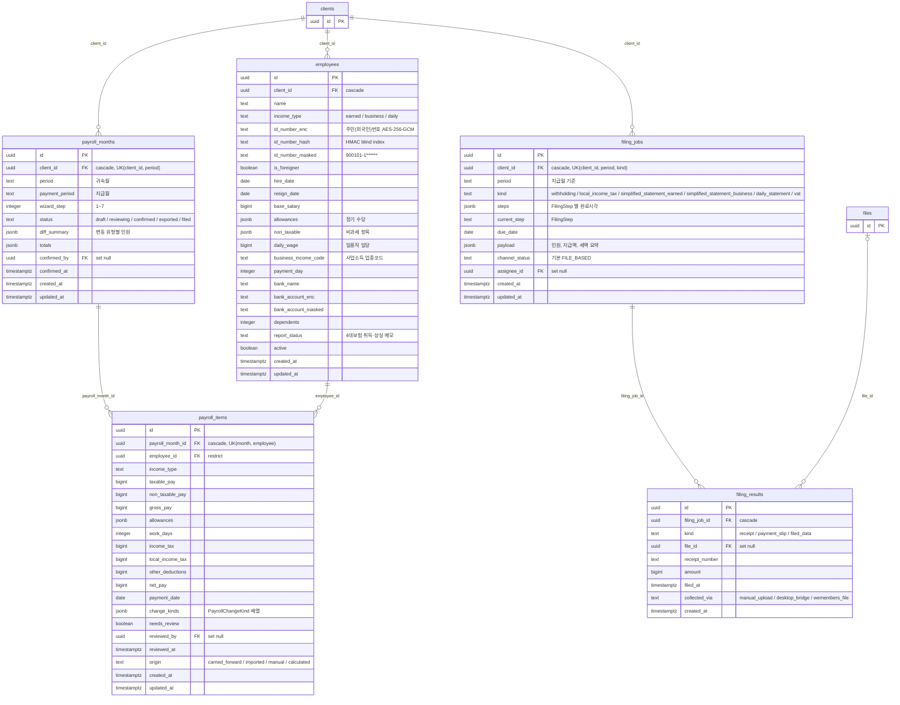
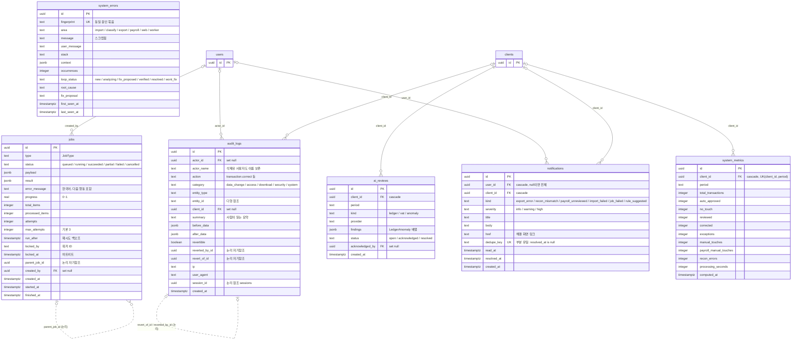

# 04. ERD — MIN TAX OPS 데이터 모델

- 문서 상태: v1 (2026-09-26). 생성 근거는 `packages/db/src/schema.ts`와 `packages/db/migrations/0000_init.sql`이다.
- 테이블 수: **31개** (`CREATE TABLE` 31건). 스키마와 이 문서가 다르면 **스키마가 기준**이다.
- 관련 문서: [03-architecture](./03-architecture.md)

## 0. 읽는 법

- 관계선
  - **실선(`--`)**: DB에 선언된 FK
  - **점선(`..`)**: FK 제약 없이 애플리케이션이 지키는 **논리 참조**
- 키 표기: `PK` 기본키, `FK` 외래키, `UK` 유일키(복합 유일키는 주석에 적음)
- 타입 표기
  - `bigint`: 원 단위 정수 금액. JS에서는 safe integer만 허용하고, 넘으면 파서가 예외를 던진다.
  - `date`: `'YYYY-MM-DD'` 문자열 그대로
  - `timestamptz`: `timestamp with time zone`
- 모든 테이블의 `id`는 `uuid default gen_random_uuid()`다. 예외는 `settings.key`와 `client_business_profiles.client_id`다.
- `users`를 가리키는 FK는 22개다. 대부분 `ON DELETE SET NULL`이고, 예외는 `sessions.user_id`와 `notifications.user_id`(CASCADE)다.
  - 다이어그램이 선으로 뒤덮이지 않도록, 행위자 기록용 FK 14개(`created_by`, `updated_by`, `approved_by`, `reviewed_by`, `confirmed_by`, `acknowledged_by`, `upload_confirmed_by`, `user_id` 일부, `assignee_id` 일부)는 속성에 `FK`로만 표시하고 관계선은 생략했다.
  - 전체 목록은 §9.1에 있다.

---

## 1. 개요도 (핵심 관계만)

```mermaid
erDiagram
  clients ||--o| client_business_profiles : "1:1 프로필"
  clients ||--o{ import_jobs : "수집"
  files |o--o{ import_jobs : "원본 파일"
  import_jobs ||--o{ transaction_sources : "원본 행 전부"
  clients ||--o{ transactions : "거래"
  import_jobs |o--o{ transactions : "생성"
  transactions ||--o{ classification_results : "엔진 판단 이력"
  transactions ||--o{ classification_corrections : "사람 수정"
  clients |o--o{ mapping_rules : "계정 규칙(null = 공통)"
  clients |o--o{ vat_rules : "부가세 규칙(override)"
  clients |o--o{ review_rules : "위험 규칙(override)"
  clients ||--o{ export_jobs : "WEHAGO 전송"
  export_jobs ||--o{ export_items : "전송 행"
  transactions |o--o{ export_items : "포함"
  export_jobs |o--o{ reconciliation_jobs : "대사"
  clients ||--o{ reconciliation_jobs : "대사"
  clients ||--o{ employees : "직원"
  clients ||--o{ payroll_months : "월 급여"
  payroll_months ||--o{ payroll_items : "직원별"
  employees ||--o{ payroll_items : "급여 행"
  clients ||--o{ filing_jobs : "신고"
  filing_jobs ||--o{ filing_results : "접수증·납부서"
  files |o--o{ filing_results : "첨부"
  files |o--o{ export_jobs : "생성 파일"
  users ||--o{ sessions : "세션"
  users |o--o{ login_history : "로그인 기록"
  users |o--o{ audit_logs : "행위자"
  clients |o--o{ audit_logs : "대상 수임처"
  users |o--o{ notifications : "수신자"
  clients |o--o{ system_metrics : "KPI"
  clients ||--o{ ai_reviews : "AI 검토"
  jobs |o..o{ jobs : "parent_job_id"
  transactions |o..o{ transaction_sources : "transaction_id"
```

위 개요도에 없는 독립 테이블: `account_codes`, `integration_connections`, `settings`, `system_errors`. 이 테이블들은 다른 테이블과 FK 관계가 없거나 사용자 참조만 있다.

---

## 2. 사용자 · 보안

---

## 3. 수임처 · 마스터 · 파일 · 설정

---

## 4. 수집 · 거래 · 분류

> 스키마 코드상 `import_jobs.client_id`는 nullable이다(수임처를 파일 내용으로 판정하기 전 단계). 이 단계는 `|o`로 읽는다. 다이어그램에는 주 경로(수임처 확정 후)를 그렸다.

---

## 5. 규칙

---

## 6. WEHAGO 전송 · 대사

---

## 7. 인건비 · 신고

---

## 8. 운영 · 감사 · 관측

---

## 9. FK 삭제 동작 요약

| 동작 | FK | 의도 |
|---|---|---|
| **RESTRICT** | `transactions.client_id`, `import_jobs.client_id`, `export_jobs.client_id`, `reconciliation_jobs.client_id`, `payroll_items.employee_id` | 장부·전송·대사 이력이 있는 수임처와 급여 이력이 있는 직원은 물리 삭제할 수 없다. 대신 `clients.active`, `employees.active`를 `false`로 바꾼다(데이터 삭제 금지 원칙) |
| **CASCADE** | `sessions.user_id`, `client_business_profiles.client_id`, `transaction_sources.import_job_id`, `classification_results.transaction_id`, `classification_corrections.transaction_id / client_id`, `mapping_rules/vat_rules/review_rules.client_id`, `export_items.export_job_id`, `employees/payroll_months/filing_jobs/ai_reviews/system_metrics/notifications.client_id`, `payroll_items.payroll_month_id`, `filing_results.filing_job_id`, `notifications.user_id` | 부모에 종속된 하위 데이터. 부모는 RESTRICT 경로 때문에 실제로 거의 삭제되지 않는다. **위험**: `clients`의 RESTRICT는 거래·가져오기·전송·대사에만 걸린다. 그래서 **거래가 없는 급여 전용 수임처**는 삭제될 수 있다. 이때 직원·월 급여·원천세 신고(`filing_jobs` → `filing_results` 접수증)·학습 기록(`classification_corrections`)까지 CASCADE로 함께 사라진다. 스키마 주석의 "학습 데이터는 절대 버리지 않는다"와도 충돌한다. `payroll_items.employee_id`의 RESTRICT가 막을 수도 있지만, CASCADE 처리 순서에 달려 있어 보장되지 않는다. → 서비스 계층은 `clients` 물리 삭제를 제공하지 않고 `active=false`만 쓴다(03 §14 G9) |
| **SET NULL** | 사용자 참조(`sessions`·`notifications`의 `user_id` 제외, §9.1), `files.client_id`, `import_jobs.file_id`, `transactions.import_job_id`, `export_jobs.file_id`, `export_items.transaction_id`, `reconciliation_jobs.export_job_id`, `filing_results.file_id`, `audit_logs.client_id` | 이력은 남기고 참조만 끊는다. `audit_logs.actor_name`은 사용자가 삭제되어도 누가 했는지 보존한다 |

### 9.1 `users` 참조 FK 전체 (22개)

| 테이블.컬럼 | ON DELETE | 다이어그램 선 |
|---|---|:-:|
| `sessions.user_id` | CASCADE | ● |
| `notifications.user_id` | CASCADE | ● |
| `login_history.user_id` | SET NULL | ● |
| `clients.assignee_id` | SET NULL | ● |
| `files.uploaded_by` | SET NULL | ● |
| `settings.updated_by` | SET NULL | ● |
| `jobs.created_by` | SET NULL | ● |
| `audit_logs.actor_id` | SET NULL | ● |
| `import_jobs.created_by` | SET NULL | |
| `transactions.reviewed_by` | SET NULL | |
| `classification_corrections.user_id` | SET NULL | |
| `mapping_rules.created_by` | SET NULL | |
| `mapping_rules.approved_by` | SET NULL | |
| `vat_rules.updated_by` | SET NULL | |
| `review_rules.updated_by` | SET NULL | |
| `export_jobs.created_by` | SET NULL | |
| `export_jobs.upload_confirmed_by` | SET NULL | |
| `reconciliation_jobs.created_by` | SET NULL | |
| `payroll_months.confirmed_by` | SET NULL | |
| `payroll_items.reviewed_by` | SET NULL | |
| `filing_jobs.assignee_id` | SET NULL | |
| `ai_reviews.acknowledged_by` | SET NULL | |

## 10. 논리 참조 (FK 없음) — 애플리케이션이 지켜야 할 규칙

| 컬럼 | 대상 | FK를 두지 않은 이유 | 지키는 곳 |
|---|---|---|---|
| `transaction_sources.transaction_id` | `transactions.id` | 원본 행을 먼저 쓰고 거래를 나중에 만든다(배치 적재 순서). 실패 행은 값이 null이다 | 가져오기 서비스, 같은 DB 트랜잭션 안에서 채움 |
| `transactions.duplicate_of_id` | `transactions.id` | 자기참조 순환 삭제를 피한다 | 중복 판정 서비스 |
| `transactions.export_job_id` | `export_jobs.id` | 최신 전송만 가리키는 비정규화 값이다. 전체 이력은 `export_items`에 있다 | 전송 서비스 |
| `classification_results.batch_job_id` | `jobs.id` | 작업 테이블은 정리(보관 이관)될 수 있다 | 분류 배치 |
| `classification_corrections.suggested_rule_id` | `mapping_rules.id` | 규칙이 거절·삭제되어도 학습 기록은 남긴다 | 규칙 제안 서비스 |
| `jobs.parent_job_id` | `jobs.id` | 큐 테이블을 가볍게 유지한다 | 워커 |
| `audit_logs.revert_of_id / reverted_by_id` | `audit_logs.id` | 감사로그는 추가만 한다. 되돌리기는 새 로그를 남기고 원 로그의 `reverted_by_id`만 채운다 | 감사 서비스 |
| `audit_logs.session_id` | `sessions.id` | 세션은 만료되면 정리되지만 감사로그는 영구 보존한다 | 감사 서비스 |
| `audit_logs.entity_id` | 여러 테이블 (`entity_type`로 구분) | 다형 참조 | 감사 서비스 |

---

## 11. 인덱스와 근거

### 11.1 선언된 인덱스 전체

| 테이블 | 인덱스 | 컬럼 | 종류 | 근거 (주요 쿼리) |
|---|---|---|---|---|
| users | `users_email_uq` | email | UNIQUE | 로그인 조회, 이메일 중복 방지 |
| sessions | `sessions_token_uq` | token_hash | UNIQUE | 모든 요청의 세션 확인(해시로 조회) |
| sessions | `sessions_user_idx` | user_id | btree | 사용자별 세션 목록·일괄 폐기 |
| login_history | `login_history_user_idx` | user_id, created_at | btree | 사용자별 최근 로그인 기록, 잠금 판단 |
| clients | `clients_code_uq` | code | UNIQUE | 사무소 코드로 조회, WEHAGO 파일명 매핑 |
| clients | `clients_bizno_uq` | business_number | UNIQUE | 파일 속 사업자번호로 수임처 자동 판정. 수임처 이중 등록 방지 |
| clients | `clients_assignee_idx` | assignee_id | btree | "내 담당 수임처" 필터 |
| account_codes | `account_codes_code_uq` | code | UNIQUE | 계정코드 조회·검증 |
| files | `files_sha_idx` | sha256 | btree | 같은 파일 재업로드 감지("이미 가져온 파일입니다") |
| files | `files_client_idx` | client_id | btree | 수임처별 파일 목록 |
| integration_connections | `integration_connections_key_uq` | key | UNIQUE | 연동당 한 행 |
| import_jobs | `import_jobs_client_idx` | client_id, created_at | btree | 수임처 360·수집 목록 최신순 |
| transaction_sources | `transaction_sources_job_idx` | import_job_id, row_number | btree | 가져오기 결과 행 목록, 실패 행 재처리, 대사 source 합계 |
| transaction_sources | `transaction_sources_tx_idx` | transaction_id | btree | 거래 → 원본 행 추적(설명 패널 "원본 보기") |
| transactions | `tx_client_period_idx` | client_id, period, status | btree | **가장 빈번**: 수임처·월·상태별 목록, 파이프라인 집계, 대사 |
| transactions | `tx_client_date_idx` | client_id, transaction_date | btree | 날짜 범위 조회, 정렬 |
| transactions | `tx_client_merchant_bizno_idx` | client_id, merchant_business_number | btree | 분류 Level 2 `exact_history` |
| transactions | `tx_client_merchant_key_idx` | client_id, merchant_key | btree | 분류 Level 3 `name_history`, 설명 패널 거래처 이력 |
| transactions | `tx_fingerprint_idx` | client_id, fingerprint | btree(**비유일**) | 중복 판정. 중복 행도 삭제하지 않고 같은 fingerprint로 남기므로 유일 제약을 걸 수 없다 |
| transactions | `tx_status_idx` | status, period | btree | 사무소 전체 "검토 필요" 버킷 집계(대시보드) |
| transactions | `tx_import_job_idx` | import_job_id | btree | 가져오기 단위 재분류·롤백 |
| transactions | `tx_export_job_idx` | export_job_id | btree | 전송 단위 조회 |
| transactions | `tx_merchant_key_global_idx` | merchant_key | btree | 분류 Level 5 `industry_pattern`(수임처를 가로지르는 조회) |
| transactions | `tx_buckets_gin` | buckets | **GIN** | 예외함 버킷 필터 `buckets @> '["high_amount"]'` |
| classification_results | `classification_results_tx_idx` | transaction_id, created_at | btree | 거래별 판단 이력(최신순) |
| classification_corrections | `corrections_client_merchant_idx` | client_id, merchant_key, field | btree | 분류 Level 4 `correction_memory`, 규칙 제안 임계치 계산 |
| classification_corrections | `corrections_created_idx` | created_at | btree | 최근 수정 KPI, 180일 창 |
| mapping_rules | `mapping_rules_client_idx` | client_id, status, priority | btree | 분류 Level 1·6: 수임처의 active 규칙을 우선순위 순으로 조회 |
| vat_rules | `vat_rules_code_client_uq` | code, client_id | UNIQUE NULLS NOT DISTINCT | 공통 규칙(client null)도 코드가 유일. 수임처 override는 같은 코드로 한 행 |
| review_rules | `review_rules_code_client_uq` | code, client_id | UNIQUE NULLS NOT DISTINCT | 위와 같음 |
| export_jobs | `export_jobs_client_period_idx` | client_id, period, kind | btree | 전송센터: 수임처·월·종류별 최신 전송 |
| export_items | `export_items_job_idx` | export_job_id | btree | 전송 파일 행 목록, 대사 export 합계 |
| export_items | `export_items_tx_idx` | transaction_id | btree | 거래가 어느 파일에 들어갔는지 |
| reconciliation_jobs | `recon_client_period_idx` | client_id, period, created_at | btree | 수임처·월의 최신 대사 결과 |
| employees | `employees_client_idx` | client_id, income_type | btree | 소득 유형별 직원 목록 |
| employees | `employees_idhash_idx` | client_id, id_number_hash | btree | 주민번호 중복 등록 감지(복호화 없이) |
| payroll_months | `payroll_months_client_period_uq` | client_id, period | UNIQUE | 수임처·귀속월 급여는 하나 |
| payroll_items | `payroll_items_month_emp_uq` | payroll_month_id, employee_id | UNIQUE | 월·직원당 한 행(멱등 재계산) |
| payroll_items | `payroll_items_emp_idx` | employee_id | btree | 직원별 급여 이력(전월 비교) |
| filing_jobs | `filing_jobs_client_period_kind_uq` | client_id, period, kind | UNIQUE | 수임처·월·세목당 신고 작업 하나 |
| filing_results | `filing_results_job_idx` | filing_job_id | btree | 신고별 접수증·납부서 |
| jobs | `jobs_queue_idx` | status, run_after | btree | **작업 획득 쿼리** `status='queued' and run_after<=now()` |
| jobs | `jobs_parent_idx` | parent_job_id | btree | 자식 작업 진행률 집계 |
| jobs | `jobs_created_idx` | created_at | btree | 작업 기록 정리·조회 |
| audit_logs | `audit_created_idx` | created_at | btree | 전체 감사로그 최신순 |
| audit_logs | `audit_entity_idx` | entity_type, entity_id | btree | "이 거래의 변경 이력" |
| audit_logs | `audit_client_idx` | client_id, created_at | btree | 수임처 360 감사 탭 |
| audit_logs | `audit_actor_idx` | actor_id, created_at | btree | 사용자별 행동 이력 |
| system_errors | `system_errors_fp_uq` | fingerprint | UNIQUE | 같은 원인 upsert(`occurrences + 1`) |
| system_errors | `system_errors_last_idx` | last_seen_at | btree | 최근 오류 순 |
| ai_reviews | `ai_reviews_client_period_idx` | client_id, period, kind | btree | 수임처·월 AI 검토 결과 |
| notifications | `notifications_user_idx` | user_id, read_at | btree | 안 읽은 알림 |
| notifications | `notifications_dedupe_uq` | dedupe_key WHERE resolved_at is null | UNIQUE **부분** | 해결되지 않은 같은 문제는 알림 한 건만. 해결 후 재발하면 새 알림 |
| system_metrics | `system_metrics_client_period_uq` | client_id, period | UNIQUE | 수임처·월 KPI upsert |

### 11.2 주의 사항

1. **`system_metrics_client_period_uq`와 NULL**: `client_id`가 null인 사무소 전체 합계 행은 일반 UNIQUE에서 NULL끼리 서로 다르게 취급된다. 그래서 같은 월에 여러 행이 생길 수 있고 `ON CONFLICT` upsert가 동작하지 않는다.
   - 권장: 사무소 합계는 저장하지 않고 수임처 행을 집계해 계산한다.
   - 저장이 필요하면 `NULLS NOT DISTINCT`로 바꿔야 한다(계약 변경).
2. **중복 판정 경쟁 조건**: `tx_fingerprint_idx`가 유일하지 않다. 그래서 같은 수임처에 두 가져오기가 동시에 돌면 둘 다 "신규"로 판정할 수 있다. 가져오기 작업은 수임처 단위 advisory lock을 잡고 판정한다.
   - 잠금 키는 용도 네임스페이스를 둔 2-키 형식이다: `pg_advisory_xact_lock(<가져오기 상수>, hashtext(client_id::text))`. 전송·대사 잠금(03 §9.2)과 키 공간을 나눈다.
   - 잠금은 판정과 삽입을 하는 **같은 DB 트랜잭션** 안에서 잡아야 효과가 있다(xact 잠금은 커밋 때 풀린다).
3. **`status` 계열 컬럼은 `text`**이고 CHECK 제약이 없다. 값 검증은 TypeScript `$type<>`과 서비스 계층이 맡는다. 운영이 안정되면 CHECK 제약 추가를 검토한다.
4. **`jsonb` 스냅샷**: `transactions.risk_flags`, `classification_results.account/vat`, `reconciliation_jobs.report`는 당시 판단을 **그대로** 보존하는 스냅샷이다. 규칙이 바뀌어도 과거 판단 근거는 바뀌지 않는다.

### 11.3 추가 검토 인덱스 (제안 — 계약 변경 필요, 부하 측정 후 결정)

| 제안 | 대상 쿼리 | 비고 |
|---|---|---|
| `transactions (client_id, period) WHERE status = 'needs_review'` 부분 인덱스 | 예외함 기본 목록 | 검토 대상은 전체의 5~10%라 작고 빠르다 |
| `transactions (client_id, period, confidence_score)` | 신뢰도 정렬 예외함 | 정렬 부하가 확인되면 추가 |
| `transaction_sources (import_job_id) WHERE outcome = 'failed'` | 실패 행 목록 | 실패가 드물어 부분 인덱스가 효율적 |
| `jobs (status, run_after) WHERE status = 'queued'` 부분 인덱스 | 작업 획득 | 완료 작업이 쌓이면 기존 인덱스가 커진다. 완료 작업 보관 이관 정책과 함께 검토 |
| `pg_trgm` GIN on `transactions.merchant_name` | Ctrl+K 부분 문자열 검색 | 확장 설치가 필요하다 |

---

## 12. 타입 매핑 (계약 ↔ 컬럼)

| 계약 타입 (`@mintax/core`) | 컬럼 |
|---|---|
| `NormalizedTransaction` | `transactions`의 원천 필드 (`merchant_*`, 금액, `fingerprint`, `raw_data`) |
| `NormalizationFailure` | `transaction_sources` (`outcome='failed'`, `error_reason`, `error_field`) |
| `AccountClassification` / `VatClassification` / `RiskFlag[]` | `classification_results.account / vat / risks` (원본), `transactions.*` (비정규화 사본) |
| `CorrectionRecord` | `classification_corrections` |
| `MappingRule` | `mapping_rules` |
| `ReconciliationReport` | `reconciliation_jobs.report` |
| `PayrollLine` / `PayrollChange` | `payroll_items` (+ `change_kinds`, `needs_review`) |
| `FilingStep` | `filing_jobs.steps`, `current_step` |
| `IntegrationDescriptor` | `integration_connections` |
| `JobType` / `JobStatus` | `jobs.type` / `jobs.status` |
| `LedgerAnomaly` | `ai_reviews.findings` |
| `ConfidencePolicy` | `settings` (예: key `confidence_policy`, 기본값 `DEFAULT_CONFIDENCE_POLICY`) |
