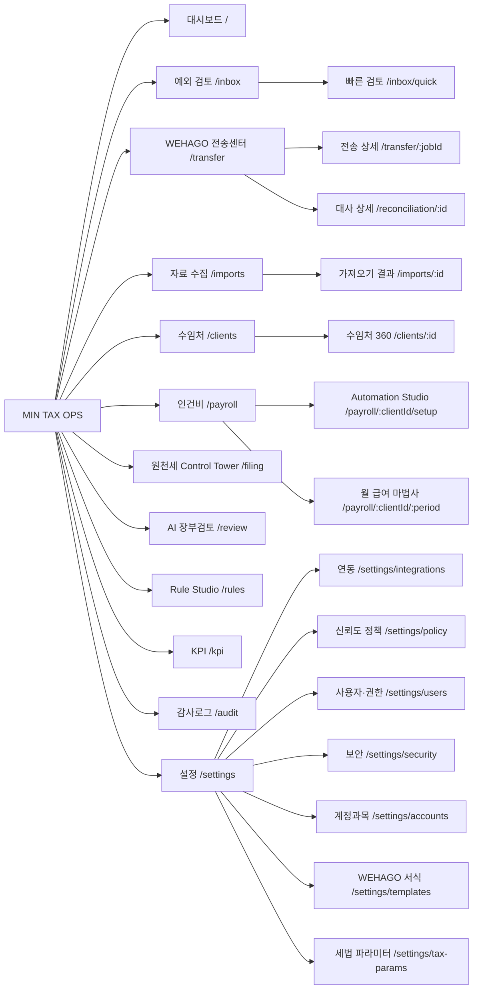

# 05. 화면 IA · 와이어프레임 명세 — MIN TAX OPS

- 문서 상태: v1 (2026-09-26)
- 기준 해상도: **1440px 데스크톱 우선**. 최소 1280px 지원, 1920px에서는 여백 대신 그리드 폭을 넓힌다. 모바일은 범위 밖이다.
- 기준 계약: `@mintax/core` 타입(`ExceptionBucket`, `ClientPipelineStage`, `FilingStep`, `IntegrationStatus`, `Permission` 등), `apps/web/tailwind.config.ts`, `apps/web/src/app/globals.css`
- 관련 문서: [03-architecture](./03-architecture.md) · [04-erd](./04-erd.md) · [06-mvp-plan](./06-mvp-plan.md)

---

## 0. 디자인 원칙

1. **예외만 보여 준다.** 자동확정된 거래는 목록에 올리지 않는다. 숫자는 누르면 해결 화면으로 가는 것만 보여 준다. "총 처리 건수", "등록 수임처 수" 같은 과시용 숫자는 두지 않는다.
2. **키보드로 끝낸다.** 예외함, 빠른 검토, 인건비 변경 검토는 마우스 없이 처리할 수 있어야 한다.
3. **근거를 옆에 둔다.** 추천마다 "왜"가 한 줄(그리드)과 전체(설명 패널)로 보인다.
4. **조밀하게, 카드 없이.** 표·구분선·여백으로 구조를 만든다. 카드(그림자 박스)는 팝오버와 다이얼로그에만 쓴다.
5. **색은 상태에만.** 기본은 중립색과 네이비/블루다. 초록·주황·빨강은 상태를 뜻할 때만 쓰고, 항상 아이콘이나 글자와 함께 쓴다(색각 이상 대응).
6. **파일 기반임을 숨기지 않는다.** WEHAGO 전송은 "파일을 만들고 사람이 올리는 것"이다. 버튼 문구도 "전송"이 아니라 "업로드 파일 받기"를 쓴다.
7. **오류는 원인·범위·다음 행동을 한 문장에.** 예: "WEHAGO 파일 생성 중 3건의 계정코드를 찾지 못했습니다. [3건 검토하기]"

### 0.1 용어 (화면 문구)

| 화면 용어 | 뜻 | 쓰지 않는 말 |
|---|---|---|
| 수임처 | 사무소의 고객사 (`clients`) | 고객, 회사 |
| 거래처 | 거래 상대방 (`merchant_*`) | 가맹점(원천 컬럼명으로만 사용) |
| 자동확정 | `auto_approved` | 자동승인(내부 용어) |
| 검토 필요 | `needs_review` | 예외(메뉴명 "예외 검토"에만 사용) |
| 업로드 파일 받기 | WEHAGO Import 파일 다운로드 | 전송하기 |
| 업로드 완료 확인 | 사람이 WEHAGO에 올린 뒤 누르는 확인 | 전송 완료 |

> 예시 데이터 주의
> - 와이어프레임의 계정코드(830 소모품비, 829 사무용품비, 822 차량유지비 등)는 research/01 §2.7의 **커뮤니티 수준 기본값**이다. 실제 코드는 수임처별 WEHAGO 계정과목표를 따른다.
> - 코드를 확인하지 못한 계정은 `1xx*`로 표기했다.
> - 수임처·거래처·인명은 모두 가상이다.

---

## 1. 디자인 토큰

`globals.css`의 CSS 변수와 `tailwind.config.ts`에 정의된 값이다. 새 색을 추가하지 않는다.

### 1.1 색

| 토큰 | RGB | HEX | 용도 |
|---|---|---|---|
| `bg` | 250 250 251 | `#FAFAFB` | 앱 배경 |
| `surface` | 255 255 255 | `#FFFFFF` | 표·패널 바탕 |
| `subtle` | 244 245 247 | `#F4F5F7` | 표 머리행, 선택되지 않은 탭, 읽기 전용 셀 |
| `border` | 228 230 235 | `#E4E6EB` | 구분선, 셀 경계 |
| `fg` | 17 24 39 | `#111827` | 본문 |
| `muted` | 107 114 128 | `#6B7280` | 보조 문구, 비활성, 제외된 행 |
| `navy` | 16 30 64 | `#101E40` | 제품 로고 배지·강조 제목 (현재 셸의 좌측 내비 바탕은 `surface`) |
| `primary` | 37 84 214 | `#2554D6` | 주 행동 버튼, 포커스, 링크, 선택 행 테두리 |
| `primary-soft` | 235 241 253 | `#EBF1FD` | 선택 행 배경, `FILE_BASED` 배지 |
| `success` / `-soft` | 22 142 84 / 231 246 238 | `#168E54` / `#E7F6EE` | 자동확정, 승인, 대사 균형, `LIVE` |
| `warning` / `-soft` | 214 118 20 / 253 243 230 | `#D67614` / `#FDF3E6` | 검토 필요, 빠른 검토 구간, 마감 임박, `RPA`·`MOCK` |
| `danger` / `-soft` | 205 45 45 / 252 235 235 | `#CD2D2D` / `#FCEBEB` | 전송 차단, 대사 불일치, 반드시 검토, 오류, 고위험 |

### 1.2 상태 → 표현 매핑

| 상태 | 색 | 아이콘 (lucide) | 문구 |
|---|---|---|---|
| 신뢰도 ≥ 95 (auto) | success | `check-circle-2` | 숫자 그대로 |
| 신뢰도 80~94 (quick_review) | warning | `circle-dot` | 숫자 그대로 |
| 신뢰도 < 80 (must_review) | danger | `alert-circle` | 숫자 그대로 |
| 위험 high | danger | `alert-triangle` | 규칙 이름 |
| 위험 warning | warning | `alert-triangle` | 규칙 이름 |
| 위험 info | muted | `info` | 규칙 이름 |
| 대사 균형 | success | `scale` | "균형" |
| 대사 불일치 | danger | `scale` | "불일치 N건" |
| 전송 차단 | danger | `ban` | "차단: 사유" |
| `LIVE` | success | `radio` | LIVE |
| `FILE_BASED` | primary-soft 바탕 + primary 글자 | `file-spreadsheet` | 파일 기반 |
| `RPA` | warning | `bot` | RPA |
| `MOCK` | warning 사선 무늬 | `flask-conical` | MOCK · 개발용 |
| `NOT_AVAILABLE` | muted | `circle-slash` | 사용 불가 |

### 1.3 타이포그래피 · 간격 · 형태

| 항목 | 값 |
|---|---|
| 글꼴 | Pretendard → Apple SD Gothic Neo → Noto Sans KR. 코드·ID는 JetBrains Mono |
| 크기 | `2xs` 11/16 (배지), `xs` 12/16 (보조), `sm` 13/20 (**그리드 기본**), `base` 14/22 (본문), 제목 16/24·18/26 (굵기 600) |
| 숫자 | 모든 금액·건수는 `tabular-nums` 우측 정렬(`.num`). 금액은 `1,234,567` (그리드에서는 "원" 생략, 머리행에 "(원)") |
| 날짜 | 그리드 `09-12`(기간이 고정된 경우) 또는 `2026-09-12`. 상대시간은 "3분 전" |
| 간격 | 4px 단위. 그리드 셀 좌우 8px, 섹션 사이 24px |
| 행 높이 | 그리드 32px (조밀 모드 28px), 머리행 32px |
| 모서리 | 6px (배지·입력), 8px (팝오버·다이얼로그) |
| 그림자 | `shadow-pop`은 팝오버·다이얼로그·명령 팔레트에만 쓴다 |
| 포커스 | 2px `primary` 윤곽선(`:focus-visible`). 그리드 포커스 행은 좌측 2px primary 막대 + `primary-soft` 배경 |

---

## 2. 전역 레이아웃 (1440px)

```
┌──────────────────────────────────────────────────────────────────────────────────────────────┐
│ MIN TAX OPS │ 수임처 [전체 ▾]  기간 [2026-09 ▾] │   [ 검색 · 명령  Ctrl+K ]   │ 작업 2 │ 알림 3 │ 김세무 ▾ │ 48px
├────────────┬─────────────────────────────────────────────────────────────────────────────────┤
│ 대시보드    │  페이지 제목                                  [보조 행동]  [주 행동]               │
│ 예외 검토 12│  ─────────────────────────────────────────────────────────────────────────────  │
│ 빠른 검토 40│                                                                                 │
│ WEHAGO 전송 │                         본문 (표 중심)                                           │
│ 자료 수집   │                                                                                 │
│ 수임처      │                                                                                 │
│ 인건비      │                                                                                 │
│ 원천세      │                                                                                 │
│ 규칙        │                                                                                 │
│ KPI        │                                                                                 │
│ 감사로그    │                                                                                 │
│ ─────      │                                                                                 │
│ 설정        │                                                                                 │
│ 216px      │                             1224px                                              │
└────────────┴─────────────────────────────────────────────────────────────────────────────────┘
```

- **상단바 48px**
  - 수임처 선택: 검색형 콤보박스, "전체" 포함
  - 기간 선택: `YYYY-MM`, 기본은 직전 월
  - 명령 팔레트(Ctrl+K)
  - 작업 트레이: 실행 중·방금 끝난 백그라운드 작업. 끝나면 사라진다
  - 알림: 해결되지 않은 **문제**의 수
  - 사용자 메뉴
- **좌측 내비 216px** (`surface` 바탕 + 오른쪽 `border` — 현재 셸 `app-shell.tsx`. 접으면 56px 아이콘만)
  - 메뉴 옆 숫자는 **처리할 일**만 보여 준다(예외 12, 빠른 검토 40). 0이면 숨긴다.
  - 예외 검토 화면에 들어가면 자동으로 접혀 그리드 폭을 확보한다.
- **우측 패널 360px**: 설명 패널·상세 드로어. 본문을 덮지 않고 폭을 나눈다.
- 수임처·기간 선택은 URL 쿼리(`?client=…&period=2026-09`)로 유지한다. 링크를 공유하면 같은 화면이 열린다.

---

## 3. 정보 구조 (IA)



| 경로 | 화면 | 최소 권한 | 주 데이터 |
|---|---|---|---|
| `/` | 대시보드 | `transactions.read` | `transactions`(버킷 집계), `system_metrics`, `export_jobs`, `reconciliation_jobs`, `payroll_months`, `filing_jobs`, `ai_reviews` |
| `/inbox` | 예외 검토 (Grid) | `transactions.read` (처리는 `transactions.review`) | `transactions`, `classification_results`, `transaction_sources` |
| `/inbox/quick` | 빠른 검토 | 위와 같음 | `transactions(review_level='quick_review')` |
| `/transfer` | WEHAGO 전송센터 | `export.create` | `transactions` 집계, `export_jobs`, `reconciliation_jobs` |
| `/transfer/:jobId` | 전송 상세 | `export.create` | `export_jobs`, `export_items`, `files` |
| `/reconciliation/:id` | 대사 상세 | `transactions.read` | `reconciliation_jobs.report` |
| `/imports` | 자료 수집 | `imports.create` | `import_jobs`, `files`, `transaction_sources` |
| `/clients`, `/clients/:id` | 수임처 목록 · 수임처 360 | `clients.read` | `clients`, `client_business_profiles` 외 전 영역 |
| `/payroll/:clientId/setup` | Payroll Automation Studio | `payroll.read` | `employees` |
| `/payroll/:clientId/:period` | 월 급여 마법사 | `payroll.write` | `payroll_months`, `payroll_items` |
| `/filing` | 원천세 Control Tower | `filing.write` | `filing_jobs`, `filing_results` |
| `/review` | AI 장부검토 (선택 기능) | `transactions.read` | `ai_reviews` (`LedgerAnomaly`) |
| `/rules` | Rule Studio | `rules.read` | `mapping_rules`, `vat_rules`, `review_rules`, `classification_corrections` |
| `/kpi` | KPI | `transactions.read` | `system_metrics` |
| `/audit` | 감사로그 | `audit.read` | `audit_logs` |
| `/settings/*` | 설정 | `settings.write` (연동 개발자 모드는 `integrations.developer`) | `settings`, `users`, `integration_connections`, `account_codes` |

권한이 없는 메뉴는 **숨긴다**. URL로 직접 들어오면 "이 화면을 볼 권한이 없습니다. 관리자에게 [필요 권한] 권한을 요청하세요."를 보여 준다.

- 경로는 이미 구현된 웹 셸 `apps/web/src/components/shell/nav.ts`의 `href`와 맞췄다(`/transfer`, `/filing`, `/review`). 둘이 다르면 셸 코드가 기준이고 이 표를 고친다.
- 셸의 메뉴 이름은 이 문서 용어와 일부 다르다. 셸은 "예외함", "원천세 신고", "거래처"(수임처 목록), "자동화 KPI", "감사 로그"를 쓴다. 화면 문구 결정은 웹 담당이 한다. 권장은 §0.1이다. 특히 고객사를 "거래처"라고 부르면 거래 상대방과 헷갈리므로 "수임처"를 권장한다.

---

## 4. 공통 컴포넌트

| 컴포넌트 | 명세 |
|---|---|
| `DataGrid` | TanStack Table + Virtual. 행 32px, overscan 20. 서버 정렬·필터·커서 페이징(500행 창). 열 너비 조절·순서 변경은 사용자별로 저장. 머리행 고정. 첫 열 체크박스. 금액 열은 우측 정렬. 합계 행은 하단에 고정(선택 행 합계 / 전체 합계 전환) |
| `MoneyCell` | `1,234,567`. 음수는 `-1,234,567`(danger 아님, 부호로만 구분) |
| `ConfidenceCell` | 숫자 + 상태 점(§1.2). 마우스를 올리면 Level과 근거 한 줄 |
| `EvidenceBadge` | 세금계산서 `세금` · 계산서 `계산` · 카드 `카드` · 현금영수증 `현영` · 통장 `통장` · 기타 `기타` (중립색, 2글자) |
| `VatCell` | `공제` / `불공` / `검토` + 유형 약칭(카과·현과·과세). `검토`는 warning |
| `StatusBadge` | §1.2 규칙 |
| `KpiStat` | 숫자 + 라벨 + 전월 대비. **링크 대상이 반드시 있다**. 없으면 KPI로 두지 않는다 |
| `BucketList` | 버킷명 · 건수 · 금액 합계 · 수임처 수 · 대표 예시 1건 · 행 전체가 링크 |
| `ExplainPanel` | §5.2.4 |
| `Stepper` | 수평 단계 표시. 완료 ✓, 현재 굵게, 차단은 danger 테두리 |
| `InlineBanner` | 영역 상단 한 줄 알림. 문구 + 행동 버튼 1~2개. 닫기는 해결될 때까지 숨김 처리만 |
| `UndoToast` | 처리 직후 좌하단 6초. "쿠팡 72,300원 → 사무용품비로 수정했습니다 [되돌리기 Ctrl+Z]" |
| `ConfirmDialog` | 되돌릴 수 없는 작업·일괄 작업에만 쓴다. 영향 범위(건수·금액)를 숫자로 보여 준다 |
| `CommandPalette` | cmdk. §6 |
| `FilterBar` | 칩형 필터. 적용된 필터만 보여 주고, 결과 건수를 즉시 반영한다 |
| `JobProgress` | "312 / 500건 분류 중 · 약 10초 남음". 실패하면 `error_message`와 행동 버튼 |

---

## 5. 화면 명세

### 5.1 대시보드 `/`

**목적**: 오늘 처리할 일을 10초 안에 파악하고 한 번에 해당 화면으로 이동한다.

```
┌ 2026-09 · 전체 수임처 ────────────────────────────────────────────────────────────────────────┐
│ 자동처리율        No-Touch율       검토 필요          전송 차단          대사 불일치         │
│ 94.6%  ▲1.2p     91.8%  ▲0.8p     318건 · 12곳 →    3곳 →             1곳 →              │
├──────────────────────────────────────────────────────────────────────────────────────────────┤
│ 검토가 필요한 거래                                                    [예외 검토 전체 열기]   │
│ 버킷               건수   금액 합계        수임처  대표 예시                                  │
│ 신규 거래처          84    12,480,300       9   (주)한빛철물 1,320,000 · 상록건설            │
│ 저신뢰도             61     4,220,150       7   네이버페이 38,000 · 미소카페                  │
│ 공제/불공제 검토      38     3,980,000       6   GS칼텍스 82,000 · 차량 미등록               │
│ 고액거래             12    48,300,000       5   삼성전자서비스 6,600,000 · 자산 가능성        │
│ 계정과목 충돌         9       812,000       4   쿠팡 72,300 · 소모품비 vs 사무용품비          │
│ 전월과 다른 분개      7     1,120,000       3   …                                           │
│ (건수 0인 버킷은 표시하지 않음)                                                               │
├──────────────────────────────────────┬───────────────────────────────────────────────────────┤
│ 마감·신고                             │ 전송·대사 문제                                         │
│ 지급명세서 D-4 미제출 4곳 →           │ 상록건설 · 계정코드 없음 3건 [3건 검토하기]              │
│ 인건비 미검토 2곳 (변경 3명) →         │ 미소카페 · 부가세 합계 1원 차이 [차이 보기]              │
│ 접수증 미수집 7곳 →                   │ 한빛철물 · WEHAGO 역수입 누락 2건 [대사 보기]            │
├──────────────────────────────────────┴───────────────────────────────────────────────────────┤
│ AI 검토 (선택)  상록건설 · 접대비 3개월 평균 240만원 → 이번 달 890만원  [거래 보기]            │
└──────────────────────────────────────────────────────────────────────────────────────────────┘
```

| 요소 | 정의 | 클릭 이동 |
|---|---|---|
| 자동처리율 | 1 − 검토 비율(02-automation-matrix §4.2 #3). 엔진이 사람 검토 없이 확정한 비율 | `/kpi` |
| No-Touch율 | `no_touch / total_transactions` (02 §4.2 #1). 자동확정 사후 수정률을 작은 글씨로 함께 표시 | `/kpi` |
| 검토 필요 | `status='needs_review'` 건수 · 수임처 수 | `/inbox` |
| 전송 차단 | 최신 `export_jobs.status='blocked'`인 수임처 수 | `/transfer?status=blocked` |
| 대사 불일치 | 최신 대사 보고서에 blocking 차이(`pending_review` 제외)가 1건 이상인 수임처 수. `balanced=false`만 세면 WEHAGO 누락·금액 불일치가 빠진다 | `/transfer?recon=mismatch` |
| 버킷 행 | `ExceptionBucket`별 `needs_review` 건수·금액 (GIN 인덱스 집계) | `/inbox?bucket=…` |
| 마감·신고 | `filing_jobs.due_date` 기준 D-7 이내 미완료, `payroll_items.needs_review` 미처리 | `/filing?due=7`, `/payroll/…` |
| AI 검토 | `ai_reviews.status='open'`의 `LedgerAnomaly.action.href` | 해당 필터 |

- 자동처리율 옆 변화량은 전월 대비 %p다. 개선·악화 모두 중립색 화살표로만 표시한다(성과를 과시하지 않는다).
- **모든 행과 숫자가 링크다.** 행동으로 이어지지 않는 수치(총 거래 수, 수임처 수, 처리 금액)는 대시보드에 두지 않는다.
- 빈 상태: "검토할 거래가 없습니다. 9월 자동처리율 96.2% · 다음 단계: [WEHAGO 전송센터]"

### 5.2 예외 검토 — Grid Mode `/inbox`

**목적**: 검토 필요 거래를 엑셀처럼 빠르게 훑고 키보드로 처리한다.

#### 5.2.1 레이아웃 (내비 자동 접힘: 본문 1384px = 그리드 1024 + 설명 패널 360)

```
┌ 예외 검토 · 2026-09 · 전체 수임처 ▾ ─────────────────────────────── [빠른 검토 40건 →] ┐
│ [검토 필요 318] [처리함(오늘) 57] [전체]     검색 /  _______________                          │
│ 버킷: (신규 거래처 84 ×) (저신뢰도 61) (공제/불공제 38) (고액 12) (충돌 9) …  신뢰도 [0–94] 증빙 [전체▾] │
├───────────────────────────────────────────────────────────────────┬──────────────────────────┤
│□ 날짜  거래처          적요        금액(원) 증빙 추천 계정      부가세 신뢰 근거         상태  │ 쿠팡                     │
│□ 09-02 (주)한빛철물    자재        1,320,000 세금 146 상품      공제 과세 61 신규 거래처  검토 │ 72,300원 · 09-12 · 카드   │
│■ 09-12 쿠팡            로켓배송       72,300 카드 830 소모품비   공제 카과 88 동일상호 9/10 검토 │ ─────────────────────── │
│□ 09-12 GS칼텍스 역삼    주유           82,000 카드 822 차량유지비 검토     74 차량 미등록 검토 │ 추천 830 소모품비  88     │
│□ 09-14 삼성전자서비스   노트북 수리  6,600,000 세금 820 수선비    공제 과세 81 고액·자산?   검토 │ Level 3 · 동일 상호 반복  │
│□ 09-15 네이버페이       -             38,000 카드 —              검토     0  미분류       검토 │ · 10건 중 9건 소모품비    │
│  …  (가상 스크롤)                                                                     │ · 마지막 2026-08-14       │
│                                                                                       │ · 평균 68,200원           │
│                                                                                       │ 다른 후보                 │
│                                                                                       │ 1 829 사무용품비 80 이력1건│
│                                                                                       │ 2 811 복리후생비 41 AI     │
│                                                                                       │ 부가세  카과 · 공제 95    │
│                                                                                       │ 위험    계정과목 충돌      │
│                                                                                       │ 최근 이력 · 원본 행 · 변경 │
├───────────────────────────────────────────────────────────────────┤ [승인 A][수정 M][제외 E][규칙 R] │
│ 선택 0건 · 목록 318건 합계 71,204,550원                                                    │                          │
└───────────────────────────────────────────────────────────────────┴──────────────────────────┘
```

#### 5.2.2 열

| 열 | 폭 | 내용 | 편집 |
|---|---:|---|---|
| □ | 28 | 선택 | Space |
| 날짜 | 72 | `transaction_date` (`MM-DD`) | — |
| 거래처 | 150 | `merchant_name`. 마우스를 올리면 사업자번호(`123-45-67890`)와 업종 | — |
| 적요 | 가변(최소 120) | `description` | — |
| 금액 | 100 | `total_amount`. 마우스를 올리면 공급가액·부가세·봉사료 | — |
| 증빙 | 52 | `EvidenceBadge` | — |
| 추천 계정 | 132 | `account_code account_name`. 미분류는 `—` | **M** (콤보박스: 코드·이름·동의어 검색) |
| 부가세 | 72 | `VatCell` | Tab으로 이동해 `공제 / 불공 / 검토` 선택 |
| 신뢰도 | 52 | `confidence_score` (계정·부가세 중 낮은 값) | — |
| 근거 | 가변(최소 140) | `classification_summary`. 위험 플래그가 있으면 가장 높은 것 1개를 앞에 둔다 | — |
| 상태 | 72 | 검토 / 승인 / 제외 / 자동확정 | — |

- "전체 수임처"로 보면 **수임처** 열(120)이 거래처 앞에 추가되고, 적요 최소폭이 80으로 줄어든다. 위 스케치는 전체 수임처 보기(대시보드와 같은 318건)이지만 폭 때문에 수임처 열을 생략했다.
- 기본 정렬: 위험 심각도 → 신뢰도 오름차순 → 금액 내림차순. 가장 위험한 것을 먼저 본다.
- MOCK 연동에서 들어온 거래는 날짜 앞에 `MOCK` 배지를 붙인다.

#### 5.2.3 키보드

| 키 | 동작 | 세부 |
|---|---|---|
| `J` / `↓` | 다음 행 | 설명 패널이 따라 바뀐다(80ms 지연 후 로드) |
| `K` / `↑` | 이전 행 | |
| `Space` | 현재 행 선택 토글 | `Shift+J/K`, `Shift+↑/↓`로 범위 선택 |
| `A` | **승인** (현재 행) | 상태 → 승인. 포커스는 다음 **미처리** 행으로 이동. 처리한 행은 새로고침 전까지 흐리게 남긴다(목록이 튀지 않게) |
| `E` | **제외** | 사유 팝오버: `1` 개인 사용 · `2` 사업 무관 · `3` 중복 · `4` 직접 입력 → Enter. 사유 없이는 제외할 수 없다 |
| `M` | **수정** | 추천 계정 셀이 콤보박스로 열린다. Enter로 확정하면 상태가 승인으로 바뀌고 수정 기록(학습)이 남는다. Tab으로 부가세 셀로 넘어간다 |
| `R` | **규칙 등록** | 규칙 초안 다이얼로그(§5.10과 같은 편집기): 조건 = `상호키 = 쿠팡`(수임처 범위), 결과 = 현재(또는 방금 수정한) 계정. 저장하면 과거 3개월 백테스트 결과를 보여 준다. staff는 **제안**으로 저장되고, `rules.approve` 권한자는 바로 활성화할 수 있다 |
| `Shift+A` | **선택 행 일괄 승인** | 사전 점검 다이얼로그: "선택 42건 중 39건을 승인합니다. 3건은 자동확정 차단 위험(고액 2, 자산 가능성 1)이 있어 제외했습니다. [39건 승인 Enter] [3건 보기]" |
| `1` `2` `3` | 설명 패널의 대안 후보 선택 | 선택하면 수정과 같게 처리된다 |
| `Enter` | 설명 패널 열기/닫기 | |
| `/` | 검색 입력으로 이동 | |
| `Esc` | 팝오버 닫기 → 선택 해제 순 | |
| `Ctrl+Z` | 방금 한 처리 되돌리기 | 감사로그 되돌리기와 같은 경로(`revert_of_id`). 전송파일에 이미 포함된 거래는 [03 §4.2](./03-architecture.md#42-거래-상태-기계) 전송 후 변경 규칙을 따른다. 파일이 `ready`이면 되돌리고 파일을 차단한다. `downloaded`·`uploaded_confirmed`이면 되돌리지 않고 "이미 WEHAGO용 파일로 받은 거래입니다. [정정 전송]"을 보여 준다 |
| `?` | 단축키 도움말 | |

- 입력창에 포커스가 있으면 단일 문자 단축키를 끈다.
- 처리 결과는 낙관적으로 먼저 반영하고, 서버가 실패를 돌려주면 해당 행을 되돌리고 오류를 인라인으로 보여 준다.
- 같은 거래처를 3번째 수정하면 토스트로 알린다: "쿠팡을 사무용품비로 3번 수정했습니다. 규칙으로 등록할까요? [R 규칙 등록]"

#### 5.2.4 설명 패널 (Explainability, 360px)

위에서 아래 순서:

1. **머리**: 거래처명, 사업자번호, 금액(공급가액/부가세/봉사료), 날짜, 증빙, 카드 끝 4자리
2. **추천 계정**: `830 소모품비 · 신뢰도 88`, 출처 라벨("Level 3 · 동일 상호 반복거래"), `summary`
3. **근거** (`reasons`, 증거 수치): 과거 처리 수, 같은 계정 수, 마지막 사용일, 평균 금액, 수정 횟수, 참조 수임처 수, AI 공급자·모델
4. **다른 후보** (`alternatives`): 번호(1~3)·계정·신뢰도·출처
5. **부가세**: 유형·공제여부·신뢰도·적용 규칙명·근거 조문(`legal_basis`). 불공제면 사유 문구
6. **위험**: 심각도 아이콘 + 메시지 + "자동확정 차단" 표시(`blocks_auto_approval`)
7. **이 거래처 최근 이력** 5건: 날짜·금액·계정·처리자(사람/자동)
8. **원본 행** (접힘): 파일명·행 번호·원본 값. 카드번호 등은 마스킹 상태로만
9. **변경 이력** (접힘): 이 거래의 감사로그

하단 고정 버튼: `[승인 A] [수정 M] [제외 E] [규칙 R]`

### 5.3 빠른 검토 `/inbox/quick`

**목적**: 신뢰도 80~94(`quick_review`) 거래를 **묶음 단위**로 확인한다.

```
┌ 빠른 검토 · 2026-09 · 40건 (9묶음) ───────────────────────────────────────────────────────┐
│ 거래처 · 추천 계정              건수   합계(원)    신뢰도  근거                     이상치     │
│ ▸ 쿠팡 · 830 소모품비             18   1,240,500    88    동일 상호 9건 중 8건       1건 ▲    │
│ ▸ 스타벅스 · 811 복리후생비        9     148,200    91    동일 업종 반복 (5곳)        —      │
│ ▾ 카카오T · 812 여비교통비         6      92,400    86    수정 2회 (최근 60일)        —      │
│     09-03  택시        14,800    09-11  택시   12,300   …                                   │
│ [A 묶음 승인]  [M 묶음 계정 변경]  [→ 펼치기]  [Enter 예외 검토에서 개별 보기]                 │
└─────────────────────────────────────────────────────────────────────────────────────────┘
```

- 묶음 기준: `수임처 + merchant_key + 추천 계정 + 부가세 판단`
- **이상치**: 묶음 안에서 금액이 평균의 3배 이상이거나 다른 위험 플래그가 붙은 거래(설정값). 이상치는 묶음 승인에서 빠지고 예외 검토로 넘어간다.
- 묶음 계정 변경(M)은 거래마다 수정을 기록한다. 다만 규칙 제안 임계치와 `correction_memory` 횟수에는 **1회**로 센다. 한 번의 판단이 여러 번으로 계산되어 규칙이 성급하게 제안되는 것을 막기 위해서다.
  - **구현 주의**: core `analyzeCorrections`와 `correction_memory` 사다리는 수정 **행 수**를 그대로 센다. 그래서 서버가 같은 묶음의 수정을 1건으로 접어서 넘겨야 한다.
  - 묶음 식별자는 `classification_corrections.reason`에 `bulk:{감사로그 ID}` 형식으로 남기는 것을 제안한다. 이 처리가 없으면 18건 묶음 수정 한 번으로 곧바로 규칙이 제안되고, 수정 기억 신뢰도가 94가 된다.
- 키보드: `J/K` 묶음 이동, `A` 묶음 승인, `→`/`←` 펼치기·접기, `M` 묶음 수정

### 5.4 WEHAGO 전송센터 `/transfer`

**목적**: 수임처별로 파이프라인 어디에 멈춰 있는지 보고, 다음 행동 한 가지를 실행한다.

```
┌ WEHAGO 전송센터 · 2026-09 ──────────────────────────────────────────────────────────────────┐
│ i  WEHAGO 전표 API가 없어 파일로 전달합니다. 파일을 받은 뒤 WEHAGO [엑셀서식 불러오기]로 올리고   │
│    '업로드 완료 확인'을 눌러 주세요.                                                           │
│                                                                                              │
│ 수집완료 ─▶ 자동분개완료 ─▶ 예외검토필요 ─▶ 검토완료 ─▶ 전송준비 ─▶ 전송 ─▶ 대사완료             │
│   42곳        40곳          12곳·318건      28곳       20곳      15곳     11곳                 │
├──────────────────────────────────────────────────────────────────────────────────────────────┤
│□ 수임처      담당   진행            거래   예외  대사     전송 파일            다음 행동          │
│□ 상록건설    김세무 ●●●○○○○        512    12   —        —                  [예외 12건 검토]    │
│□ 미소카페    이세무 ●●●●○○○        230     0   불일치 1원 차단: 대사        [차이 보기]         │
│□ 한빛철물    김세무 ●●●●●○○        488     0   균형     v2 준비            [업로드 파일 받기]  │
│□ 다온학원    박세무 ●●●●●●○        120     0   균형     v1 받음 09-25 14:02 [업로드 완료 확인] │
│□ 온누리상사  박세무 ●●●●●●○        302     0   균형     v1 업로드 확인      [WEHAGO 결과 대사]  │
│□ 새봄의원    이세무 ●●●●●●●         95     0   대사완료 v1 완료            —                  │
├──────────────────────────────────────────────────────────────────────────────────────────────┤
│ 선택 3곳: [전송 파일 일괄 생성] (전송준비 단계만)                                               │
└──────────────────────────────────────────────────────────────────────────────────────────────┘
```

- 파이프라인 줄은 `ClientPipelineStage`별 **수임처 수**(예외 단계는 거래 수도)를 보여 준다. 단계를 누르면 표가 필터된다. 판정 기준은 [03 §2.2](./03-architecture.md#22-월간-업무-루프)에 있다.
- "다음 행동"은 한 행에 **주 행동 1개**만 둔다.

| 조건 | 다음 행동 | 결과 |
|---|---|---|
| `needs_review > 0` | 예외 N건 검토 | `/inbox?client=…` |
| 검토 완료, 대사 없음 | 대사 실행 | `reconcile(pre_export)` |
| 대사 불균형·차단 | 차이 보기 | `/reconciliation/:id` |
| `export_allowed` | WEHAGO 파일 생성 | `export_wehago` 작업 → `export_jobs(validating→ready/blocked)` |
| `ready` | 업로드 파일 받기 | 다운로드(감사 `export.download`) → `downloaded` |
| `downloaded` | 업로드 완료 확인 | 확인 다이얼로그: "WEHAGO에 [엑셀서식 불러오기]로 올린 뒤 누르세요. 행 488 · 합계 36,210,000원" → `uploaded_confirmed` |
| `uploaded_confirmed` | WEHAGO 결과 대사 | WEHAGO 매입매출장 엑셀 업로드 → `reconcile(post_export)` |
| 대사완료 | — | |

- **전송 상세 드로어**(`/transfer/:jobId`, 우측 360px)
  - 서식: `template_key` · `template_version`. 서식이 MOCK이면 경고를 붙인다.
  - 행 수·공급가액·부가세·합계, 사전검증 결과(`validation`), 버전 이력(v1, v2 …), 관련 감사로그
- **서식 상태별 안전장치** (`packages/adapters` 템플릿의 `status`·`verified`)

| 서식 상태 | 뜻 | 화면 |
|---|---|---|
| `mock` | 열 구성을 모르는 개발용 서식 (현재 급여·사업소득·일용직) | 파일명 앞에 `MOCK_`을 붙이고, 첫 행에 "개발용 서식 — WEHAGO에 올리지 마세요"를 넣는다. "업로드 완료 확인" 버튼을 끈다 |
| `standard` + `verified=false` | MIN TAX OPS 표준 레이아웃. WEHAGO 실서식과 같은지 확인되지 않음 (현재 매입매출·일반전표) | 배지 "검증필요 서식". 받기 전에 확인 다이얼로그: "WEHAGO 실서식으로 확인되지 않은 파일입니다. 열 매칭 화면에서 공급가액·부가세 열을 확인하고 올리세요." 이 서식으로 올린 기간은 **역수입 대사(`post_export`)가 필수**다. 대사 전까지 전송센터 행에 "WEHAGO 반영 미확인" 경고를 남기고, 마감 체크리스트에서 완료 처리를 막는다 |
| `office_sample` + `verified=true` | 사무소가 WEHAGO에서 내려받은 실서식으로 등록하고 첫 업로드에 성공함 | 경고 없음 |

- **다시 만들기(v2 이상)** — [03 §8.3](./03-architecture.md#83-전송-버전과-정정-전송-이중-기장-방지)
  - 이전 버전이 `downloaded`·`uploaded_confirmed`이면 생성 버튼 옆에 경고를 띄운다: "v1을 이미 받았습니다. WEHAGO에 올렸다면 v2를 올리기 전에 v1 전표(행 488 · 합계 36,210,000원)를 지워야 합니다."
  - v2의 "업로드 완료 확인"에는 "WEHAGO에서 v1 전표를 삭제했습니다" 체크가 필수다.
  - 이전 `ready` 버전은 "무효(v2로 대체)"로 표시하고 받을 수 없게 한다.
- 차단 사유 예시
  - "WEHAGO 파일 생성 중 3건의 계정코드를 찾지 못했습니다. [3건 검토하기]"
  - "매입매출 전표에 필요한 거래처코드가 12건 없습니다. [거래처코드 등록]"
  - "부가세 합계가 원본보다 1원 적습니다. 1원 차이도 전송하지 않습니다. [차이 보기]"

### 5.5 대사 상세 `/reconciliation/:id`

```
┌ 대사 · 미소카페 · 2026-09 · 전송 전 파일검증(pre_export, v2) · 불일치 · 전송 차단 ── [다시 대사] ┐
│ 원본 230건 12,480,300 = 전송 226건 12,302,210 + 중복 2건 98,000 + 제외 1건 40,000               │
│                         + 실패 0 + 대기 1건 40,089  → 차이: 부가세 −1원                            │
├──────────────────────────────────────────────────────────────────────────────────────────────┤
│ 단계        건수    공급가액       부가세       합계                                             │
│ 원본         230   11,345,730    1,134,570   12,480,300                                          │
│ 처리         228   11,256,640    1,125,660   12,382,300                                          │
│ 전송         226   11,183,828    1,118,382   12,302,210                                          │
│ WEHAGO        —            —            —            —                                           │
├ [차이 목록 3] [증빙별] [계정별] [원본 행 추적] ───────────────────────────────────────────────┤
│ 차단 · 미검토        09-28 스타벅스 40,089   검토하지 않은 거래가 1건 있습니다. [검토하기]         │
│ 차단 · 금액 불일치   전송 행 117의 부가세가 거래보다 1원 적습니다. 거래 3,637원 ↔ 전송 3,636원       │
│                      (서식 렌더링의 합계 역산 반올림으로 보입니다) [행 보기]                        │
│ 설명됨 · 중복        09-05 GS25 49,000 · 2건  이미 가져온 거래와 승인번호가 같아 중복으로 보관했습니다. │
└──────────────────────────────────────────────────────────────────────────────────────────────┘
```

- `ReconDiscrepancy.kind` → 화면 라벨

| kind | 라벨 |
|---|---|
| `duplicate_excluded` | 설명됨 · 중복 |
| `user_excluded` | 설명됨 · 제외 |
| `parse_failed` | 차단 · 변환 실패 |
| `pending_review` | 차단 · 미검토 |
| `missing_in_export` | 차단 · 전송 누락 |
| `extra_in_export` | 차단 · 전송 초과 |
| `amount_mismatch` | 차단 · 금액 불일치 |
| `missing_in_wehago` | WEHAGO 누락 |
| `extra_in_wehago` | WEHAGO 추가분 |
| `unexplained` | 차단 · 설명 불가 |

- `pre_export`는 두 가지다. 파일을 만들기 전에는 "전송준비"(승인 거래 금액)로 계산한다. 파일을 만든 뒤에는 "전송"(파일 행 금액)으로 계산한다. 위 스케치는 파일을 만든 뒤다. 화면은 등식 줄에 둘 중 어느 쪽인지 표시한다.
- `extra_in_wehago` 중 이미 매칭된 전송 행과 같은 키인 것은 "이중 기장 의심"(danger)으로 따로 보여 준다([03 §8.2](./03-architecture.md#82-단계와-시점), §14 G8).
- 등식 줄은 네 차원(건수·공급가액·부가세·합계) 중 **어긋난 차원을 danger로 강조**한다.
- 증빙별·계정별 탭은 같은 표를 소계 단위로 보여 준다. 각 소계에도 균형 여부를 표시한다.
- "원본 행 추적" 탭: 원본 행 번호 → 거래 → 전송 행 번호를 한 줄로 따라간다.

### 5.6 수임처 360 `/clients/:id`

```
┌ 상록건설 · 123-45-67890 · 법인 · 건설업(451101) · 일반과세 · 담당 김세무 · WEHAGO 회사코드 1024 ┐
│ 연동: 위멤버스 파일 · Bridge(PC-회계1)     원천세 매월 · 사업연도 1월 시작        [프로필 편집] │
├ [개요] [거래] [규칙 7] [학습 이력] [인건비] [신고] [AI 검토] [파일] [감사로그] ──────────────┤
│ 이번 달                                                                                       │
│ 파이프라인  ●●●○○○○  예외검토필요 · 12건 [검토]                                              │
│ 대사        —                                                                                 │
│ 인건비      9월 급여 확정 대기 · 변경 2명 [마법사]                                               │
│ 신고        원천세 D-16 · 준비 중 [Control Tower]                                               │
│                                                                                               │
│ 최근 6개월     4월   5월   6월   7월   8월   9월                                                │
│ 자동처리율     88%   90%   92%   93%   95%   94%                                                │
│ 예외 건수       61    52    40    36    25    30                                                │
│ 수정 건수       14     9     6     5     3     4                                                │
│                                                                                               │
│ 제안된 규칙 1  "쿠팡 → 829 사무용품비 (동일 수정 3회)" [검토]                                   │
└───────────────────────────────────────────────────────────────────────────────────────────────┘
```

| 탭 | 내용 | 데이터 |
|---|---|---|
| 개요 | 이번 달 할 일, 6개월 추이, 제안 규칙 | 여러 테이블 집계 |
| 거래 | 이 수임처 전체 거래 그리드(상태 필터) | `transactions` |
| 규칙 | 수임처 규칙(활성·제안·비활성), 적용 횟수 | `mapping_rules`, `vat_rules`, `review_rules` (client_id) |
| 학습 이력 | 수정 기록(전→후, 누가, 언제, 규칙 제안 연결) | `classification_corrections` |
| 인건비 | 직원 요약, 월별 급여 상태 | `employees`, `payroll_months` |
| 신고 | 세목별 신고 진행·접수증 | `filing_jobs`, `filing_results` |
| AI 검토 | 이상 징후와 처리 상태 | `ai_reviews` |
| 파일 | 원본·생성 파일(다운로드는 감사 기록) | `files` |
| 감사로그 | 이 수임처 관련 로그 | `audit_logs` (client_id) |
| 프로필 편집 | 업종, 과세유형, 불공제 차량, 사업용 카드, 위험 규칙 파라미터, 반기납부, 사업연도 | `client_business_profiles` |

### 5.7 Payroll Automation Studio `/payroll/:clientId/setup`

**목적**: 한 번 설정하면 매월 "변경분만" 보면 되도록 수임처 인건비 기준을 잡는다.

```
┌ 인건비 설정 · 상록건설 ── [직원 10] [급여 항목] [변동 기준] [파일 서식] [자동화] ─────────────────┐
│ 이름    소득구분  주민번호          입사일      퇴사일   기본급(원)  정기수당    비과세    지급일 신고상태 │
│ 김민수  근로      900101-1******   2021-03-02   —      3,300,000   직책 200,000 식대 …    25    취득완료 │
│ 이영희  근로      920315-2******   2023-07-10   —      2,800,000   —            …         25          │
│ 박일용  일용      —  (번호 없음 !)  2026-09-01   —      일당 150,000                      —           │
│ …                                                                    [주민번호 보기] (권한·감사기록) │
└──────────────────────────────────────────────────────────────────────────────────────────────┘
```

| 탭 | 내용 |
|---|---|
| 직원 | 직원 그리드. 주민번호는 마스킹만 보인다. `payroll.sensitive` 권한자만 [보기]를 누를 수 있고, 누를 때마다 감사로그 `employee.view_sensitive`가 남는다. 번호가 없으면 `missing_id` 경고 |
| 급여 항목 | 수당·비과세 항목 정의. 비과세 한도 같은 법정 값은 **세법 파라미터 설정값(검증필요)** 을 참조하고 화면에 출처를 표시한다 |
| 변동 기준 | 큰 급여 변동 임계치(기본 ±20%), 0원 지급 경고, 소득구분 변경 경고 |
| 파일 서식 | WEHAGO 급여자료·사업소득·일용직 업로드 서식의 등록 상태. 실제 서식을 받기 전에는 **MOCK** 배지를 붙이고 파일 생성을 개발용으로 제한한다 |
| 자동화 | 전월 복사 기본값, 지급일, 급여 자료 수신 경로(수임처 엑셀, 위멤버스 급여대장 등) |

### 5.8 월 급여 마법사 `/payroll/:clientId/:period` (7단계)

`payroll_months.wizard_step`(1~7)과 `status`(`draft → reviewing → confirmed → exported → filed`)에 대응한다.

```
┌ 9월 급여 · 상록건설 · 귀속 2026-09 / 지급 2026-09 ────────────────────────────────────────────┐
│ ① 기준 확인 ─ ② 자료 반영 ─ ❸ 변경분 검토 ─ ④ 세액 계산 ─ ⑤ 확정 ─ ⑥ 파일 생성 ─ ⑦ 신고 연계     │
├──────────────────────────────────────────────────────────────────────────────────────────────┤
│ 검토할 변경 2명  (변동 없음 8명은 접어 둠 ▸)                                                     │
│ 이름    변동                  전월 지급총액   이번 달     증감      메시지                        │
│ 김민수  급여 변경 +10.0%       3,500,000      3,850,000  +350,000  기본급 3,300,000 → 3,630,000   │
│                                                             [확인 A] [수정 M]                    │
│ 최지훈  이번 달 명단 없음       2,900,000      —          —         퇴사했나요? 퇴사일을 입력하면   │
│                                                                    퇴사 처리합니다 [퇴사 처리] [이번 달 지급 추가] │
├──────────────────────────────────────────────────────────────────────────────────────────────┤
│ 변동 없음 8명 · 지급총액 23,400,000 (전월과 동일)                           [다음: 세액 계산 →]   │
└──────────────────────────────────────────────────────────────────────────────────────────────┘
```

| 단계 | 이름 | 하는 일 | 완료 조건 |
|---|---|---|---|
| 1 | 기준 확인 | 귀속월·지급월, 전월 확정 여부, 소득구분별 인원, 반기납부 여부 | 전월이 확정됨(첫 달이면 수기 시작) |
| 2 | 자료 반영 | 전월 복사(`origin=carried_forward`) + 수임처 엑셀 가져오기(`imported`) + 수기 수정(`manual`). 엑셀이 전체 명단이면 전월과 값이 같은 사람은 `carried_forward`를 유지하고, 엑셀에 없는 전월 재직자는 행을 만들지 않고 `missing_this_month`로 넘긴다 | 모든 재직자가 행을 갖거나 `missing_this_month`로 표시됨(3단계에서 확인) |
| 3 | **변경분 검토** | `needs_review=true`인 사람만 보여 준다. 변동 유형(`PayrollChangeKind`) 칩, 전월과 비교, 메시지 | 검토 필요 0명 |
| 4 | 세액 계산 | 소득세·지방소득세 계산. 값은 모두 **효력일이 있는 세법 파라미터**에서 읽고, 출처는 research/03 §1.8(법령 미러 원문)이다: 사업소득 3%(+지방 0.3%), 일용근로 (일급 − 150,000) × 6% × 45%, 소액부징수 1,000원 미만(인적용역 사업소득은 2024-07-01부터 배제), 지방소득세 = 소득세의 10%. 근로소득 간이세액표와 **끝수 처리 단계는 미확인**(research/03 U12)이므로 WEHAGO 급여 결과와 교차검증하기 전까지 검증필요 배지를 붙인다. 검산: 지급총액 = 과세 + 비과세, 차인지급액 = 지급총액 − 공제 | 검산 오류 0 |
| 5 | 확정 | 요약(인원·지급총액·세액) 확인 후 확정(`payroll.write`). 확정 후에는 행이 잠긴다 | `status=confirmed` |
| 6 | 파일 생성 | WEHAGO 급여자료·사업소득·일용직 작업파일(`export_jobs.kind=payroll_*`)과 급여대장 검토 엑셀 | 파일 생성 성공 |
| 7 | 신고 연계 | `filing_jobs` 생성·갱신: 원천세·지방소득세(지급월 단위), 사업소득 간이지급명세서·일용근로 지급명세서(매월), 근로소득 간이지급명세서(**2026년은 반기** — 해당 반기 묶음 작업에 이번 달분을 더함, §5.9). 기한은 세법 파라미터로 계산한다 | Control Tower에 반영 |

- 변동 유형 칩: 급여 변경 · 큰 변동(±20%) · 신규 입사 · 이번 달 명단 없음 · 퇴사 · 0원 지급 · 주민번호 없음 · 소득구분 변경
- 단계 이동: 확정 전까지는 앞 단계로 자유롭게 돌아갈 수 있다. 확정 후 되돌리려면 `audit.revert` 권한이 필요하다.
- 키보드: `J/K` 사람 이동, `A` 확인, `M` 수정, `Ctrl+Enter` 다음 단계

### 5.9 원천세 Control Tower `/filing`

**목적**: 전 수임처의 원천세·지급명세서 진행을 한 표로 보고 마감 위험을 먼저 처리한다.

```
┌ 원천세 Control Tower · 지급월 2026-09 ─────────────────────────────────────────────────────┐
│ i 전자신고 API가 없습니다. WEHAGO 또는 홈택스에서 신고한 뒤 접수증·납부서를 올려 주세요.          │
│ 마감 D-4 미제출 4곳 [보기]   접수증 미수집 7곳 [보기]   인건비 미확정 2곳 [보기]                 │
├──────────────────────────────────────────────────────────────────────────────────────────────┤
│ 수임처     주기  기한      입력 급여 사업 일용 원천 간이 지방 신고 접수증 납부서  다음 행동        │
│ 상록건설   매월  10-12 D-16 ●   ○   ●   —   ○   ○   ○   ○   ○     ○      [급여 확정]       │
│ 미소카페   매월  10-12 D-16 ●   ●   —   —   ●   ●   ●   ○   ○     ○      [신고 완료 표시]   │
│ 새봄의원   반기  —          ●   ●   ●   —   ●   ●   ●   ●   ●     ○      [납부서 올리기]    │
├──────────────────────────────────────────────────────────────────────────────────────────────┤
│ 접수증·납부서 올리기: PDF 또는 위멤버스 일괄 ZIP을 끌어 놓으세요. 사업자번호·세목·귀속을 읽어       │
│ 자동으로 맞춥니다. 맞추지 못한 파일은 직접 지정합니다.                                            │
└──────────────────────────────────────────────────────────────────────────────────────────────┘
```

- 열은 `FilingStep` 10단계다: 입력(`payroll_input`) · 급여(`earned_confirmed`) · 사업(`business_confirmed`) · 일용(`daily_confirmed`) · 원천(`withholding_ready`) · 간이(`simplified_statement_ready`) · 지방(`local_tax_ready`) · 신고(`filed`) · 접수증(`receipt_collected`) · 납부서(`payment_slip_collected`)
  - `●` 완료, `○` 미완료, `—` 해당 없음. 기한 초과 미완료는 `○`를 danger로 표시한다.
- **기한은 효력일이 있는 설정값**(`settings` 세법 파라미터 + 수임처 `withholding_semiannual`)으로 계산한다. 기본값과 근거는 research/03 §1·§4.3(법령 미러 원문)이다.

| 신고 | 주기 · 기한 (기본값) |
|---|---|
| 원천세 · 지방소득세 특별징수 | 다음 달 10일. 반기납부 승인 수임처는 7월 10일(상반기), 1월 10일(하반기). 소득처분 상여 등 일부는 반기납부에서 제외 |
| 사업소득 간이지급명세서 · 일용근로소득 지급명세서 | 매월, 지급일이 속한 달의 다음 달 말일 |
| 근로소득(상용) 간이지급명세서 | **2026년: 반기** (1~6월분 7월 말일, 7~12월분 다음 해 1월 말일). **2027-01-01 지급분부터 매월**(유예 개정 반영, 2026 세법개정안의 재유예 여부는 재확인 필요) |

- **요일 보정**: 기한이 토·일·공휴일이면 다음 영업일로 미룬다(국세기본법 제5조①, 지방세기본법 제24조①).
  - 예: 9월 지급분 원천세 2026-10-10(토) → **2026-10-12(월)**
  - 예: 2026 하반기 근로 간이지급명세서 2027-01-31(일) → 2027-02-01(월)
  - 공휴일 목록은 설정 데이터로 관리한다.
- 근로 간이지급명세서의 반기 작업은 `filing_jobs(kind=simplified_statement_earned, period=반기 마지막 달)`로 하나만 둔다. 예: 2026 하반기는 `period='2026-12'`. 매월 마법사가 그 달 지급분을 `payload`에 더한다.
- 신고 제출 자체는 MIN TAX OPS가 하지 않는다.
  - WEHAGO가 전자신고 파일을 만들고, 사람이 홈택스 "파일 변환신고 / 변환제출"로 올린다.
  - 지방소득세는 위택스(한건신고 / 엑셀파일신고 / 회계파일신고)로 신고한다.
  - 근거: research/03 §4.1
- 기본 필터: "마감 7일 이내 미완료". 정렬: D-day 오름차순.
- 접수증 자동 매칭은 `filing_results.collected_via`(`manual_upload / desktop_bridge / wemembers_file`)를 기록한다. 매칭 근거(PDF에서 읽은 사업자번호·세목)를 보여 주고 사람이 확정한다.
- **접수증이 있어야 "신고" 단계가 완료된다.** 「홈택스 이용에 관한 규정」 제13조는 접수증 출력·보관을 요구한다.
- 같은 신고를 다시 전송하면 **최종분이 유효**하다(같은 규정 제15조). 그래서 접수증은 차수별로 모두 보관하고, 가장 늦은 접수분을 정본으로 표시한다(research/03 §4.2).

### 5.10 Rule Studio `/rules`

```
┌ Rule Studio ── [제안됨 5] [활성 128] [비활성·거절] [부가세 규칙] [위험 규칙] ────────────────────┐
│ 규칙                       범위     결과            적용  마지막   │ 쿠팡 → 사무용품비            제안 │
│ 쿠팡 → 사무용품비 (제안)     상록건설  829 사무용품비     —    —      │ 근거: 동일 수정 3회 (김세무)       │
│ KT → 통신비 (기본)          공통      814 통신비        412  09-26  │ 조건                              │
│ 농협+축산 → 원재료           정육식당  1xx 원재료*      88   09-25  │ [모두 만족 ▾]                      │
│ …                                                                  │  상호키   [같음 ▾]  [쿠팡      ]   │
│                                                                    │  합계금액 [미만 ▾]  [300000    ]   │
│                                                                    │  [+ 조건] [+ 그룹]                 │
│                                                                    │ 읽기: 상호키 = "쿠팡" 그리고        │
│                                                                    │       합계금액 < 300000             │
│                                                                    │ 결과  829 사무용품비 · 신뢰도 99    │
│                                                                    │ 부가세 지정 [없음 ▾]  우선순위 100  │
│                                                                    │ ─ 백테스트 (최근 3개월) ─           │
│                                                                    │ 일치 27건 · 결과가 바뀌는 9건 [목록] │
│                                                                    │ 충돌: "쿠팡 전체 → 소모품비"(우선 90)│
│                                                                    │ [거절] [초안 저장] [승인·활성화]     │
└──────────────────────────────────────────────────────────────────────────────────────────────┘
```

- **조건 편집기**
  - DSL(`Condition`)을 트리로 편집한다. 그룹은 모두 만족(`all`) / 하나라도(`any`) / 제외(`not`)다.
  - 필드 목록은 `FIELD_LABELS`, 연산자는 `ConditionOperator` 16종이다.
  - 읽기 문장은 `describeCondition`으로 만들고, 저장 전에 `validateCondition` 오류를 인라인으로 보여 준다.
- **백테스트**: 최근 3개월 확정 거래에 적용해 보고, 일치 건수와 **결과가 바뀌는 거래 목록**(전 → 후)을 보여 준다. 충돌 규칙(같은 거래에 걸리는 다른 활성 규칙)도 경고한다.
- **승인**: `rules.approve` 권한자만 활성화할 수 있고, 감사로그 `rule.approve`를 남긴다. 기존 자동확정 거래에 소급 적용할지는 별도 체크박스로 고르며 기본은 끔이다.
- **부가세 규칙 탭**: `outcome`(불공제/공제/검토), 사유 문구, **근거 조문**(필수 입력), 수임처 override
- **위험 규칙 탭**: `kind`별 파라미터 폼(금액 기준 등 `params`), 버킷, 심각도, 자동확정 차단 여부, 메시지 템플릿
- 공통 규칙(`client_id = null`)은 admin만 편집한다.
- 정리 대상 표시: 90일 동안 적용 0회인 규칙, 적용된 거래의 수정률이 높은 규칙

### 5.11 KPI `/kpi`

**KPI 정의는 [02-automation-matrix §4](./02-automation-matrix.md#4-kpi-정의)가 기준이다.** 이 화면은 그 정의를 그대로 보여 주고, 숫자마다 원인 목록으로 이동한다.

- 모수 `E` = 중복·변환 실패를 뺀 거래
- 사무소 합산은 분자 합 ÷ 분모 합(가중)이다.

| # | KPI (화면 이름) | 정의 요지 (`system_metrics`) | 누르면 |
|---|---|---|---|
| 1 | No-Touch율 | 사람이 한 번도 만지지 않고 끝난 비율 `no_touch / total_transactions`. **항상 옆에 "자동확정 사후 수정률"을 함께 표시**한다(문턱을 낮춰 부풀리는 것 방지) | 사람이 만진 거래 목록 |
| 2 | 자동분류 정확도 (Auto Classification Rate) | 엔진 계정이 수정 없이 남은 비율(저장 컬럼 없음, 조회 시 계산) | 가장 많이 수정된 계정·거래처 → 규칙 후보 |
| 3 | 검토 비율 (Manual Review Rate) | 사람 검토로 보낸 비율 `reviewed / total_transactions`. **자동처리율 = 1 − 검토 비율** | 버킷별 분포 |
| 4 | 수정률 (Correction Rate) | 계정·부가세를 1회 이상 고친 비율 `corrected / total_transactions` | 수정 이력 |
| 5 | 수임처당 처리시간 | `processing_seconds / 60` (분) | 단계별 소요 |
| 6 | 수임처당 예외 | `exceptions` | 예외 종류별 |
| 7 | 대사 오류 | `recon_errors` (blocking 불일치). **1건 이상이면 즉시 알림** | 대사 목록 |
| 8 | 인건비 수동 터치 | `payroll_manual_touches` | 수임처별 급여 마법사 |
| 9 | 수임처당 수동 터치 | `manual_touches` | 수임처별 |

```
┌ KPI · 2025-10 ~ 2026-09 ─────────────────────────────────────────────────────── [기간 ▾] ┐
│ 자동처리율 94.6%  No-Touch 91.8% (사후 수정 0.4%)  수정률 3.1%  수임처당 예외 42  대사 오류 1 │
│ ┌ 월별 추이 (자동처리율 · No-Touch) ─────────────────────────────────────────────────────┐ │
│ │  선 그래프 12개월                                                                       │ │
│ └──────────────────────────────────────────────────────────────────────────────────────┘ │
│ 자동화 개선 여지가 큰 수임처            수정이 많은 계정 → 규칙 후보                         │
│ 수임처    자동처리율  예외   수정        계정         수정  주 거래처         [규칙 만들기]   │
│ 상록건설    88.2%      61    14         829 사무용품비   9  쿠팡, 다이소                     │
└──────────────────────────────────────────────────────────────────────────────────────────┘
```

- **직원별 KPI는 기본으로 표시하지 않는다**(감시 도구로 오해받지 않게). admin 설정으로 팀 단위 표시만 허용한다.
- 차트는 선 2개 이하로, 범례 대신 선 끝에 라벨을 둔다.

### 5.12 감사로그 `/audit`

```
┌ 감사로그 ── 기간 [09-01 ~ 09-26] 사용자 [전체] 수임처 [전체] 분류 [전체] 작업 [전체] ── [CSV] ┐
│ 시각              사용자   작업                 요약                                  되돌리기 │
│ 09-26 14:02:11   김세무   transaction.correct   쿠팡 72,300원 소모품비 → 사무용품비       [되돌리기] │
│ 09-26 14:01:40   김세무   transaction.approve   42건 일괄 승인 (상록건설)                 [되돌리기] │
│ 09-26 13:55:02   박관리   rule.approve          쿠팡 → 사무용품비 (상록건설)              되돌림됨 → │
│ 09-26 13:40:19   이세무   export.download       미소카페 9월 매입매출 v2                   —        │
│ 09-26 09:12:44   김세무   employee.view_sensitive 김민수 주민번호 열람                     —        │
└──────────────────────────────────────────────────────────────────────────────────────────┘
```

- **상세 드로어**
  - before/after를 필드 단위 비교표(필드 · 이전 · 이후)로 보여 준다. 민감 필드는 마스킹한다.
  - 메타데이터: IP, 브라우저, 세션
- **되돌리기**
  - 조건: `revertible = true`, 아직 되돌리지 않음, `audit.revert` 권한
  - 영향 미리보기를 먼저 보여 준다. 예: "거래 1건의 계정을 소모품비로 되돌립니다. 이 거래는 아직 아무도 받지 않은(`ready`) v2 전송파일에 포함되어 있어, 되돌리면 v2가 차단되고 파일을 다시 만들어야 합니다."
  - 포함된 전송파일이 `downloaded`·`uploaded_confirmed`이면 [되돌리기]를 끄고 [정정 전송]으로 안내한다([03 §4.2](./03-architecture.md#42-거래-상태-기계)). WEHAGO에 이미 있는 전표를 MIN TAX OPS에서만 되돌리면 두 장부가 어긋난다.
  - 되돌리면 새 로그(`revert_of_id`)가 생기고 원 로그에 `reverted_by_id`가 채워진다.
- CSV 내보내기 자체도 감사로그(`download`)로 남는다.

### 5.13 설정 · 연동 `/settings/integrations`

```
┌ 연동 ─────────────────────────────────────────────────────────────── 개발자 모드 [ 끔 ] ┐
│ 연동              상태             근거                                   마지막 동기화  행동 │
│ 위멤버스 API       사용 불가         공개·제휴 API 미확인(2026-09 조사).     —            재평가 조건 │
│                                    웹케시 서면 회신 시 재평가                                    │
│ 위멤버스 파일       파일 기반         통합자료 엑셀 다운로드 → 업로드/Bridge   09-26 09:10  [서식 샘플 등록] │
│ 홈택스 원본 파일    파일 기반         세금계산서·카드·현금영수증 엑셀          09-25 17:40  [안내] │
│ 홈택스 직접 수집    사용 불가         정책상 배제(협의 없는 스크래핑 제한)     —            —      │
│ WEHAGO 전표 API    사용 불가         공개 전표 API 미확인(developer 사이트 접속 불가) —      재평가 조건 │
│ WEHAGO 매입매출 파일 파일 기반 · 검증필요 표준 서식으로 생성. 실서식 미등록            —      [서식 등록] │
│ WEHAGO 급여 파일    MOCK(개발자 모드) 열 구성 미확인. 업로드 금지                  —      [서식 등록] │
│ Desktop Bridge    파일 기반         PC-회계1 연결됨 · v0.3.1               3분 전       [기기 관리] │
│ 클라우드 폴더       사용 불가         설정되지 않음                          —            [설정]  │
│ AI (휴리스틱)      LIVE              로컬 규칙, 외부 전송 없음               —            —      │
└──────────────────────────────────────────────────────────────────────────────────────────┘
```

- 각 행은 `integration_connections`(`status`, `status_reason`, `last_sync_at`, `last_error`)를 그대로 보여 준다. **근거 없는 상태는 표시할 수 없다**(`status_reason` 필수).
- 스케치의 Desktop Bridge 행("PC-회계1 연결됨")은 **Bridge 구현 후 모습**이다. 2026-09-26 현재 Bridge와 `/api/bridge/*`는 구현되지 않았다. 그래서 이 행은 "사용 불가 · 미구현(설계 완료)"으로 보여야 한다([integration-architecture §7](./integration-architecture.md#7-현실적-상태표-2026-09-26)).
- 이 화면의 상태·문구는 `packages/adapters`의 연동 레지스트리(`getIntegrationStatuses`)가 기준이다. 스케치와 다르면 레지스트리를 따른다.
- **상태별 화면 규칙**

| 상태 | 화면 규칙 |
|---|---|
| `LIVE` | [지금 동기화] 버튼과 마지막 오류를 보여 준다 |
| `FILE_BASED` | 파일 받는 곳·올리는 방법 안내, Bridge 연결 상태, 서식 샘플 등록 |
| `RPA` | 기본은 꺼져 있다. 켜려면 admin + "자동화 허용 근거(약관·서면)" 기록이 필요하다 |
| `MOCK` | **개발자 모드에서만** 목록에 보인다. MOCK 자료는 모든 화면에서 `MOCK` 배지로 구분하고, MOCK 서식 파일은 업로드 완료 확인을 막는다 |
| `NOT_AVAILABLE` | 회색으로 표시하고 사유와 재평가 조건을 보여 준다. **동작하는 척하는 버튼을 두지 않는다** |

- **개발자 모드**(`integrations.developer`)
  - MOCK 어댑터 선택, 합성데이터 생성
  - 형식 프로파일(헤더 지문) 목록, WEHAGO 서식 제목행 해시
  - 작업 큐 보기(`jobs`), 원본 payload 보기
- **다른 설정 화면**
  - 신뢰도 정책(`autoApproveMin 95`, `quickReviewMin 80`, `ruleSuggestionThreshold 3`): 바꾸기 전에 영향 미리보기를 보여 준다. 예: "지난달 기준 자동처리율 94.0% → 91.2%"
  - 사용자·권한, 보안(MFA 강제·허용 IP·세션 시간), 계정과목, WEHAGO 서식(버전·제목행 해시)
  - 세법 파라미터: 모든 값에 **출처·확인일**을 입력하고, 확인되지 않은 값은 "검증필요" 배지를 붙인다

### 5.14 자료 수집 `/imports`

```
┌ 자료 수집 ─────────────────────────────────────────────── Bridge: PC-회계1 연결됨 (3분 전) ┐
│ ┌ 파일을 끌어 놓거나 선택하세요 (xlsx · csv · xls*) ─ 수임처·서식은 파일 내용으로 자동 판정합니다 ┐ │
│ └──────────────────────────────────────────────────────────────────────────────────────────┘ │
│ 시각    파일                         수임처    서식                  가져옴 중복 실패 원본 합계   상태 │
│ 09-26  카드_상록건설_202609.xlsx     상록건설  홈택스 사업용카드 v1     503    7    2  38,452,100 부분 성공 [실패 2건] │
│ 09-26  통합자료_0926.xlsx            —        알 수 없음              —      —    —  —          확인 필요 [서식 지정] │
└──────────────────────────────────────────────────────────────────────────────────────────┘
```

- 알 수 없는 서식이면 이렇게 안내한다: "알 수 없는 서식입니다. 첫 줄 제목: 승인일자, 카드사, 카드번호 … [수임처·서식 직접 지정] [서식 등록 요청]"
- 같은 파일을 다시 올리면(`files.sha256` 일치): "09-26 09:10에 이미 가져온 파일입니다. [결과 보기]"
- `xls*`: BIFF 형식 `.xls`는 변환이 필요할 수 있다([03 §13.1](./03-architecture.md#131-왜-pythonopenpyxl이-아니라-typescriptexceljs인가)). 변환할 수 없으면 "Excel에서 xlsx로 다시 저장해 올려 주세요"라고 안내한다.

---

## 6. Ctrl+K 통합 검색·명령

```
┌──────────────────────────────────────────────────────────────┐
│ > 쿠팡 72300                                                  │
│ 거래                                                          │
│   09-12 쿠팡 72,300 · 상록건설 · 830 소모품비 · 검토           │
│ 거래처                                                        │
│   쿠팡 · 3개 수임처 · 최근 09-12                               │
│ 규칙                                                          │
│   쿠팡 → 사무용품비 (제안)                                     │
│ 명령                                                          │
│   "쿠팡" 규칙 만들기 · 상록건설 9월 전송파일 생성               │
└──────────────────────────────────────────────────────────────┘
```

- 입력 해석
  - 숫자 10자리(하이픈 포함 가능) → 사업자번호
  - 쉼표 숫자·"원" → 금액 일치 검색
  - `2026-09`·`9월` → 기간
  - 그 외 → 수임처명·거래처명·적요·규칙명 부분 일치
- 그룹: 이동(화면), 수임처, 거래, 거래처, 규칙, 명령, 최근
- 명령 예: 예외 검토 열기, 전송파일 생성, 대사 실행, 급여 마법사 열기, 개발자 모드 전환(권한자만)
- **권한 필터**: 볼 수 없는 수임처·화면은 결과에 나오지 않는다. 주민번호·카드번호로는 검색하지 않는다.
- 키보드: `↑↓` 이동, `Enter` 실행, `Tab` 그룹 이동, `Esc` 닫기

---

## 7. 알림 — 문제만

- 알림 종류는 `notifications.kind` 6가지뿐이다: `export_error`, `recon_mismatch`, `payroll_unreviewed`, `import_failed`, `job_failed`, `rule_suggested`
- **성공 알림은 보내지 않는다.** 작업 완료는 작업을 시작한 화면의 토스트와 상단 작업 트레이로 알린다.
- 종 모양 옆 숫자 = `resolved_at is null`인 알림 수(읽음과 무관). 문제를 해결하면 **자동으로 해소**된다. 예: 차단되었던 전송이 `ready`가 되면 해당 `export_error`가 해소된다.
- 중복 방지: `dedupe_key`(예: `export:{clientId}:{period}:{kind}`). 같은 문제가 해결 전에 다시 생기면 새 행을 만들지 않고 기존 알림의 제목·본문만 최신 내용으로 바꾼다(부분 유일 인덱스 `notifications_dedupe_uq`). 발생 횟수 컬럼은 없다.
- `rule_suggested`는 info로 하루 한 번 묶어서 보낸다.

```
┌ 알림 · 해결 필요 3 ───────────────────────────────────────────┐
│ 높음  상록건설 · WEHAGO 파일 생성 차단                          │
│       계정코드를 찾지 못한 거래 3건            [3건 검토하기]   │
│ 높음  미소카페 · 대사 불일치 (부가세 1원)       [차이 보기]      │
│ 주의  다온학원 · 9월 급여 변경 2명 미검토        [마법사 열기]    │
└──────────────────────────────────────────────────────────────┘
```

---

## 8. 오류 UX

### 8.1 규칙

1. **문장 구조**: 무엇이 + 몇 건/얼마 + (영향) + `[다음 행동]`. 기술 정보(오류 코드, 스택)는 "자세히"에 접어 둔다.
2. "오류가 발생했습니다"만 단독으로 쓰지 않는다. 500 페이지를 보여 주지 않는다. 서버 오류도 `jobs.error_message` 또는 API 응답의 한국어 `message`와 `action`으로 바꿔 보여 준다.
3. **부분 성공은 부분 성공이라고 쓴다.** 실패한 부분을 숨기지 않는다.
4. 오류 위치
   - 영역 오류: 그 영역 상단 `InlineBanner`
   - 일시 오류: 토스트
   - 입력 오류: 필드 아래
5. 사람이 고칠 수 없는 오류: "잠시 후 다시 시도해 주세요. 계속되면 관리자에게 [오류 번호 복사]를 전달하세요." 오류 번호는 `system_errors.fingerprint` 앞 8자리다.

### 8.2 문구 카탈로그 (예)

| 상황 | 문구 | 행동 |
|---|---|---|
| 계정코드 매핑 실패 | WEHAGO 파일 생성 중 3건의 계정코드를 찾지 못했습니다. | [3건 검토하기] |
| 거래처코드 없음 | 매입매출 전표에 필요한 거래처코드가 12건 없습니다. | [거래처코드 등록] |
| 대사 1원 차이 | 부가세 합계가 원본보다 1원 적습니다. 1원 차이도 전송하지 않습니다. | [차이 보기] |
| 미검토 남음 | 검토하지 않은 거래가 5건 있어 파일을 만들 수 없습니다. | [5건 검토하기] |
| 가져오기 부분 성공 | 500건을 가져왔습니다. 2건은 금액 형식 오류로 '실패'로 보관했습니다(삭제하지 않음). | [2건 확인] |
| 알 수 없는 서식 | 알 수 없는 서식입니다. 첫 줄 제목: 승인일자, 카드사 … | [서식 직접 지정] |
| 같은 파일 재업로드 | 09-26 09:10에 이미 가져온 파일입니다. | [결과 보기] |
| WEHAGO 서식 변경 감지 | 등록된 WEHAGO 매입매출 서식과 제목줄이 다릅니다(v2026-09 → 새 서식). 새 서식을 등록할 때까지 파일을 만들지 않습니다. | [서식 등록] |
| MOCK 서식 | 개발용(MOCK) 서식으로 만든 파일입니다. WEHAGO에 올리지 마세요. | [실제 서식 등록 방법] |
| 권한 없음 | 이 작업에는 '규칙 승인' 권한이 필요합니다. | [승인 요청 보내기] |
| 세션 만료 | 30분 동안 사용하지 않아 로그아웃되었습니다. 작업 중이던 내용은 저장되어 있습니다. | [다시 로그인] |
| Bridge 끊김 | PC-회계1 Bridge와 20분째 연결되지 않았습니다. 다운로드 폴더 자동 수집이 멈췄습니다. | [연결 방법] |

---

## 9. 키보드 단축키 전체

| 범위 | 키 | 동작 |
|---|---|---|
| 전역 | `Ctrl+K` / `⌘K` | 검색·명령 |
| 전역 | `?` | 단축키 도움말 |
| 전역 | `G` 다음 `I` / `E` / `D` | 예외 검토 / 전송센터 / 대시보드로 이동 |
| 그리드 | `J` `K` `↑` `↓` | 행 이동 |
| 그리드 | `Space`, `Shift+J/K` | 선택, 범위 선택 |
| 그리드 | `A` / `Shift+A` | 승인 / 선택 일괄 승인 |
| 그리드 | `E` | 제외(사유 필수) |
| 그리드 | `M` | 계정 수정 |
| 그리드 | `R` | 규칙 등록 |
| 그리드 | `1` `2` `3` | 대안 후보 선택 |
| 그리드 | `Enter` / `Esc` | 설명 패널 / 닫기·선택 해제 |
| 그리드 | `/` | 검색 |
| 그리드 | `Ctrl+Z` | 방금 처리 되돌리기 |
| 빠른 검토 | `A` `M` `→` `←` | 묶음 승인·수정·펼치기·접기 |
| 마법사 | `Ctrl+Enter` | 다음 단계 |

---

## 10. 상태 화면 · 접근성

| 상태 | 규칙 |
|---|---|
| 로딩 | 그리드는 행 모양 스켈레톤(최대 10행). 작업은 `JobProgress`에 건수로 표시한다(원형 스피너만 두지 않음) |
| 빈 상태 | 왜 비었는지 + 다음 행동 1개. 예: "검토할 거래가 없습니다 · [WEHAGO 전송센터]" |
| 권한 없음 | 필요한 권한 이름 + 요청 방법 |
| 오프라인·서버 불가 | 상단 danger 띠: "서버에 연결할 수 없습니다. 처리한 내용은 저장되지 않았을 수 있습니다." 처리 버튼을 끈다 |

- 대비: 본문 글자는 WCAG AA 이상. `muted` 글자는 12px 이상에서만 쓴다.
- 색만으로 상태를 전달하지 않는다(아이콘 + 글자).
- 모든 조작은 키보드로 가능해야 한다. 포커스 순서는 필터 → 그리드 → 설명 패널 → 행동 버튼이다.
- 스크린리더: 그리드는 `role="grid"`, 행 선택은 `aria-selected`, 처리 결과는 `aria-live="polite"`로 알린다.
- 1280px: 설명 패널을 오버레이로 바꾸고, 적요 열을 기본으로 숨긴다(열 설정에서 켤 수 있다).
