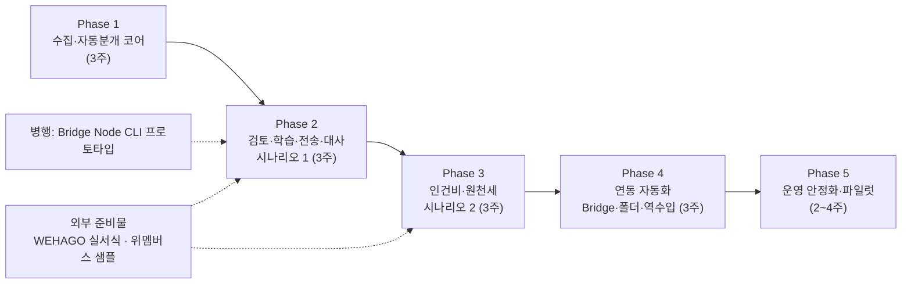

# 06. MVP 계획 · 인수 기준 — MIN TAX OPS

- 문서 상태: v1 (2026-09-26)
- 관련 문서: [03-architecture](./03-architecture.md) · [04-erd](./04-erd.md) · [05-screen-ia](./05-screen-ia.md) · [integration-architecture](./integration-architecture.md) · [desktop-bridge-design](./desktop-bridge-design.md)
- 기간은 엔지니어 2명 기준 **추정치**다. 외부 준비물(§5)이 늦어지면 해당 항목은 MOCK으로 진행하고, 완료 기준에 "실서식 전환"을 따로 둔다.

---

## 0. 현재 위치 (기준선)

| 항목 | 상태 |
|---|---|
| 모노레포 골격 (pnpm, TS 5.9 strict, vitest 3 unit/integration 프로젝트) | 완료 |
| 도메인 계약 `packages/core` (types, money, normalize, dsl, fingerprint, policy, hash) | 완료 |
| DB 스키마 31개 테이블 + 초기 마이그레이션 `0000_init.sql` | 완료 |
| 웹 디자인 토큰 (`tailwind.config.ts`, `globals.css`) | 완료 |
| adapters · security · ai · server · worker · bridge · seed 구현 | 병렬 진행 중 |
| 외부 조사: WEHAGO(research/01), 위멤버스(research/02) | 완료 (원문 미열람 항목은 검증필요) |

---

## 1. 단계 개요

| Phase | 목표 | 핵심 산출물 | 종료 조건 |
|---|---|---|---|
| 1 | 파일 한 개를 넣으면 전 거래가 근거 있는 판단을 갖는다 | 파일 어댑터, 가져오기 파이프라인, 중복 판정, 계정·부가세·위험 엔진, Job Queue, 로그인·RBAC·감사 기초, 합성데이터·골든셋 v1 | 골든셋 기준 충족(§2.1) |
| 2 | 예외만 사람이 보고, 1원도 틀리지 않은 WEHAGO 파일을 만든다 | 예외 검토 Grid·설명 패널·키보드, 빠른 검토, 학습·규칙 제안, Rule Studio, 대사 엔진, WEHAGO 템플릿, 전송센터, 대시보드, 알림, KPI | **시나리오 1 통과** |
| 3 | 급여는 바뀐 사람만 본다 | 직원(암호화), 급여 변동 엔진, 월 급여 마법사 7단계, 세법 파라미터 설정, 급여 템플릿, 신고 작업, Control Tower, 접수증 업로드·매칭 | **시나리오 2 통과** |
| 4 | 파일을 사람이 옮기지 않는다 | Desktop Bridge(Tauri), 다운로드 폴더 감지, 클라우드 폴더, WEHAGO 역수입 대사, 위멤버스 ZIP 접수증 수집, 연동 설정 화면, MFA·IP 제한·키 교체, AI Provider(선택) | 사무소 PC 1대 파일럿 1주 무사고 |
| 5 | 실제 사무소에서 안전하게 운영한다 | Self-Improvement Loop 화면·게이트, 관측·백업·복구 리허설, 성능(월 20만 건), 보안 점검, 실데이터 파일럿(수임처 3~5곳) | 파일럿 1개월 대사 오류 0, 사고 0 |

---

## 2. 단계별 범위와 완료 기준 (Definition of Done)

### 공통 DoD (모든 마일스톤에 적용)

1. **타입**: 변경한 패키지의 `npx tsc -p tsconfig.json --noEmit` 오류 0
2. **테스트**
   - 변경 코드에 unit 테스트(`*.test.ts`)가 있다.
   - DB가 필요한 경로에는 integration 테스트(`*.int.test.ts`)가 있다.
   - `vitest run --project unit` 전체 통과
3. **금액 불변식**: 금액을 다루는 코드는 정수 검사(`assertWon`)를 통과한다. 대사 등식 테스트가 있다(무작위 입력 속성 테스트 포함).
4. **감사**: 사람의 데이터 변경 API는 모두 `audit_logs`를 남긴다(테스트로 확인).
5. **보안**
   - 새 API는 권한 검사 테스트를 갖는다(허용 1 + 거부 1 이상).
   - 로그·오류 메시지에 주민번호·카드 전체번호 패턴이 없다(스크럽 테스트).
6. **UX**
   - 사용자 오류 문구는 한국어이고 원인·범위·다음 행동을 갖는다.
   - 500을 그대로 노출하지 않는다.
7. **정직성**: 확인되지 않은 외부 사실(서식 열, 코드값, 법정 기한·세율)은 설정값·템플릿 데이터로 두고 "검증필요"를 표시한다. 코드 상수로 박지 않는다.
8. **데이터**: 저장소와 preview 환경에는 합성데이터만 둔다.
9. **문서**: 계약·연동 상태가 바뀌면 해당 docs를 같은 변경에서 고친다.

### Phase 1 — 수집·자동분개 코어

| 범위 | 세부 |
|---|---|
| 파일 어댑터 | 헤더 앵커 기반 형식 감지(상위 20행 스캔), 레이아웃 지문, 홈택스 원본 3종 프로파일(전자세금계산서: 헤더 6행은 코드 3건 일치, 33열 순서는 1건 근거라 샘플로 확정, 다중 품목 행은 승인번호로 묶음 · 사업용카드 14열 · 현금영수증 부분) + 위멤버스 **MOCK** 프로파일. xlsx(exceljs 스트리밍), csv(papaparse + CP949 판별), HTML 위장 xls |
| 가져오기 | `files`(sha256, 암호화 저장) → `import_jobs` → `transaction_sources`(모든 행) → 정규화 → fingerprint → 중복 → `transactions`. 수임처 단위 advisory lock |
| 엔진 (`core`, 순수) | 계정 Level 1~8, 부가세 엔진, 위험 엔진(`review_rules` kind 8종), 정책(`reviewLevelFor`) |
| AI | 휴리스틱 Provider(외부 전송 없음), 신뢰도 상한 85 |
| Job Queue | `jobs` 획득(`SKIP LOCKED`)·재시도·리퍼·진행률 |
| 보안 기초 | 로그인(scrypt, 잠금), 세션(해시, 유휴/절대 만료), RBAC 권한표, 감사로그 기록 도우미 |
| 시드 | 합성 수임처 5곳 × 6개월 이력, 기본 규칙(`system_default`), **골든셋 v1**(거래 1,000건 이상, 정답 계정·부가세·버킷) |

**Phase 1 DoD**

- 골든셋에서 다음을 만족한다(목표치이며 설정 변경 없이 측정한다).
  - 자동확정으로 판정된 거래의 계정 정답률 ≥ 99%, 부가세 정답률 ≥ 99%
  - 차단 위험 규칙에 걸려야 하는 거래가 자동확정된 수 = 0
  - 원본 행 수 = `transaction_sources` 행 수 (유실 0)
- 같은 파일을 두 번 넣어도 거래가 늘지 않는다(파일 sha256). 같은 거래가 다른 채널로 들어오면 중복으로 보관된다(fingerprint).
- 500행 파일의 가져오기 + 분류가 개발 PC에서 30초 안에 끝난다(참고 지표).

### Phase 2 — 검토·학습·전송·대사 (시나리오 1)

| 범위 | 세부 |
|---|---|
| 예외 검토 | Grid(가상화, 10개 열), 키보드 `A/E/M/R/J/K/Space/Shift+A`, 설명 패널, 되돌리기 토스트 |
| 빠른 검토 | 묶음 승인·묶음 수정, 이상치 분리 |
| 학습 | `classification_corrections` 기록, 동일 수정 3회 → 규칙 제안, 알림 `rule_suggested` |
| Rule Studio | DSL 편집기, 읽기 문장, 검증, 백테스트(최근 3개월), 승인 권한 |
| 대사 | `pre_export` 등식(4개 차원 × 전체·증빙별·계정별), 차이 분류, 전송 차단 |
| WEHAGO | 매입매출·일반전표 템플릿 레지스트리(`template_key/version`, 제목행 해시), **실서식을 받기 전에는 MOCK**, 파일 재읽기 검증 |
| 전송센터 | 파이프라인 7단계, 행별 다음 행동, 다운로드 감사, 업로드 완료 확인 |
| 대시보드·알림·KPI | 버킷 집계, 문제 알림 6종(자동 해소), `kpi_snapshot` |
| 병행 | Bridge Node CLI 프로토타입(업로드 경로·서명 검증) |

**Phase 2 DoD**: 아래 **시나리오 1 인수 테스트** 통과 + 부정 테스트(§3.1.4) 통과.

### Phase 3 — 인건비·원천세 (시나리오 2)

| 범위 | 세부 |
|---|---|
| 직원 | 주민번호·계좌 암호화, blind index, 마스킹, 열람 감사 |
| 급여 | 전월 복사, 엑셀 가져오기, 변동 분류(`PayrollChangeKind`), 7단계 마법사, 확정 잠금 |
| 세액·기한 | **효력일이 있는 세법 파라미터**(`settings`)로 계산한다. 값마다 출처·확인일을 기록한다. 기본값은 research/03 §4.3(법령 미러 원문). law.go.kr 대조와 세무사 확인 전에는 검증필요 표시 |
| 파일 | WEHAGO 급여자료·사업소득·일용직 템플릿(실서식 전에는 MOCK), 급여대장 검토 엑셀 |
| 신고 | `filing_jobs` 생성·단계 갱신, Control Tower, 접수증·납부서 업로드와 PDF 텍스트 매칭 |

**Phase 3 DoD**

- 아래 **시나리오 2 인수 테스트** 통과
- 세액 계산이 research/03 §4.4 **테스트 벡터 T1~T6**을 통과한다
  - 예: 일용 일급 200,000 → 소득세 1,350 · 지방 135
  - 예: 일급 187,000 → 소액부징수 0
  - 끝수 처리 단계는 WEHAGO 결과로 확정하기 전까지 검증필요로 둔다(research/03 U12)
- 신고 기한 계산이 요일 보정을 포함해 research/03 §4.5 캘린더와 일치한다

### Phase 4 — 연동 자동화

| 범위 | 세부 |
|---|---|
| Desktop Bridge | Tauri 패키징, 폴더 감시, 형식 스니핑(서버 프로파일), 서명 업로드, 결과 파일 받기, 폴더 이동, 로컬 로그, OS 키체인, 자동 업데이트, 코드 서명 |
| 채널 | 다운로드 폴더 감지(C), 클라우드 폴더(D: S3 호환 prefix / SFTP·NAS) |
| 역수입 대사 | WEHAGO 매입매출장 엑셀 → `post_export` 대사(일자 + 사업자번호 + 금액 + 과세유형) |
| 신고 결과 | 위멤버스 신고리스트 일괄 ZIP → 접수증·납부서 자동 매칭 |
| 보안 강화 | 관리자 MFA 필수, 허용 IP, 키 교체 재암호화 작업, Bridge 기기 관리 |
| AI (선택) | Anthropic Provider(환경변수로 켬), 장부 검토(`ai_reviews`) |

**Phase 4 DoD**

- 사무소 PC 1대에서 1주 동안 다운로드한 파일이 사람 개입 없이 수집된다. 수집 누락 0, 중복 업로드 0.
- Bridge 토큰 폐기가 1분 안에 반영된다.
- 서명이 없거나 만료된 요청은 거부된다(테스트).

### Phase 5 — 운영 안정화·파일럿

| 범위 | 세부 |
|---|---|
| Self-Improvement Loop | `system_errors` 수집·지문, 루프 상태 화면, 게이트(재현 테스트 + 골든셋 + 대사 불변식), preview 비교 보고서 |
| 운영 | 구조화 로그, 헬스체크, 큐 적체 알림, 백업(PITR)·**복구 리허설**, 키 백업 절차 |
| 성능 | 월 20만 건 기준 예외함 첫 화면 < 1초, 대사 < 10초(수임처·월 단위) |
| 보안 점검 | 권한 우회·IDOR·CSRF·파일 업로드 점검, 의존성 취약점 |
| 파일럿 | 실서식 확보 후 수임처 3~5곳 실데이터 1개월 |

**Phase 5 DoD**: 파일럿 1개월 동안 대사 오류로 인한 잘못된 WEHAGO 업로드 0건, 개인정보 사고 0건, 자동처리율과 수정률이 매월 기록됨.

---

## 3. 성공 시나리오 = 인수 테스트

두 시나리오는 **합성데이터로 결정적으로 재현**되어야 한다. 구현 위치(제안)는 다음과 같다.

- 서비스 수준: `packages/server/src/scenarios/*.int.test.ts` (실제 PostgreSQL)
- 화면 수준: `tests/e2e/scenario-*.spec.ts` (Playwright)
- 픽스처: `packages/seed` (골든셋과 같은 생성기, 고정 시드)

### 3.1 시나리오 1 — 카드 500건 월 처리

**목표 문장**: "카드 500건 → 470건 자동확정 → 30건 예외 → 4건 수정 → 학습 → WEHAGO Import 생성 → 대사 → 업로드 준비 → 감사로그"

#### 3.1.1 준비 (Given)

| 항목 | 값 |
|---|---|
| 수임처 | 합성 "시나리오상사" (개인, 일반과세, 업종 `service`) |
| 이력 | 2026-03 ~ 2026-08 확정 거래(주요 거래처별 반복 이력, 사람 수정 일부 포함) |
| 규칙 | `system_default` 기본 규칙 + 수임처 `user` 규칙 몇 개 |
| 정책 | `DEFAULT_CONFIDENCE_POLICY` (95 / 80 / 3) |
| 입력 파일 | 홈택스 사업용카드 형식(14열) 합성 xlsx, 2026-09, **500행**, 원본 합계 `S`(픽스처에 기록) |
| 예외 설계 | 30건. 주 버킷: 신규 거래처 10, 저신뢰도 6, 공제/불공제 검토 5, 고액 3, 계정과목 충돌 3, 자산 가능성 2, 해외결제 1 |
| 수정 설계 | 30건 중 4건은 정답이 추천과 다르다. 그중 3건은 같은 거래처(합성 "쿠팡")이고 정답은 `소모품비 → 사무용품비`다 |
| WEHAGO 서식 | 매입매출 템플릿(실서식 등록 전에는 MOCK) |
| 수임처 전송 범위 | "카드 매입을 MIN TAX OPS 파일로 반영"을 켬(이중 기장 방지 설정 — [integration-architecture §8](./integration-architecture.md)) |

#### 3.1.2 실행과 기대 결과 (When / Then)

| # | 행동 | 기대 결과 (검증 대상) |
|---|---|---|
| 1 | 파일 업로드 | `import_jobs`: `succeeded`, `total_rows=500`, `imported_rows=500`, `duplicate_rows=0`, `failed_rows=0`, `source_*_amount` = 픽스처 합계 · `transaction_sources` 500행 모두 `ok` |
| 2 | 분류 작업 완료 | `transactions`: `auto_approved` **470**, `needs_review` **30** · 자동확정 470건은 모두 `confidence_score ≥ 95`이고 차단 위험 0 · 예외 30건은 모두 버킷 ≥ 1개 · `classification_results` 500행 · 대시보드 자동처리율 **94.0%** |
| 3 | 예외 검토: 26건 승인(`A`, `Shift+A`), 4건 수정(`M`) | `approved` 30 · `classification_corrections` **4행**(`field=account`, `before_source`·`before_confidence` 기록) · `touch_count ≥ 1`인 거래 30 |
| 4 | 학습: 3번째 "쿠팡" 수정 직후 | `mapping_rules` 1행: `status=suggested`, `origin=system_suggested`, `suggestion_reason`에 "동일 수정 3회" · `classification_corrections.suggested_rule_id` 연결 · 알림 `rule_suggested` 1건 |
| 5 | manager가 Rule Studio에서 백테스트 확인 후 승인 | `status=active`, `approved_by` 기록, 감사 `rule.approve` · **검증용 추가 파일**(2026-10 쿠팡 2건)을 넣으면 2건 모두 `classification_source=user_rule`, `confidence_score=99`, `auto_approved` |
| 6 | 대사 실행 (`pre_export`) | `reconciliation_jobs`: `balanced=true`, `export_allowed=true` · 등식: source 500 / S = export 500 / S + 중복 0 + 제외 0 + 실패 0 + 대기 0 · 4개 차원 모두 차이 0원 · 증빙별·계정별 소계도 균형 |
| 7 | WEHAGO 파일 생성 | `export_jobs`: `kind=wehago_purchase_sales`, `status=ready`, `row_count=500`, 금액 합계 = S · `export_items` 500행 · 생성 파일을 **다시 읽은** 합계 = S · MOCK 서식이면 파일명 `MOCK_` 접두사와 경고 행 |
| 8 | 업로드 파일 받기 | `status=downloaded`, `downloaded_at` 기록, 감사 `export.download` · 전송센터 단계 "전송" |
| 9 | 감사로그 확인 | 아래 표의 로그가 모두 있고, 각 로그에 before/after와 사람이 읽는 요약이 있다 |

| 기대 감사로그 | 건수 | 되돌리기 가능 |
|---|---:|:-:|
| `transaction.approve` | 26 | ● |
| `transaction.correct` | 4 | ● |
| `rule.approve` | 1 | ● |
| `export.create` | 1 | |
| `export.download` | 1 | |
| 시스템 로그(`category=system`): 가져오기·분류·대사 실행, 규칙 제안 생성 | 각 1 이상 | |

#### 3.1.3 KPI 기대값

정의는 [02-automation-matrix §4](./02-automation-matrix.md#4-kpi-정의)를 따른다. 모수 `E` = 500이다(중복·실패 0).

| KPI | 값 |
|---|---|
| 자동처리율 (= 1 − 검토 비율) | 470 / 500 = **94.0%** |
| 검토 비율 (Manual Review Rate) | 30 / 500 = 6.0% |
| No-Touch율 | 470 / 500 = 94.0% (자동확정 470건 중 사후 수정 0) |
| 자동분류 정확도 (Auto Classification Rate) | 엔진 계정이 그대로 남은 496 / 500 = 99.2% |
| 수정률 (Correction Rate) | 4 / 500 = 0.8% |
| 대사 오류 | 0 |

#### 3.1.4 부정 테스트 (같은 픽스처에서 하나씩 바꿈)

| 변형 | 기대 |
|---|---|
| 전송 대상 1건의 부가세를 1원 줄임 | `balanced=false`, `unexplained`(blocking) · `export_jobs.status=blocked` · 문구 "부가세 합계가 원본보다 1원 적습니다. 1원 차이도 전송하지 않습니다." |
| 1건을 검토하지 않고 남김 | `pending_review` blocking · "검토하지 않은 거래가 1건 있어 파일을 만들 수 없습니다. [1건 검토하기]" |
| 계정코드가 계정표에 없는 거래 3건 | 파일 생성 차단 · "WEHAGO 파일 생성 중 3건의 계정코드를 찾지 못했습니다. [3건 검토하기]" |
| 같은 파일을 다시 업로드 | 거래 수 변화 없음 · "이미 가져온 파일입니다" |
| 같은 거래 7건을 다른 채널(Bridge)로 다시 넣음 | 7건이 `duplicate`로 보관(삭제 없음) · 대사에서 `duplicate_excluded`(설명됨)로 균형 유지 |
| 금액 칸이 깨진 행 2건 | `failed_rows=2`, `partial` · 금액을 알 수 없으면 `parse_failed` blocking |
| WEHAGO 서식 제목행 해시 불일치 | 파일 생성 차단 · "등록된 서식과 제목줄이 다릅니다" |
| staff가 규칙 승인 시도 | 403 · "규칙 승인 권한이 필요합니다" · 감사 `security` 로그 |

### 3.2 시나리오 2 — 직원 10명 월 급여

**목표 문장**: "직원 10명 중 급여변경 1 + 퇴사 1 → 변경된 2명만 검토 → 원천세·간이지급명세서·WEHAGO 작업파일 준비"

#### 3.2.1 준비 (Given)

| 항목 | 값 |
|---|---|
| 수임처 | "시나리오상사", 원천세 매월 납부(`withholding_semiannual=false`) |
| 직원 | 근로소득 10명(합성 주민번호는 형식만 맞춘 **가짜 값**, 암호화 저장) |
| 전월 | 2026-08 `payroll_months.status=confirmed`, `payroll_items` 10행 |
| 9월 입력 | 수임처 제출 급여 엑셀(합성): 김민수 기본급 3,300,000 → 3,630,000 (+10%). 최지훈은 9월 명단에 없음(8/31 퇴사). 나머지 8명은 8월과 같음 |
| 세법 파라미터 | 테스트 픽스처 세트(간이세액표·지방소득세 비율 등). 실제 값의 정확성은 이 테스트 범위 밖이다(§5) |
| 서식 | WEHAGO 급여자료 템플릿(실서식 전에는 MOCK) |

#### 3.2.2 실행과 기대 결과

| # | 단계 | 기대 결과 |
|---|---|---|
| 1 | 마법사 1~2단계: 전월 복사 + 엑셀 반영 | `payroll_months(2026-09)` 생성, `wizard_step=2` · 재직자 행 생성(`origin`: `carried_forward` 8, `imported` 1) |
| 2 | 3단계 변경분 검토 | 검토 대상 **정확히 2명**: 김민수 `kinds=[pay_changed]`, `changeRate=10.0` · 최지훈 `kinds=[missing_this_month]` · 나머지 8명 `needs_review=false`(기본으로 접힘) · `diff_summary`: `{unchanged: 8, pay_changed: 1, missing_this_month: 1}` |
| 3 | 김민수 확인(`A`) · 최지훈 "퇴사 처리"(퇴사일 2026-08-31) | `employees.resign_date` 기록, 감사 `employee.update` · 9월 대상 9명 · 검토 대상 0 → 알림 `payroll_unreviewed` 자동 해소 · 인건비 수동 터치 **2** |
| 4 | 4단계 세액 계산 | 9명 모두 소득세·지방소득세 계산 · 검산: 각 행 `gross_pay = taxable_pay + non_taxable_pay`, `net_pay = gross_pay − income_tax − local_income_tax − other_deductions` · 모든 금액 정수 |
| 5 | 5단계 확정 | `status=confirmed`, `confirmed_by` · 확정 후 행 수정 API는 거부 |
| 6 | 6단계 파일 생성 | `export_jobs`: `kind=payroll_earned`, `status=ready`, 행 9 · 파일 재읽기 합계 = Σ `payroll_items` · 주민번호가 들어간 파일은 암호화 저장, 다운로드 시 감사 |
| 7 | 7단계 신고 연계 | `filing_jobs(period=2026-09)` 생성: `withholding`(payload: 인원 9, 지급총액 = Σ gross, 소득세 = Σ income_tax, `due_date=2026-10-12` — 10-10 토요일 보정), `local_income_tax`(= Σ local_income_tax, 같은 기한) · 근로 간이지급명세서는 **2026년 반기 제출**이므로 `simplified_statement_earned(period=2026-12, due_date=2027-02-01)` 묶음 작업의 `payload`에 9월분이 더해진다(월별 작업을 만들지 않음) · `current_step=withholding_ready` · Control Tower에 표시 |
| 8 | 감사로그 | `payroll.review`(1), `employee.update`(1), `payroll.confirm`(1), `export.create`(1) + 시스템 로그 |

#### 3.2.3 부정 테스트

| 변형 | 기대 |
|---|---|
| 한 명의 급여 +25% | `pay_changed_large`, severity 상향, 검토 대상 포함 |
| 신규 입사자 주민번호 없음 | `new_hire` + `missing_id` · 확정 차단 "주민번호가 없는 직원 1명" |
| 0원 지급 | `zero_pay` 검토 대상 |
| 확정 후 수정 시도 | 거부 · "확정된 급여입니다. 수정하려면 확정을 되돌려야 합니다(관리자)" |
| `payroll.sensitive` 없는 사용자의 주민번호 열람 | 403, 마스킹만 보임 |
| 사업소득자 1명(지급 1,000,000원) 추가 | 소득세 30,000 · 지방 3,000 · `simplified_statement_business(period=2026-09, due_date=2026-11-02)` 생성(10-31 토요일 보정) |
| 반기납부 수임처(`withholding_semiannual=true`) | 9월분 원천세가 `period=2026-12` 반기 작업(기한 2027-01-11, 01-10 일요일 보정)에 누적 |

---

## 4. 위험과 대응

| 위험 | 영향 | 대응 |
|---|---|---|
| WEHAGO 매입매출·급여 업로드 서식 열 구성 미확인(research/01 U2, U7) | 실제 업로드 불가 | 템플릿 레지스트리 + MOCK으로 개발. 실서식을 받으면 템플릿 데이터만 추가한다(코드 변경 최소화) |
| 위멤버스 엑셀 레이아웃 미확인(research/02 U2) | 위멤버스 파일 자동 판정 불가 | 홈택스 원본 프로파일을 1순위로 쓴다. 알 수 없는 서식은 격리하고 사람이 지정한다 |
| `.xls`(BIFF) 입출력 | 일부 파일 처리 불가 | [03 §13.1](./03-architecture.md#131-왜-pythonopenpyxl이-아니라-typescriptexceljs인가) 대응 순서 |
| 수임처별 계정과목표·거래처코드 테이블 부재(03 §14 G1·G2) | 매입매출 파일 생성 시 코드 누락 | Phase 2 시작 전에 계약 소유자가 결정. 그 전에는 사무소 표준 계정표와 코드 누락 차단으로 운영 |
| 이중 기장(WEHAGO T 자체 수집과 중복) | 장부 오류 | 수임처별 전송 범위 설정 + 역수입 대사(`extra_in_wehago`) |
| 세법 파라미터 오류 | 세액 오계산 | 연도별 파라미터 테이블 + 출처·확인일 + 세무사 확인 전 검증필요 표시 |
| 스크래핑 규제(2026-08-20 시행령) | 위멤버스 수집 중단 가능 | 홈택스 원본 수동 업로드 경로를 상시 유지한다(research/02 U11) |
| 학습 오염(잘못된 수정의 반복) | 자동확정 오류 확산 | 규칙은 사람 승인 필수, 수정 기억만으로는 자동확정 불가(최대 94), 백테스트 |

---

## 5. 사무소 대표(오너) 준비물 — 일정의 선행 조건

| # | 준비물 | 필요한 때 | 쓰임 |
|---|---|---|---|
| U1 | WEHAGO T에서 **엑셀서식 내려받기** 파일: 매입매출전표, 신용카드, 급여자료입력(1줄·2줄), 사원등록, 사업소득자등록, 일용직사원등록 | Phase 2·3 시작 | 템플릿 확정(MOCK 해제) |
| U2 | WEHAGO 일반전표 업로드 시 **열 매칭 설정 화면** 캡처와 한 번 성공한 샘플 | Phase 2 | 일반전표 표준 출력 |
| U3 | WEHAGO 매입매출장 **엑셀 변환** 샘플 1개 | Phase 4 | 역수입 대사 |
| U4 | 수임처별 **계정과목표** export와 코드체계(3/5자리), **거래처등록 LIST** 엑셀 | Phase 2 | 계정·거래처코드 매핑 |
| U5 | 위멤버스 **통합자료 엑셀**, **신고리스트 일괄 ZIP** 샘플 각 1개(개인정보 마스킹) | Phase 1~4 | 형식 프로파일 등록 |
| U6 | 홈택스 원본 3종 샘플(전자세금계산서 목록, 사업용카드 공제확인, 현금영수증 매입) | Phase 1 | 1순위 파서 확인 |
| U7 | 웹케시(위멤버스)·더존(WEHAGO)에 **제휴 API·자동화 허용 여부 서면 문의** | 언제든 | 연동 상태 재평가 |
| U8 | **세법 파라미터 확정**: research/03·04가 법령 미러로 확인한 값의 law.go.kr 원문 대조, 근로소득 간이세액표 연도판, 끝수 처리 단계(U12), 비과세 한도, 2026 세법개정 결과(근로 간이지급명세서 2027-01 월별 전환 유지 여부), WEHAGO 불공제사유 번호표 — 세무사 검토 | Phase 3 | 세액·기한 계산 |
| U9 | 배포 형태 결정(국내 리전 클라우드 / 사내 서버), 백업 보관 위치 | Phase 4 | 운영 환경 |
| U10 | Bridge **코드 서명 인증서**(Windows) 구매 결정 | Phase 4 | 설치 경고 방지 |
| U11 | 개인정보 처리방침·위탁·국외이전(AI 사용 시) 검토 | Phase 4 | AI Provider 활성화 조건 |
