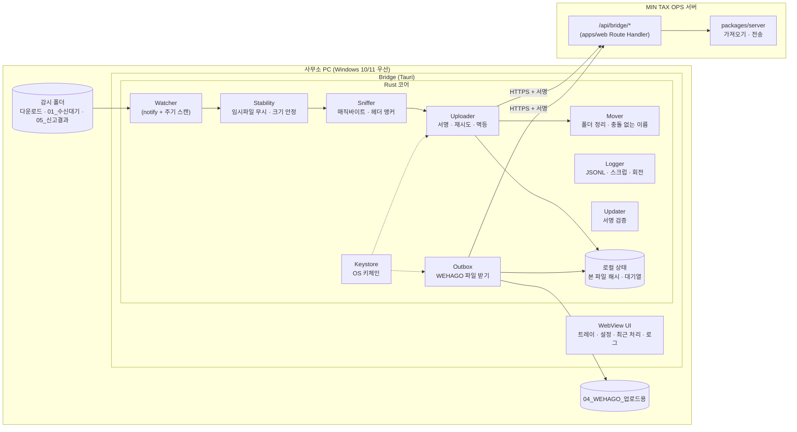
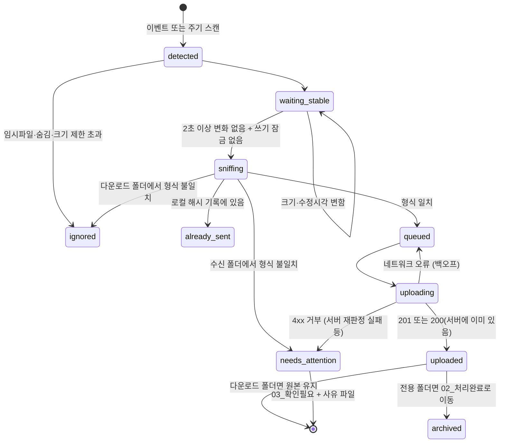
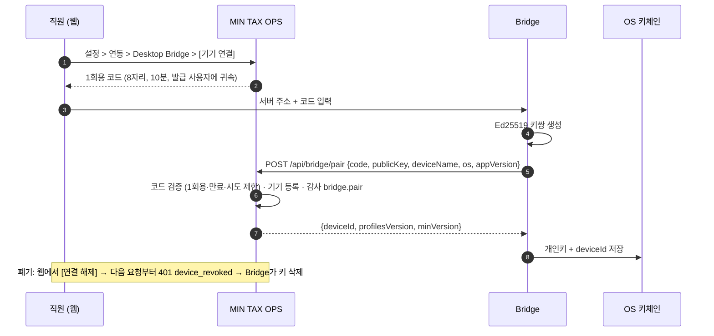
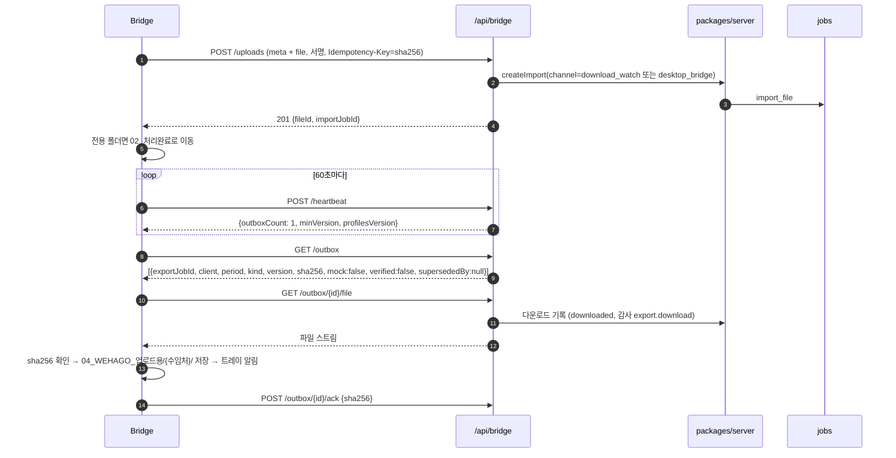

# Desktop Bridge 설계 — 사무소 PC 경량 에이전트

- 문서 상태: v1 (2026-09-26)
- 구현
  - 현재(2026-09-26): **미착수**. `apps/bridge`에는 `package.json`·`tsconfig.json`만 있고, 서버 `/api/bridge/*`도 없다. 아래 §11이 첫 구현 범위다.
  - 다음: `apps/bridge` Node CLI 프로토타입 (`pnpm --filter @mintax/bridge start`, 의존성은 `@mintax/core`만)
  - 목표: Tauri 앱 (Phase 4)
- 관련 문서: [integration-architecture](./integration-architecture.md) (Adapter C·E), [03-architecture §10 보안](./03-architecture.md#10-보안-아키텍처), [06-mvp-plan](./06-mvp-plan.md)
- 서버 API(`/api/bridge/*`)는 이 문서가 **제안하는 계약**이다. `apps/web` Route Handler 구현이 확정되면 그쪽이 기준이다.

---

## 0. 왜 필요한가

- 위멤버스·홈택스·WEHAGO에는 확인된 자동 연동 API가 없다([integration-architecture §0](./integration-architecture.md#0-결론-먼저)). 자료는 **사무소 PC의 다운로드 폴더**에 파일로 떨어진다.
- 브라우저(웹앱)는 보안상 PC 폴더를 감시하거나 파일을 옮길 수 없다.
- 그래서 직원이 매번 파일을 찾아 올리고, 만든 WEHAGO 파일을 받아 정리하는 "손 작업"이 남는다. Bridge는 이 **파일 이동만** 자동화한다.

### 0.1 하는 일

1. 지정 폴더(다운로드 폴더, Bridge 수신 폴더, 신고결과 폴더)를 감시한다.
2. 새 파일이 위멤버스·홈택스·WEHAGO 서식인지 **가볍게 판별**한다(최종 판정은 서버).
3. 서명된 요청으로 서버에 올리고, 결과에 따라 파일을 폴더로 정리한다.
4. 서버가 준비한 WEHAGO 업로드 파일을 받아 수임처별 폴더에 저장하고 알려 준다.
5. 로컬 로그를 남기고, 자동 업데이트한다.

### 0.2 하지 않는 일

- 위멤버스·홈택스·WEHAGO에 **로그인하거나 화면을 조작하지 않는다**(RPA 아님).
- 인증서·비밀번호를 다루지 않는다.
- 파일 내용을 해석해 장부를 판단하지 않는다(서버 `adapters`가 권한을 가진다).
- 서버의 원격 명령을 실행하지 않는다. 서버는 형식 프로파일·최소 버전 같은 **정해진 설정 값**만 내려준다.
- 형식과 맞지 않는 파일은 이름도 내용도 서버로 보내지 않는다.

---

## 1. 사용자 흐름

| # | 상황 | Bridge 동작 | 사람이 하는 일 |
|---|---|---|---|
| 1 | 직원이 위멤버스에서 통합자료 엑셀을 받음 | 다운로드 폴더에서 감지 → 서식 일치 → 업로드 → 트레이 알림 "상록건설 카드 500건 업로드됨 · 예외 30건" | 알림을 눌러 예외 검토 |
| 2 | 직원이 홈택스 원본 엑셀을 받음 | 위와 같음 (`hometax_*` 프로파일) | — |
| 3 | 서버에서 WEHAGO 파일이 `ready`가 됨 | 다음 하트비트(≤60초)에 받아 `04_WEHAGO_업로드용/상록건설/2026-09_매입매출_v2.xlsx`로 저장 → 알림 | WEHAGO에서 [엑셀서식 불러오기] → 웹에서 "업로드 완료 확인" |
| 4 | 위멤버스 신고리스트 일괄 ZIP을 받음 | `05_신고결과`에 넣거나 설정으로 자동 감지 → 업로드 → 서버가 PDF 본문으로 접수증·납부서 매칭 | 매칭 실패분만 웹에서 지정 |
| 5 | 서식을 모르는 엑셀 | 업로드하지 않음(다운로드 폴더) 또는 `03_확인필요`로 이동하고 사유 파일 생성(수신 폴더) | 필요하면 웹에서 직접 업로드·서식 지정 |
| 6 | 인터넷 끊김 | 로컬 대기열에 넣고 재시도(최대 24시간), 트레이 상태 "오프라인 · 대기 3건" | — |

---

## 2. 구성



| Rust 구성 (예정) | 용도 |
|---|---|
| `notify` (+ debouncer) | 파일시스템 이벤트 |
| `calamine` | xlsx·**xls(BIFF)**·ods 읽기. 헤더 스니핑, 선택적 xls → xlsx 변환(§4.4) |
| `zip` | ZIP 목록 확인(신고결과 일괄 다운로드) |
| `reqwest` (rustls) | HTTPS |
| `ed25519-dalek`, `sha2`, `hmac` | 요청 서명, 해시 |
| `keyring` | Windows 자격 증명 관리자 / macOS 키체인 / Linux Secret Service |
| `tracing` + 파일 회전 | 로컬 로그 |
| Tauri 플러그인: updater, autostart, single-instance, notification | 자동 업데이트, 로그인 시 시작, 중복 실행 방지, 알림 |

크레이트·플러그인 이름과 옵션은 구현 시점의 Tauri v2 공식 문서로 다시 확인한다.

---

## 3. 폴더 구조와 파일 수명주기

### 3.1 기본 폴더 (설정에서 위치 변경 가능)

```
문서\MIN TAX OPS\
  01_수신대기\                 ← 여기에 넣으면 업로드 (Adapter E, 업로드 후 이동)
  02_처리완료\2026-09\         ← 서버 수신 확인된 파일
  03_확인필요\                 ← 서식 불명·수임처 불명·서버 거부 + 같은 이름의 .사유.txt
  04_WEHAGO_업로드용\상록건설\  ← 서버가 준비한 WEHAGO 파일 (읽기 전용 권장)
  05_신고결과\                 ← 접수증·납부서 PDF / 위멤버스 일괄 ZIP
다운로드\                      ← 감지만 (Adapter C, 기본은 원본 유지)
```

| 폴더 | 업로드 후 원본 | 이유 |
|---|---|---|
| 다운로드 (C) | **유지** (설정으로 이동 가능) | 사용자 공간이므로 건드리지 않는다. 다시 올리지 않는 것은 로컬 해시 기록으로 보장한다 |
| 01_수신대기 (E) | **02_처리완료로 이동** | Bridge 전용 폴더. 처리 상태가 폴더 위치로 보인다 |
| 05_신고결과 | **02_처리완료로 이동** | 위와 같음 |

- 이름 충돌이 나면 `파일명 (2).xlsx`처럼 번호를 붙인다. 덮어쓰지 않는다.
- 이동은 같은 볼륨 안의 rename으로 한다. 다른 볼륨이면 복사 → 해시 확인 → 원본 삭제 순으로 한다.

### 3.2 파일 상태



---

## 4. 감지와 판별

### 4.1 안정성 판정

- **무시할 이름**: `*.crdownload`, `*.part`, `*.partial`, `*.download`, `*.tmp`, `~$*`(Office 잠금), `.~lock.*#`, 숨김·시스템 파일
- **안정 판정**: 크기와 수정시각이 2초 동안 같다. 그리고 공유 읽기로 열 수 있어야 한다(Windows에서 쓰기 중 잠금 확인).
- **크기 제한**: 50MB(설정값). 넘으면 무시하고 로그에 남긴다.
- **이벤트 유실 대비**: 30초마다 전체 스캔한다. 네트워크 드라이브와 동기화 폴더는 이벤트가 빠지는 경우가 있다.

### 4.2 형식 판별 (가벼운 판별 → 서버 재판정)

1. 매직바이트
   - `PK\x03\x04` → xlsx(`[Content_Types].xml` 포함) 또는 ZIP
   - `D0 CF 11 E0` → xls
   - `%PDF` → PDF
   - `<`로 시작하고 `<table` 포함 → HTML 위장 xls
   - 텍스트 → CSV
2. 헤더 앵커: 첫 시트 상위 30행만 읽는다. 셀 값을 정규화(NFKC, 공백 제거)한 뒤 **서버가 내려준 프로파일의 앵커 조합**과 비교한다.
3. 판정
   - 앵커 조합 하나가 모두 일치하면 `matched(profileKey)`
   - 일부만 일치하면 `unknown`
   - 파일명은 참고 점수로만 쓴다.
4. ZIP: 항목 목록만 본다(압축 해제는 서버). PDF가 들어 있고 신고결과 폴더에서 왔으면 `filing_bundle`
5. PDF: **신고결과 폴더에서 온 것만** 올린다. 다운로드 폴더의 PDF는 기본으로 올리지 않는다(PDF는 너무 흔해서 오탐 위험이 크다).

형식 프로파일은 **데이터**(JSON)다. 서버 `GET /api/bridge/profiles`에서 버전과 함께 받는다. 서버 `adapters`와 같은 앵커 정의를 공유하므로 Rust와 TypeScript에 규칙이 이중으로 박히지 않는다. 최종 판정은 항상 서버가 파일 전체로 다시 한다.

### 4.3 서버로 보내는 메타데이터

```json
{
  "sha256": "9f2c…",
  "originalName": "카드사용내역_202609.xlsx",
  "sizeBytes": 48213,
  "detectedAt": "2026-09-26T09:10:03+09:00",
  "sourceFolder": "downloads",
  "sniff": { "container": "xlsx", "profileKey": "hometax_card_purchase_v1", "profilesVersion": 7 },
  "bridge": { "deviceId": "dev_…", "appVersion": "0.3.1", "os": "windows-11" }
}
```

- `sourceFolder`는 `downloads | inbox | filing | cloud_sync` 중 하나다. 서버는 이 값으로 `IngestChannel`을 정한다: `downloads`면 `download_watch`, 그 밖은 `desktop_bridge`.
- 헤더 셀 값이나 데이터 행은 메타데이터에 넣지 않는다. 파일 본문은 multipart로 보낸다.

### 4.4 `.xls`(BIFF) 처리 (Phase 4 선택)

서버의 exceljs는 BIFF `.xls`를 읽지 못한다([03 §13.1](./03-architecture.md#131-왜-pythonopenpyxl이-아니라-typescriptexceljs인가)). Tauri Bridge는 `calamine`으로 xls를 읽을 수 있다. 그래서 다음 옵션을 둔다.

- **원본 xls**와 **값만 옮긴 xlsx 변환본**을 함께 올린다. 메타데이터에 `convertedFrom: "xls"`를 넣는다.
- 서버는 변환본으로 파싱하고, 원본은 감사용으로 보관한다.
- 날짜·금액 셀 변환 규칙(엑셀 일련번호 → `YYYY-MM-DD`, 정수 금액)은 골든 테스트로 검증한다.
- 변환 실패 시 `03_확인필요`에 사유를 남긴다.

---

## 5. 서버 API 계약 (제안)

### 5.1 엔드포인트

| 메서드 | 경로 | 용도 | 인증 | 서버 권한 |
|---|---|---|---|---|
| POST | `/api/bridge/pair` | 페어링 코드 교환, 기기 공개키 등록 | 1회용 페어링 코드 | 코드를 발급한 사용자 |
| POST | `/api/bridge/heartbeat` | 상태 보고. 응답은 `serverTime`, `minVersion`, `profilesVersion`, `outboxCount` | 서명 | — |
| GET | `/api/bridge/profiles?since={ver}` | 형식 프로파일(앵커 데이터) | 서명 | — |
| POST | `/api/bridge/uploads` | 파일 업로드(multipart: `meta` JSON + `file`) | 서명 + `Idempotency-Key: {sha256}` | `imports.create` |
| GET | `/api/bridge/uploads/{id}` | 가져오기 결과 요약(건수·예외·오류) | 서명 | 같은 기기 |
| GET | `/api/bridge/outbox` | 받을 파일 목록(`export_jobs.status=ready`, 사용자 접근 가능 수임처) | 서명 | `export.download` |
| GET | `/api/bridge/outbox/{exportJobId}/file` | 파일 받기 → `downloaded`, 감사 `export.download` | 서명 | `export.download` |
| POST | `/api/bridge/outbox/{exportJobId}/ack` | 로컬 저장 확인(`sha256`) | 서명 | 같은 기기 |
| POST | `/api/bridge/logs` | 스크럽된 진단 로그 전송(사용자가 [로그 보내기]를 누른 경우만) | 서명 | — |

**오류 응답**은 한국어로 쓰고 다음 행동을 담는다.

```json
{ "code": "unknown_format", "message": "알 수 없는 서식입니다. 웹에서 서식을 지정해 주세요.", "action": { "label": "서식 지정", "href": "/imports/…" } }
```

| 상황 | 상태 코드 | `code` | Bridge 동작 |
|---|---|---|---|
| 이미 받은 파일 | 200 | `duplicate` | 성공으로 처리, 기존 결과 링크 |
| 서식 불명(서버 재판정) | 422 | `unknown_format` | `03_확인필요` + 사유 |
| 수임처 판정 불가 | 422 | `client_unresolved` | `03_확인필요` + 사유 |
| 파일 과대 | 413 | `too_large` | `03_확인필요` |
| 서명 오류·시각 오차 | 401 | `bad_signature` / `clock_skew` | 재시도하지 않고 "PC 시계를 확인하세요" |
| 기기 폐기 | 401 | `device_revoked` | 키 삭제, "연결이 해제되었습니다" |
| 앱 버전 낮음 | 426 | `upgrade_required` | 업데이트 후 재시도 |
| 권한 없음 | 403 | `forbidden` | 알림, 재시도 안 함 |
| 서버·네트워크 오류 | 5xx·연결 실패 | — | 대기열·지수 백오프(30초 → 최대 30분, 24시간 후 포기 알림) |

### 5.2 요청 서명

모든 요청(페어링 제외)에 다음 헤더를 붙인다.

| 헤더 | 값 |
|---|---|
| `X-MTO-Device` | 기기 ID |
| `X-MTO-Timestamp` | Unix 초 |
| `X-MTO-Nonce` | 16바이트 난수(base64url) |
| `X-MTO-Content-SHA256` | 요청 본문 바이트의 SHA-256(hex). 본문이 없으면 빈 문자열의 해시 |
| `X-MTO-Sig-Alg` | `ed25519`(운영) 또는 `hmac-sha256`(프로토타입) |
| `X-MTO-Signature` | 아래 정규 문자열 서명(base64url) |

```
정규 문자열 = "MTO1" + "\n" + SIG_ALG + "\n" + DEVICE_ID + "\n" + METHOD + "\n" + PATH(쿼리 포함)
            + "\n" + TIMESTAMP + "\n" + NONCE + "\n" + CONTENT_SHA256 + "\n" + IDEMPOTENCY_KEY(없으면 빈 문자열)
```

- 기기 ID·알고리즘·멱등키까지 서명에 넣는다. 서명을 가로챈 사람이 헤더만 바꿔(다른 기기 ID, 다른 멱등키) 재사용하지 못하게 하기 위해서다. 버전 접두사 `MTO1`은 나중에 형식을 바꿀 때 구분하는 용도다.
- **알고리즘은 서버가 정한다.** 서버는 기기에 등록된 알고리즘만 받는다. `X-MTO-Sig-Alg`는 확인용일 뿐이다(다운그레이드 방지). 운영 환경(`NODE_ENV=production`)에서는 `hmac-sha256`을 거부한다. 명시적 시험 플래그가 있을 때만 예외다.

서버 검증 순서:

1. 기기가 활성 상태인지, 연결된 사용자가 활성 상태인지 확인
2. `|서버시각 − TIMESTAMP| ≤ 300초`
3. 논스가 10분 안에 재사용되지 않았는지 확인
4. 본문 해시 재계산 후 일치 확인
5. 서명 검증(상수 시간 비교)
6. 요청을 **기기와 연결된 사용자 권한**으로 처리하고, 감사로그 행위자는 "사용자명 (Bridge: 기기명)"으로 남긴다

| 단계 | 방식 | 서버 보관 | 비고 |
|---|---|---|---|
| 프로토타입 (Phase 2) | HMAC-SHA256, 사무소 공용 비밀 `BRIDGE_SHARED_SECRET` | 환경변수 | 기기 구분·개별 폐기 불가 → 사내 시험용만. 페어링이 없어 "연결된 사용자"가 없다. 그래서 서버 설정으로 지정한 **사용자 1명**(제안: `BRIDGE_ACTING_USER_EMAIL`, 기본 권한 staff)의 권한으로만 처리한다. 지정하지 않았으면 `/api/bridge/*`는 503 "Bridge가 설정되지 않았습니다"로 응답한다. 감사로그 행위자는 "사용자명 (Bridge: 공용 비밀)"이다 |
| 운영 (Phase 4) | **기기별 Ed25519 키쌍**. 개인키는 PC 키체인, 서버는 **공개키만** 보관 | 기기 레지스트리 | 서버 DB가 유출되어도 기기 자격이 새지 않는다. 개별 폐기 가능 |

- 기기 레지스트리는 전용 테이블이 아직 없다([03 §14 G3](./03-architecture.md#14-알려진-계약상-공백-계약-소유자-결정-필요)). 임시로 `integration_connections(key='desktop_bridge').config`(공개키는 비밀이 아님)에 두고, 운영 전 `bridge_devices`를 추가한다.
- 논스 저장소도 여러 web 인스턴스가 공유해야 한다. 단일 인스턴스 프로토타입은 메모리 LRU로 충분하다. 운영에서는 `bridge_devices`와 함께 DB 테이블(또는 unlogged 테이블)로 둔다.

### 5.3 페어링과 폐기



- 연결된 사용자가 비활성화되거나 권한이 바뀌면 기기 요청에도 즉시 반영된다(요청마다 사용자 권한을 조회).
- 키 교체: 기본 180일마다(설정값) Bridge가 새 키쌍으로 `pair/rotate`(서명 요청)를 호출한다. 서버는 이전 키를 폐기한다.

### 5.4 업로드·결과 받기 흐름



- 받는 대상: 연결된 사용자가 접근할 수 있는 수임처의 `ready` 파일이다. 같은 사용자의 다른 기기가 이미 받은 파일은 목록에 "받음"으로 표시하고, 다시 받기는 수동으로만 한다.
- `mock:true` 파일은 파일명 앞에 `MOCK_`을 붙여 저장하고 경고 알림을 띄운다. 검증되지 않은 표준 서식(`verified:false`)은 파일명 뒤에 `_검증필요`를 붙인다.
- Bridge가 받은 것도 사람이 받은 것과 같게 `downloaded`로 기록된다. 그 뒤의 정정은 [03 §8.3](./03-architecture.md#83-전송-버전과-정정-전송-이중-기장-방지) 정정 전송 절차를 따른다.
- **무효 버전 정리**: 서버가 어떤 버전을 새 버전으로 대체했다고 알리면(outbox 응답의 `supersededBy`), Bridge는 로컬 파일을 `04_WEHAGO_업로드용/{수임처}/_무효/`로 옮긴다. 옛 파일을 WEHAGO에 올리는 실수를 막기 위해서다.
- "업로드 완료 확인"은 Bridge가 대신하지 않는다. WEHAGO 업로드를 사람이 확인해야 하기 때문이다. 알림의 [웹에서 확인] 링크로 연결만 한다.

---

## 6. 로컬 로그

| 항목 | 규칙 |
|---|---|
| 위치 | Windows `%LOCALAPPDATA%\MinTaxOps\Bridge\logs\bridge-YYYY-MM-DD.jsonl`, macOS `~/Library/Logs/MinTaxOps/` |
| 형식 | JSON Lines: `ts, level, event, fileSha8, fileNameMasked, profileKey, httpStatus, durationMs, message` |
| 스크럽 | 파일명의 연속 숫자 6자리 이상은 `***`로 가린다(주민번호·계좌 오기재 대비). 셀 값·행 데이터는 기록하지 않는다. `scrubSensitive`와 같은 패턴 규칙을 쓴다 |
| 보존 | 14일 또는 50MB 중 먼저 도달하는 쪽에서 회전·삭제 |
| 전송 | 사용자가 [로그 보내기]를 누를 때만, 최근 3일분을 스크럽해 `/api/bridge/logs`로 보낸다 |
| UI | "최근 처리 20건" 목록(시각·파일·결과·[웹에서 보기]), 오류는 사유와 해결 방법 |

---

## 7. 자동 업데이트

- Tauri updater 플러그인을 쓴다. 업데이트 파일은 **서명**되어 있고, 앱에 내장된 공개키로 검증한다. 서명 키쌍은 Tauri signer로 만들고, 개인키는 빌드 환경 비밀로만 보관한다.
- 매니페스트 위치: MIN TAX OPS 서버 또는 오브젝트 스토리지의 정적 JSON. 대상 OS·아키텍처·현재 버전별로 둔다.
- 채널: `stable` / `beta`. 서버 매니페스트에서 비율을 조절해 단계적으로 배포한다.
- **최소 버전 강제**: 하트비트의 `minVersion`보다 낮으면 업로드를 멈추고 "업데이트가 필요합니다" 버튼만 보여 준다(426).
- 롤백: 문제 버전보다 높은 번호로 이전 코드를 다시 배포한다(업데이터는 버전 비교로 동작한다).
- 업데이트는 사용자가 작업 중이 아닐 때(대기열 비어 있음) 적용하고, 재시작을 알린다.

---

## 8. 코드 서명과 설치

| 항목 | 계획 |
|---|---|
| 대상 OS | **Windows 10/11 x64 우선**. macOS는 필요 시 |
| 설치 형식 | NSIS **사용자 단위 설치**(관리자 권한 불필요). 조직 배포가 필요하면 MSI도 만든다 |
| WebView2 | Windows 10 일부에 없을 수 있다. 설치 관리자에 부트스트래퍼를 포함한다 |
| Windows 서명 | Authenticode로 설치 파일과 실행 파일을 서명하고 타임스탬프를 붙인다. 인증서 종류(OV/EV/클라우드 서명 서비스)와 SmartScreen 평판 확보 방식은 **검증필요** — 오너 결정 사항(06 §5 U10) |
| macOS 서명 | Developer ID 서명 + 공증(notarization) |
| 서명 키 보관 | CI 비밀 또는 HSM. 개발자 PC에 두지 않는다 |
| 자동 시작 | 로그인 시 시작(설정으로 끌 수 있다), 트레이 상주, 중복 실행 방지 |
| 프록시 | 시스템 프록시 설정을 따른다. 사내 TLS 검사 장비가 있으면 추가 CA 설정을 안내한다 |

---

## 9. 보안 위협과 대응

| 위협 | 대응 |
|---|---|
| 기기 자격 탈취 | 개인키는 OS 키체인에만 둔다(파일로 저장 금지). 요청마다 서명 + 시각 + 논스. 웹에서 즉시 폐기 |
| 요청 재전송 | 300초 시각 창 + 논스 재사용 금지 + 업로드 멱등키 |
| 서버 사칭 | HTTPS(시스템 신뢰 저장소). 페어링 때 서버 주소를 고정한다. 클라우드 배포에서는 SPKI 핀 고정을 선택할 수 있다 |
| 업데이트 변조 | 서명된 업데이트만 설치 |
| 악성·과대 파일 | 크기 제한, Bridge는 파일을 실행·해석하지 않는다. 서버가 ZIP 폭탄·경로 탈출·매크로를 방어한다 |
| 개인정보 외부 유출 | 형식 불일치 파일은 전송하지 않는다. 로그에 행 데이터가 없다. 전송은 TLS, 서버는 암호화 저장 |
| 과도한 파일 접근 | 설정된 폴더만 감시한다. Tauri 권한(capabilities)으로 파일시스템 범위를 제한한다 |
| 공용 PC | 기기는 사용자 1명에 귀속된다. OS 사용자 계정마다 키체인이 분리된다. 퇴사 시 기기를 폐기한다 |
| 서버의 원격 조작 | 서버는 정해진 스키마의 값(프로파일, 최소 버전)만 보낸다. 명령 실행 기능은 없다 |

---

## 10. 트레이·설정 UI

```
┌ MIN TAX OPS Bridge ───────────────────────────── 연결됨 · 김세무 · v0.3.1 ┐
│ 감시 폴더                                                                  │
│  [v] 다운로드  C:\Users\kim\Downloads        (원본 유지)                     │
│  [v] 수신대기  문서\MIN TAX OPS\01_수신대기   (업로드 후 이동)                 │
│  [v] 신고결과  문서\MIN TAX OPS\05_신고결과                                    │
│  [+ 폴더 추가]                                                             │
│ 최근 처리                                                                   │
│  09:10  카드사용내역_202609.xlsx   업로드 · 상록건설 500건   [웹에서 보기]   │
│  09:02  보고서.xlsx                무시 · 서식 불일치                        │
│  08:55  2026-09_매입매출_v2.xlsx   받음 · 04_WEHAGO_업로드용\상록건설        │
│ 대기 0건 · 마지막 하트비트 12초 전                                           │
│ [로그 보내기]  [업데이트 확인]  [연결 해제]                                  │
└──────────────────────────────────────────────────────────────────────────┘
```

- 트레이 아이콘 상태
  - 정상: 기본색
  - 대기 중: 점 표시
  - 오류·오프라인: 주황
  - 연결 해제: 회색
- 알림은 문제와 결과 파일 도착만 띄운다. 웹과 같은 "문제만 알림" 원칙이다. 업로드 성공 알림은 설정으로 끌 수 있다.

---

## 11. Node CLI 프로토타입 범위 (`apps/bridge`)

**목적**: Tauri 전에 프로토콜·폴더 규칙·서버 엔드포인트를 검증하고, 사내에서 먼저 쓴다.

### 11.1 명령 (제안)

| 명령 | 동작 |
|---|---|
| `sniff <파일>` | 판별 결과만 출력(업로드 안 함). 디버그용 |
| `upload <파일>` | 단건 업로드 |
| `watch [--downloads <dir>] [--inbox <dir>] [--filing <dir>] [--once]` | 폴더 감시 → 업로드 → 이동. `--once`는 한 번 스캔하고 종료(스케줄러용) |
| `pull [--out <dir>]` | 준비된 WEHAGO 파일 받기 |
| `status` | 서버 연결·대기열·최근 처리 |

실행: `pnpm --filter @mintax/bridge start -- watch --inbox "…\01_수신대기"`

### 11.2 설정 (환경변수)

| 변수 | 뜻 |
|---|---|
| `MINTAX_SERVER_URL` | 서버 주소 |
| `BRIDGE_SHARED_SECRET` | 프로토타입 HMAC 비밀(서버 `.env`와 같은 값) |
| `BRIDGE_ROOT` | 기본 폴더 루트(기본 `문서/MIN TAX OPS`) |
| `BRIDGE_DEVICE_NAME` | 로그·감사에 표시할 기기 이름 |

### 11.3 모듈 구성 (제안)

| 모듈 | 내용 |
|---|---|
| `config` | 환경변수 검증, 기본 폴더 생성 |
| `stable` | 임시파일 패턴, 2초 안정 판정(가짜 타이머로 테스트) |
| `sniff` | 매직바이트 판별. **헤더 앵커 스니핑은 선택 사항**이다. `apps/bridge` 의존성은 `@mintax/core`뿐이라 exceljs가 없다. 필요하면 Node 내장 `zlib`로 xlsx 첫 시트 상위 행만 읽는 최소 구현을 쓰고, 아니면 판정을 서버에 맡긴다(서버가 재판정하므로 정확성 손실 없음) |
| `sign` | `node:crypto` HMAC-SHA256(선택: Ed25519도 Node 내장), 정규 문자열 생성 |
| `api` | Node 22 내장 `fetch`·`FormData`·`Blob`, 오류 코드 매핑, 백오프 |
| `state` | JSON 상태 파일(본 파일 sha256, 대기열, outbox 받은 목록). 원자적 쓰기(임시 파일 → rename) |
| `folders` | 충돌 없는 이름, 볼륨 간 이동(복사 → 해시 확인 → 삭제) |
| `log` | JSONL 로거. `scrubSensitive`(`@mintax/core`) 적용, 14일 회전 |
| `watch` | `fs.watch`(recursive) + 30초 주기 스캔 |

### 11.4 프로토타입의 한계 (Tauri에서 해결)

| 한계 | Tauri에서 |
|---|---|
| 비밀을 환경변수·파일(권한 0600)에 둔다. Windows에서는 파일 권한이 약하다 | OS 키체인 |
| 공용 HMAC 비밀이라 기기별 폐기가 안 된다 | 기기별 Ed25519 |
| 트레이·알림·자동 시작 없음(콘솔 실행) | 트레이 앱 |
| 자동 업데이트·코드 서명 없음 | updater + 서명 |
| xls(BIFF) 판별만 하고 변환은 못 한다 | calamine 변환(선택) |
| `fs.watch`가 네트워크 드라이브에서 불안정 | notify + 주기 스캔 |

### 11.5 프로토타입 테스트 (vitest unit)

- 매직바이트 판별: 테스트 안에서 바이트 픽스처 생성(xlsx·zip·xls·pdf·html·csv)
- 임시파일 무시 패턴, 안정 판정(가짜 타이머)
- 서명 정규 문자열과 HMAC 값(고정 벡터). 기기 ID·멱등키를 바꾸면 서명이 달라지는지 확인
- 충돌 없는 이름 생성, 상태 파일 멱등(같은 sha256 두 번 → 한 번만 대기열)
- 서버 오류 코드 → 폴더 이동 결정 표
- 로그 스크럽(6자리 이상 숫자 마스킹, 행 데이터 미기록)

### 11.6 서버 측 준비물 (apps/web · packages/server 담당)

- `/api/bridge/*` Route Handler와 서명 검증 미들웨어(정규 문자열 `MTO1`, 기기별 알고리즘 고정, 운영 환경 HMAC 거부)
- 프로토타입 대행 사용자 설정(`BRIDGE_ACTING_USER_EMAIL`, 제안 — `.env.example`에는 아직 없음). 없으면 503
- 업로드 → `createImport` 연결(`channel` 결정 규칙 §4.3)
- outbox 조회·다운로드 감사
- 기기·페어링 코드 저장(임시로 `integration_connections`)
- 프로파일 JSON 제공(`adapters` 레지스트리에서 앵커만 추출)

---

## 12. 미결 사항

| # | 항목 | 결정 주체 |
|---|---|---|
| B1 | `bridge_devices`, 논스 저장 테이블 추가 (03 §14 G3) | 계약(스키마) 소유자 |
| B2 | Windows 코드 서명 인증서 종류·구매 | 사무소 대표 |
| B3 | 위멤버스 일괄 ZIP의 구조(거래처별 폴더·파일명) 실물 확인 (research/02 U5) | 사무소 샘플 제공 |
| B4 | 다운로드 폴더 PDF 자동 업로드 허용 여부(기본 끔) | 사무소 대표 |
| B5 | macOS 지원 필요 여부 | 사무소 대표 |
| B6 | 클라우드 배포 시 SPKI 핀 고정 사용 여부(인증서 교체 절차와 함께) | 운영 담당 |
