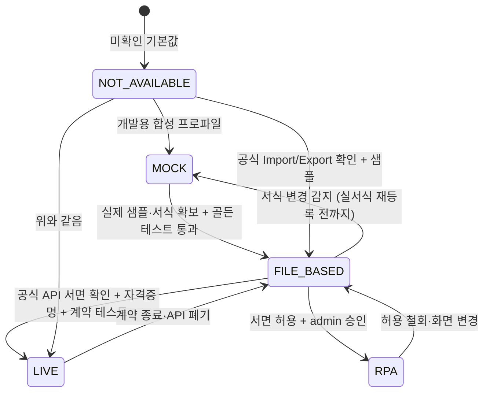
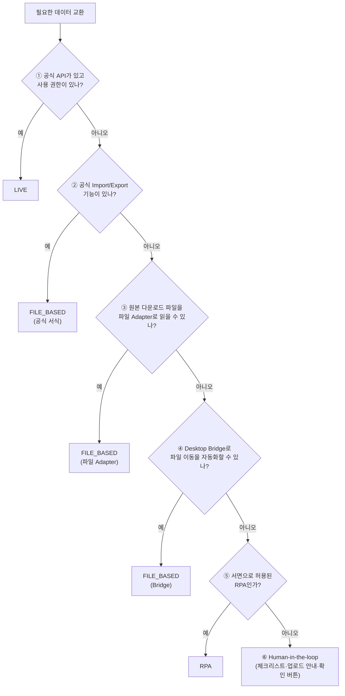
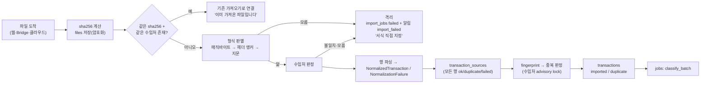

# 연동 아키텍처 — 위멤버스 · 홈택스 · WEHAGO · Desktop Bridge

- 문서 상태: v1 (2026-09-26)
- 근거: [research/01-wehago](./research/01-wehago.md), [research/02-wemembers](./research/02-wemembers.md), [research/03-hometax-wetax-filing](./research/03-hometax-wetax-filing.md), [research/04-vat-and-account-rules](./research/04-vat-and-account-rules.md)
  - 두 조사 모두 원문 대부분을 열람하지 못하고 검색 요약을 근거로 삼았다. "[공식]"으로 표시된 사실도 원문으로 재확인해야 한다.
- 관련 문서: [03-architecture](./03-architecture.md) · [desktop-bridge-design](./desktop-bridge-design.md) · [06-mvp-plan §5 준비물](./06-mvp-plan.md#5-사무소-대표오너-준비물--일정의-선행-조건)
- 계약: `IngestChannel`, `IntegrationStatus`, `IntegrationDescriptor` (`@mintax/core`), `integration_connections` (DB)

---

## 0. 결론 먼저

1. **2026-09-26 현재, 외부 시스템과 자동으로 데이터를 주고받는 API는 하나도 확인되지 않았다.**
   - 위멤버스 공개·제휴 API: 미확인
   - WEHAGO 전표 등록 API: 미확인
   - 홈택스 직접 수집: 정책상 배제
2. 그래서 주 경로는 **FILE_BASED**다.
   - 들어오는 방향: 사람이 위멤버스·홈택스에서 파일을 받는다 → (Bridge가 감지해) 올린다
   - 나가는 방향: MIN TAX OPS가 WEHAGO 업로드 파일을 만든다 → 사람이 WEHAGO에서 "엑셀서식 불러오기"로 올린다
3. 자동화의 목표는 "API 연동"이 아니다. **파일 이동·판정·검증·대사를 기계가 하고, 외부 시스템 조작은 사람이 하는 것**이다. Desktop Bridge가 이 간극을 메운다.
4. 확인되지 않은 엔드포인트·서식 열·코드값을 코드에 넣지 않는다. 템플릿·프로파일 **데이터**로 두고 "검증필요"를 표시한다.

---

## 1. 원칙

| # | 원칙 | 구현 |
|---|---|---|
| 1 | **상태를 속이지 않는다** | 모든 연동 기능은 5가지 상태 중 하나이고, 근거(`status_reason`, `docsRef`)를 가진다 |
| 2 | **역할 분리** | WEHAGO T가 이미 수집하는 원천(세금계산서·카드·현금영수증·통장)을 MIN TAX OPS가 전표 파일로 다시 넣지 않는다. 기본은 분류·검토·대사만 하고, 넣을지는 수임처별로 정한다(§8) |
| 3 | **원본 보존** | 받은 파일은 해시와 함께 암호화 원본으로 보관한다. 원본 행은 `transaction_sources`에 전부 남긴다 |
| 4 | **멱등** | 파일 단위는 `files.sha256`, 거래 단위는 `computeFingerprint`(채널·파일명·행번호 제외)로 판정한다. 같은 거래가 어느 경로로 몇 번 들어와도 한 건이다 |
| 5 | **모르는 것은 격리** | 알 수 없는 서식, 수임처를 판정할 수 없는 파일은 적재하지 않는다. 격리 후 사람에게 묻는다 |
| 6 | **외부 인증정보를 보관하지 않는다** | 세무대리인 인증서, 홈택스·위멤버스·WEHAGO 비밀번호는 저장하지 않는다. 외부 로그인은 사람이 한다 |
| 7 | **자동화는 허락받은 만큼만** | RPA는 서면 허용 근거가 있어야 켤 수 있다. 기본은 꺼져 있다 |

---

## 2. 상태 모델

### 2.1 정의

| 상태 | 뜻 | 켜기 위한 조건 | 화면 |
|---|---|---|---|
| `LIVE` | 공식 API·SDK로 기계끼리 실시간 교환 | 공식 문서 또는 서면 계약(`docsRef`) + 자격증명(`config_enc`) + **계약 테스트**(기록된 응답으로 파서 검증) 통과 | 동기화 버튼, 마지막 동기화·오류 |
| `FILE_BASED` | 공식 Import/Export 기능이나 원본 다운로드 파일을 사람 또는 Bridge가 옮긴다 | 실제 샘플 파일로 만든 형식 프로파일·템플릿 + 골든 테스트 | 받는 곳·올리는 방법 안내 |
| `RPA` | 사람의 화면 조작을 프로그램이 대신한다 | 서면 허용 근거(약관·제휴 회신) + admin 승인 + 감사 기록. **현재 해당 없음** | 기본 꺼짐, 켜면 경고 |
| `MOCK` | 합성 데이터나 가짜 서식으로 흉내 낸다 | 개발·테스트 전용 | 개발자 모드에서만 보인다. MOCK 자료·파일에는 배지와 `MOCK_` 접두사를 붙인다 |
| `NOT_AVAILABLE` | 확인되지 않았거나 정책상 배제 | — | 회색, 사유와 재평가 조건. 동작 버튼 없음 |

### 2.2 전이



- 상태 변경은 `settings.write`(개발자 전이는 `integrations.developer`) 권한으로만 할 수 있다. 변경할 때마다 감사로그(`integration.status_change`, before/after, 근거)를 남긴다.
- 런타임도 상태를 강제한다.
  - 연동 레지스트리는 `LIVE`가 아닌 기능의 원격 호출 코드를 실행하지 않는다.
  - `MOCK` 서식으로 만든 파일은 "업로드 완료 확인"을 할 수 없다.

### 2.3 키 체계 (제안)

`integration_connections.key`는 자유 텍스트이고 유일하다. 한 외부 시스템 안에서도 기능마다 상태가 다르다(예: 위멤버스 API는 불가, 파일은 가능). 그래서 **기능 단위 키**를 쓴다. 스키마 주석의 `wemembers | wehago | …`는 이 키의 접두사다. 최종 키 목록은 `packages/adapters` 레지스트리가 기준이다.

| 키 | 기능 |
|---|---|
| `wemembers.api` | 위멤버스 자료 API 수집 (Adapter A) |
| `wemembers.file` | 위멤버스 통합자료 엑셀 수집 (Adapter B) |
| `wemembers.filing_zip` | 위멤버스 신고리스트 일괄 ZIP(접수증·신고서·납부서) |
| `hometax.file` | 홈택스 원본 엑셀(세금계산서·사업용카드·현금영수증) |
| `hometax.scrape` | 홈택스 직접 수집 |
| `wehago.voucher_api` | WEHAGO 전표 API 등록 |
| `wehago.purchase_sales_file` | 매입매출전표 엑셀 업로드 파일 |
| `wehago.general_journal_file` | 일반전표 엑셀 업로드 파일 |
| `wehago.payroll_file` | 급여·사원·사업소득·일용직 업로드 파일 |
| `wehago.ledger_reimport` | 매입매출장 엑셀 변환 → 역수입 대사 |
| `wehago.master_file` | 거래처·계정과목표 수집 |
| `wetax.file` | 위택스 자료(지방소득세 납부서 등) |
| `hometax.efiling` | 원천세·지급명세서·간이지급명세서 전자신고 제출 |
| `wetax.local_tax_filing` | 지방소득세 특별징수 신고 |
| `download_watch` | 다운로드 폴더 감지 (Adapter C) |
| `cloud_folder` | 클라우드·공유 폴더 감시 (Adapter D) |
| `desktop_bridge` | Desktop Bridge (Adapter E) |
| `ai_provider.heuristic` / `ai_provider.anthropic` | AI Provider |
| `third_party.popbill` / `third_party.codef` | 제3자 수집 API (후보) |

---

## 3. 폴백 우선순위



②~④는 서로 배타적이지 않다. 공식 서식(②)이나 원본 파일(③)을 **Bridge(④)가 옮기는** 조합이 가장 흔하다.

| 기능 | ① API | ② 공식 Import/Export | ③ 파일 Adapter | ④ Bridge | ⑤ RPA | ⑥ 사람 | **현재 선택** |
|---|---|---|---|---|---|---|---|
| 위멤버스 자료 수집 | 미확인 | 엑셀 다운로드(열 미확인) | 샘플 필요 | 가능 | 약관 미확인 → 보류 | 다운로드·업로드 | ③+④ (샘플 전 MOCK) |
| 홈택스 원본 자료 | 없음(스크래핑 배제) | 엑셀 내려받기 | 프로파일 3종 | 가능 | 배제 | 다운로드 | ③+④ |
| WEHAGO 전표 반영 | 미확인 | 엑셀서식 불러오기 | — (출력) | 파일 전달 | 보류 | 업로드·확인 | ② + ⑥ |
| WEHAGO 결과 확인 | 미확인 | 매입매출장 엑셀 변환 | 역수입 프로파일(샘플 필요) | 가능 | 보류 | 변환·업로드 | ②+③ |
| 급여·사업소득·일용직 | 미확인 | 엑셀서식 내려받기/불러오기 | — (출력) | 파일 전달 | 보류 | 업로드·확인 | ② (서식 전 MOCK) + ⑥ |
| 원천세·지급명세서 신고 | 없음 | WEHAGO 전자신고 / 홈택스 | — | — | 배제 | 신고 | ⑥ (MIN TAX OPS는 준비·추적) |
| 접수증·납부서 수집 | 미확인 | 위멤버스 일괄 ZIP | PDF 텍스트 매칭 | 가능 | 보류 | 업로드 | ③+④ |
| 거래처·계정과목표 | 미확인 | WEHAGO 거래처 LIST·계정 export | 마스터 프로파일 | 가능 | 보류 | export·업로드 | ②+③ |

---

## 4. 수집 어댑터 A~E

### 4.0 공통 개념 인터페이스

실제 시그니처는 `packages/adapters` 구현이 기준이다. 아래는 책임 경계만 보여 준다.

```ts
// 개념 — 형식 프로파일은 데이터다 (Bridge 스니퍼와 공유)
interface FormatProfile {
  key: string;               // 예: 'hometax_card_purchase_v1'
  source: TransactionSource; // 'business_card' 등
  anchors: string[][];       // 헤더 행 판정용 제목 조합 (하나라도 모두 일치하면 후보)
  headerScanRows: number;    // 상위 N행에서 헤더 탐색 (기본 20)
  status: 'verified' | 'observed' | 'mock'; // 근거 수준
}

// 개념 — 어댑터는 판정·변환만 한다 (DB 쓰기 없음)
interface IngestAdapter {
  descriptor: IntegrationDescriptor;
  detect(sample: { sheetRows: unknown[][]; fileName: string; mime: string | null }): { profileKey: string; score: number } | null;
  parse(input: FileInput, ctx: { clientId: UUID; profileKey: string }):
    AsyncIterable<NormalizedTransaction | NormalizationFailure>;
}
```

**채널 기록 규칙** (`IngestChannel`)

- 운반 경로가 A·C·D·E이면 그 경로를 기록한다: `wemembers_api`, `download_watch`, `cloud_folder`, `desktop_bridge`
- 웹 화면에서 직접 올린 경우는 원본 출처로 기록한다: 위멤버스 서식이면 `wemembers_file`, 홈택스 원본이면 `hometax_file`, 그 밖은 `manual_upload`
- 서식은 채널과 따로 `import_jobs.format_profile`에 남는다.
- fingerprint에는 채널이 들어가지 않는다. 그래서 채널이 달라도 중복 판정이 된다.

### 4.1 Adapter A — 위멤버스 API (`wemembers_api`)

| 항목 | 내용 |
|---|---|
| 현재 상태 | **NOT_AVAILABLE**. 공개·제휴 API, 개발자 문서, 제휴 공고를 찾지 못했다(research/02 I3, U1) |
| 코드 | 어댑터 자리와 상태 설명만 둔다. `WEMEMBERS_API_BASE_URL`, `WEMEMBERS_API_KEY` 환경변수는 **권한을 받았을 때를 위한 자리**일 뿐이다. 엔드포인트·인증 방식은 추측해서 구현하지 않는다 |
| LIVE 전환 조건 | ① 웹케시와 서면 제휴(데이터 범위, 재저장·활용 허용: 2026-08-20 시행령의 대리인 저장 제한 취지 검토, research/02 R4) ② 공식 API 문서 ③ 건별 데이터인지 합계 수준인지 확인(research/02 U3) ④ 기록된 응답으로 계약 테스트 ⑤ 요청 한도·장애 시 파일 경로 폴백 |
| 매핑 | 응답 → `NormalizedTransaction` (`channel='wemembers_api'`, 원본 ID가 있으면 `originalSourceId`) |

### 4.2 Adapter B — Excel/CSV 파일 (`wemembers_file`, `hometax_file`, `manual_upload`)

**형식 판별 (매직바이트 우선, 확장자는 참고)**

| 판별 | 형식 | 처리 |
|---|---|---|
| `PK\x03\x04` + `[Content_Types].xml` + `xl/workbook.xml` | xlsx | exceljs 스트리밍 읽기. 수식 셀은 캐시값만 읽는다 |
| `PK\x03\x04` (그 밖) | ZIP | 압축 해제 후 항목마다 재판정. 항목 수·총 크기·압축비 제한, 경로 탈출(`../`) 차단 |
| `D0 CF 11 E0` | xls (BIFF/OLE) | exceljs는 읽지 못한다. 변환 경로(Bridge의 calamine 또는 서버 LibreOffice 헤드리스, 검증필요)를 쓰고, 안 되면 "xlsx로 저장해 올려 주세요" |
| 앞부분이 `<` 이고 `<table` 포함 | HTML 위장 xls | HTML 표 파싱 |
| `%PDF` | PDF | 신고 결과 문서(§6.3) |
| 텍스트 | CSV/TSV | BOM이 있으면 UTF-8. 없으면 UTF-8 엄격 디코딩을 시도하고, 실패하면 CP949(iconv-lite). 구분자는 papaparse가 추정 |

**헤더 탐지**: 상위 20행에서 프로파일의 앵커 조합을 찾는다. 행 번호를 고정하지 않는다(홈택스 세금계산서는 6행으로 관찰되었지만 고정하지 않음). 레이아웃 지문은 정규화한 헤더 목록의 해시다. 등록된 지문과 다르면 **격리**한다.

**프로파일 (2026-09 기준 근거 수준)**

| 프로파일 | 근거 | 핵심 규칙 |
|---|---|---|
| `hometax_tax_invoice_v1` (전자세금계산서 목록) | [커뮤니티] 헤더 6행은 코드 3건 일치. **33열 순서는 1건에만 근거**. 2013년 코드는 `번호` 열이 있고 `주소` 열이 없어 다르다(research/02 §2.5-A 팩트체크) | 앵커 `작성일자 + 승인번호 + 공급가액`. 순서를 고정하지 않고 헤더 **이름 + 위치 문맥**으로 매핑한다. `상호/대표자명/종사업장번호`가 공급자·공급받는자에 두 번씩 나온다. 방향: 공급자 사업자번호가 수임처면 `sales`, 공급받는자가 수임처면 `purchase`. 음수 금액 행이 있을 수 있다(수정세금계산서 여부는 미확인). **한 승인번호가 품목마다 여러 행일 수 있다**(U6): 승인번호로 묶어 거래 1건으로 만들고 품목 행은 `raw_data`에 보존한다. 묶음 금액과 품목 합계가 다르면 경고한다. `승인번호`는 fingerprint 1순위. 변형 레이아웃은 별도 지문으로 등록한다 |
| `hometax_card_purchase_v1` (사업용카드 매입세액 공제 확인/변경) | [커뮤니티] 14열 | 앵커 `승인일자 + 가맹점사업자번호 + 공제여부결정`. 금액 검산 `합계 = 공급가액 + 세액 + 비과세`는 관찰 예시에 근거한 **추론**이므로 불일치를 경고만 한다. `공제여부결정`·`비고` → `sourceDeductibleHint`와 `raw_data`. **승인번호 열이 없다** → 아래 "카드 동일 거래" 규칙 |
| `hometax_cash_receipt_purchase_v1` (현금영수증 매입) | [커뮤니티] 크롤링 필드명만. 브라우저 엑셀 파일과 같은지는 미확인. 매출내역 다운로드는 **탭 구분 텍스트**라는 관찰이 있다 | 헤더명 동의어 사전(`매입금액↔합계↔총금액`, `부가세↔세액`). `공급가액 + 부가세 + 봉사료`는 관찰된 **대체 계산식**일 뿐 검증식이 아니다. 매입금액이 비었을 때만 쓰고, 불일치는 경고만 한다. 승인·취소(`거래구분`)는 부호로 처리 |
| `wemembers_*` (통합자료) | **미확인** (research/02 U2) | 샘플을 받기 전에는 `mock` 상태. 합계 수준 자료일 수 있다(U3). 그 경우 거래 적재가 아니라 **대사 기준값**으로만 쓴다 |
| `wehago_ledger_purchase_sales_v1` (매입매출장 엑셀 변환, 역수입) | [공식] 변환 항목: 일자, 거래처, 유형, 품명, 공급가액, 부가세, 합계, 차변계정, 대변계정, 관리, 전표상태 | 실제 헤더 원문과 사업자번호 포함 여부는 **샘플 필요**. 현재 core 대사 키는 `일자 + 합계 + 정규화 거래처명`(2차 `일자 + 합계`)이다. 사업자번호가 있으면 `일자 + 사업자번호 + 금액 + 과세유형`으로 올린다(§6.2, 검증필요) |

**카드 동일 거래 규칙** (승인번호가 없는 원천)

- 같은 날, 같은 카드, 같은 가맹점, 같은 금액의 결제가 두 번 있으면 fingerprint `row` 기준으로는 같은 값이 나온다. 그러면 두 번째 결제가 중복으로 잘못 판정된다.
- 어댑터는 이런 행들에 `originalSourceId = 'card|' + 일자 + 카드(마스킹) + 가맹점사업자번호 + 합계 + '#' + 동일키 내 순번`을 준다. `computeFingerprint`가 `src` 기준을 쓰도록 하기 위해서다.
- 순번은 동일 키 그룹 안에서만 매긴다. 그래서 같은 기간 파일이면 어느 경로로 들어와도 같은 값이 나온다.
- 동시에 위험 규칙 `duplicate_amount`가 "중복 의심"으로 표시해서 사람이 확인하게 한다.

**수임처 판정**

1. 파일 안의 수임처 사업자번호(공급받는자·카드 소유 사업자 등)로 `clients.business_number`를 찾는다.
2. 1이 안 되면 사용자가 고른 수임처를 쓴다.
3. 파일 안 사업자번호와 사용자가 고른 수임처가 다르면 적재하지 않고 확인을 요청한다.

### 4.3 Adapter C — 다운로드 폴더 자동 감지 (`download_watch`)

| 항목 | 내용 |
|---|---|
| 실행 주체 | **Desktop Bridge** (브라우저는 PC의 다운로드 폴더를 읽을 수 없다) |
| 대상 | OS 기본 다운로드 폴더 + 사용자가 지정한 브라우저 저장 폴더 |
| 동작 | 새 파일 → 다운로드 중 임시파일(`.crdownload`, `.part`, `.download`, `.tmp`, `~$` 잠금파일)은 무시 → 크기가 2초 이상 변하지 않으면 "안정" → 매직바이트·헤더 스니핑 → **등록된 프로파일과 맞는 파일만** 업로드 |
| 개인정보 | 프로파일과 맞지 않는 파일은 내용도 이름도 서버로 보내지 않는다. 로컬 로그에는 "무시함(형식 불일치)"만 남긴다 |
| 원본 처리 | 다운로드 폴더는 사용자 공간이므로 **기본은 원본 유지**다. 이미 올린 파일은 로컬 기록(sha256)으로 다시 올리지 않는다. 설정으로 "업로드 후 정리 폴더로 이동"을 켤 수 있다 |
| 상태 | Bridge 연결 시 **FILE_BASED**. 2026-09-26 현재 Bridge 미구현이므로 사용할 수 없다 |

### 4.4 Adapter D — 클라우드 폴더 감시 (`cloud_folder`)

| 항목 | 내용 |
|---|---|
| 실행 주체 | **서버(worker)**. 5분 간격 폴링 |
| 지원 저장소 | S3 호환 버킷의 `inbox/{수임처코드}/` prefix, 사내 설치 시 SFTP 또는 NAS 마운트 경로 |
| 동작 | 새 객체 → `files`로 복사(암호화) → 가져오기. 성공하면 `processed/…`, 실패하면 `failed/…`로 이동하고 사유 파일(`.error.txt`)을 둔다 |
| 개인 클라우드 (Google Drive·OneDrive·Dropbox API) | **NOT_AVAILABLE**. OAuth 앱 등록·권한 범위 검토가 되어 있지 않다. 대안: PC의 동기화 클라이언트 폴더를 Bridge가 감시(Adapter E) |
| 상태 | 설정 전 **NOT_AVAILABLE**, 저장소를 설정하면 **FILE_BASED** |

### 4.5 Adapter E — Desktop Bridge (`desktop_bridge`)

| 항목 | 내용 |
|---|---|
| 역할 | 사무소 PC의 **Bridge 전용 폴더**(수신 대기·WEHAGO 업로드용·신고결과)를 관리한다. 서명 토큰으로 `/api/bridge/*`에 업로드하고, 준비된 WEHAGO 파일을 받아 둔다 |
| 원본 처리 | Bridge 전용 수신 폴더의 파일은 서버 확인(ack) 후 **처리완료 폴더로 이동**한다(기본) |
| 상태 | **미구현**(설계 완료). Node CLI 프로토타입 → Tauri 앱 순서로 만든다. 연결되면 **FILE_BASED** |
| 상세 | [desktop-bridge-design](./desktop-bridge-design.md) |

---

## 5. 공통 수집 파이프라인



- 행 하나라도 실패해도 전체를 버리지 않는다. 결과는 `partial`이고, 실패 행은 사유와 함께 남는다.
- 원본 합계(`import_jobs.source_*_amount`)는 **파싱 가능한 모든 행**(성공·중복·실패)의 합이다. 대사 source 단계와 검산에 쓴다.

---

## 6. 송출 (Outbound)

### 6.1 WEHAGO — 전표·급여 파일

| 종류 (`export_jobs.kind`) | WEHAGO 메뉴 (research/01) | 상태 | 비고 |
|---|---|---|---|
| `wehago_purchase_sales` | 매입매출전표입력 > 엑셀서식 내려받기/불러오기 | FILE_BASED (서식 확보 전 **MOCK**) | 거래처코드 필수. 유형코드 매핑 필요 |
| `wehago_general_journal` | 일반전표입력 엑셀 업로드 (지정 양식 없음, 열 매칭) | FILE_BASED | 필수 7항목: 월·일·구분·계정과목코드·계정과목명·차변·대변 [공식] + 거래처코드·거래처명·적요 |
| `payroll_earned` / `payroll_business` / `payroll_daily` | 급여자료입력 / 사업소득 / 일용직 엑셀서식 | FILE_BASED (서식 확보 전 **MOCK**) | 주민번호는 숫자만. 첫 행 샘플은 반영되지 않는다 [공식, 발췌] |
| `review_excel` | (WEHAGO 아님) 사람 검토용 엑셀 | — | |

**템플릿 레지스트리** (`packages/adapters`)

- 식별: `template_key` + `template_version`(서식을 내려받은 날짜 `YYYYMMDD`)
- 서식 상태(`status` + `verified`, 2026-09-26 코드 기준)
  - `mock`: 열 구성을 모르는 개발용이다. 급여·사업소득·일용직이 해당한다. `MOCK_` 파일명이고 업로드 완료 확인을 막는다.
  - `standard`(`verified=false`): MIN TAX OPS 표준 레이아웃이다. 매입매출·일반전표가 해당한다. "검증필요 서식" 경고를 붙이고, 역수입 대사 전에는 대사완료로 보지 않는다.
  - `office_sample`(`verified=true`): 사무소가 WEHAGO에서 내려받은 실서식이다. 첫 업로드 성공이 기록되어야 한다.
- 제목행 해시: 등록할 때 저장하고, 생성할 때 다시 비교한다. 다르면 차단한다.
- **코드 매핑은 데이터로 둔다**(research/01 §2.5·2.6 [공식, 스니펫] 수준, 실서식으로 확정).

| 매핑 | 값 (조사 기준) | 키 |
|---|---|---|
| 매입매출 유형 | 매출 11~24, 매입 51~62 (예: 51 과세, 53 면세, 54 불공, 57 카과, 58 카면, 61 현과, 62 현면). **범위를 닫지 않는다**: 25·63·64 같은 추가 코드가 관찰되었다(출처 미상, research/01 §2.5 팩트체크). 수임처 WEHAGO 화면의 유형 목록으로 채운다 | `VatType` → 코드 |
| 분개유형 | 0 분개없음, 1 현금, 2 외상, 3 혼합, 4 카드, 5~7 외상추가 | 결제수단·증빙 → 코드 |
| 일반전표 구분 | 1 출금, 2 입금, 3 차변, 4 대변, 5 결차, 6 결대 | 차/대변 → 코드 |
| 유형 입력 형식 | 숫자 `57`인지 약칭 `카과`인지 **미확인** | 템플릿 속성 |

- 불공(54)은 불공제 사유 번호를 선택해야 한다. 번호표는 3번만 확인되었다. 그래서 사유 **텍스트만** 기록하고 사람 검토 필수로 둔다.
  - 화면의 사유 번호는 부가가치세법 제39조①의 호 번호와 다르다. 예: 차량은 5호인데 화면 사유는 3번이다. 두 매핑을 분리한다.
- **사전검증(pre-flight)** — 템플릿 렌더링 전에 확인한다.
  - 사업자번호 체크섬(`isValidBusinessNumber`)
  - 공급가액 + 세액 = 합계
  - 유형별 세액 규칙(면세·현면·영세는 세액 0)
  - 회계기간 안의 일자
  - 계정코드가 수임처 계정표에 있는지
  - 거래처코드가 있는지(매입매출)
  - 특수문자 제거
  - 파일 크기·행 수 제한(초과 시 분할, 한도는 검증필요)
- **출력 형식**: 기본은 xlsx다. WEHAGO가 xls(97-2003)만 받는 것으로 확인되면 변환 단계를 추가한다(research/01 U8).
- **전달**: 브라우저 다운로드 또는 Bridge 결과 폴더. 업로드는 사람이 한다. 올린 뒤 "업로드 완료 확인"을 누른다(`uploaded_confirmed`).

### 6.2 WEHAGO — 역수입 대사

사람이 WEHAGO 매입매출장을 엑셀로 변환해 올리거나 Bridge로 넘긴다. 그러면 `post_export` 대사가 돈다.

- **현재 매칭 키(core `reconcile` 구현)**: 1차 **일자 + 합계 + 정규화 상호**, 2차 **일자 + 합계**다. 역수입 행 계약(`ReconWehagoRow`)에 사업자번호가 없다.
- **목표 키**: WEHAGO 중복전표 기준과 같은 **일자 + 사업자번호 + 금액 + 과세유형**(research/01 §2.9 [공식])이다. 매입매출장 변환 샘플에 사업자번호 열이 있는지 확인한 뒤 core 계약을 넓힌다.
  - 이 기준은 WEHAGO(Smart A 10) 도움말에서 확인한 것이다. WEHAGO T에도 같은지는 추론이므로 파일럿에서 확인한다.
- 같은 전표가 WEHAGO에 두 번 있으면(이전 버전과 새 버전을 모두 올린 경우) 현재 core는 `extra_in_wehago`(비차단)로만 표시한다. 이중 기장 의심으로 차단하도록 보완한다([03 §8.3](./03-architecture.md#83-전송-버전과-정정-전송-이중-기장-방지), §14 G8).

### 6.3 홈택스·위택스 신고와 결과 수집

| 항목 | 상태 | 방식 |
|---|---|---|
| 전자신고 제출 | **NOT_AVAILABLE** (MIN TAX OPS가 직접 제출하지 않음) | WEHAGO가 전자신고 파일을 만들고 사람이 홈택스 `파일 변환신고`(원천세)·`변환제출`(지급명세서·간이지급명세서)로 올린다. 지방소득세는 위택스에서 신고한다. MIN TAX OPS는 `filing_jobs`로 준비 데이터·검산·기한·단계를 관리한다(`channel_status='FILE_BASED'`). **국세청 전산매체 파일을 직접 만들지 않는다**: 규격 원문과 암호화 방식이 미확인이다(research/03 §4.2) |
| 접수증·신고서·납부서 수집 | **FILE_BASED** | 위멤버스 신고리스트 **일괄 ZIP**(거래처별 폴더, research/02 D3·D4) 또는 개별 PDF → Bridge·업로드 → PDF 본문에서 사업자번호·세목·귀속기간·접수번호를 추출해 `filing_jobs`와 매칭 → `filing_results`(`collected_via`). ZIP 파일명 규칙은 미확인이므로 **본문 기준**으로 매칭하고, 실패하면 수동 매핑 |
| 납부서 카카오·문자 발송 | **NOT_AVAILABLE (중복 구현 금지)** | 위멤버스 기능을 그대로 쓴다(research/02 D5) |
| MIN TAX OPS → 위멤버스로 보내기 | **NOT_AVAILABLE** | 확인된 입력 경로 없음 |

- PDF 텍스트 추출 라이브러리는 아직 의존성에 없다. Phase 4에서 도입 여부를 결정한다.

---

## 7. 현실적 상태표 (2026-09-26)

| 키 | 상태 | 근거 (`status_reason`) | 재평가 조건 |
|---|---|---|---|
| `wemembers.api` | **NOT_AVAILABLE** | 공개·제휴 API 미확인 (research/02 I3·U1) | 웹케시 서면 회신 |
| `wemembers.file` | **FILE_BASED** (위멤버스 고유 프로파일은 MOCK) | 통합자료 엑셀 다운로드 기능은 [공식(검색 요약)], 열 구성 미확인 (D1·U2). 지금은 홈택스 원본 레이아웃과 같은 파일만 판별된다. 위멤버스 고유 서식은 "알 수 없는 서식"으로 격리된다 | 사무소 실계정 샘플 등록 |
| `wemembers.filing_zip` | **FILE_BASED** (파일명 규칙 미확인) | 신고리스트 개별·일괄 다운로드 (D3·D4) | 샘플 ZIP으로 매칭 검증 |
| `hometax.file` | **FILE_BASED** | 원본 엑셀 3종 레이아웃 [커뮤니티] 관찰. 전자세금계산서 열 순서는 1건 근거 (research/02 §2.5) | 실제 샘플로 지문 확정 |
| `hometax.scrape` | **NOT_AVAILABLE (정책상 배제)** | 2026-08-20 시행 개인정보 보호법 시행령: 대리인의 자동화 도구 전송요구는 "사전에 협의한 방식"이어야 한다(제42조의6③1나 [법령 미러]). 홈택스·세무대리 수집에 적용되는지는 미확인이므로 보수적으로 배제. 국세청 오픈 API 설계 진행 중 (research/02 R1~R4) | 국세청 공식 오픈 API 공개 |
| `wehago.voucher_api` | **NOT_AVAILABLE** | 공개 전표 API 미확인, `developer.wehago.com` 접속 불가 (research/01 U1) | 더존 서면 회신 |
| `wehago.purchase_sales_file` | **FILE_BASED** (검증필요 표준 서식, `verified=false`) | 엑셀서식 내려받기/불러오기 [공식], 열 미확인 (U2). WEHAGO 실서식으로 올라간다는 보장이 없다 | 실서식 등록 + 첫 업로드 성공 |
| `wehago.general_journal_file` | **FILE_BASED** (검증필요 표준 서식, `verified=false`) | 지정 양식 없음 + 필수 7항목 매칭 [공식] | 실제 업로드 1회 성공 기록 |
| `wehago.payroll_file` | **MOCK** | 서식 기능 [공식], 열 미확인 (U7). 업로드 금지 | 실서식 등록 |
| `wehago.ledger_reimport` | **FILE_BASED** (헤더 샘플 필요) | 매입매출장 엑셀 변환 [공식] | 샘플 등록 |
| `wehago.master_file` | **FILE_BASED** | 거래처 가져오기(지정 양식), 계정과목 수임처별 가변 [공식] | 수임처 온보딩 |
| `wetax.file` | **FILE_BASED** (위멤버스 경유) | 위택스 납부서는 위멤버스가 일괄 수집 (D5) | — |
| `hometax.efiling` (원천세·간이지급명세서·지급명세서 제출) | **FILE_BASED** (API는 NOT_AVAILABLE) | 「홈택스 이용에 관한 규정」 제12조: 전자신고는 작성·**변환**·확인 방식뿐이고 API 방식 규정이 없다 (research/03 A1). WEHAGO가 파일을 만들고 사람이 변환신고·변환제출 | 국세청 제출 API 공개 |
| `wetax.local_tax_filing` (지방소득세 특별징수 신고) | **FILE_BASED** (사람) | 위택스 한건신고 / 엑셀파일신고 / 회계파일신고 (research/03 §1.4) | — |
| `download_watch` | **미구현** → 목표 FILE_BASED | Bridge가 없어 동작하지 않는다(아래 주의) | Bridge 프로토타입 + `/api/bridge/*` 구현 |
| `cloud_folder` | **NOT_AVAILABLE** (미설정) | 저장소 미설정 | 저장소 설정 |
| `desktop_bridge` | **미구현** → 목표 FILE_BASED | `apps/bridge`에는 `package.json`만 있고, `/api/bridge/*` Route Handler도 없다 | 프로토타입 + 서명 검증 테스트 통과 |
| `ai_provider.heuristic` | **LIVE** (내부) | 로컬 규칙, 외부 전송 없음 | — |
| `ai_provider.anthropic` | 키 설정 시 **LIVE**, 아니면 NOT_AVAILABLE | `AI_PROVIDER=anthropic` + `ANTHROPIC_API_KEY` | 개인정보 검토(06 §5 U11) |
| `third_party.popbill` / `third_party.codef` | **NOT_AVAILABLE (보류)** | 공식 벤더 API는 있으나, 사전협의 여부·비용·규제 검토 전 (research/02 §2.7) | 비용·규제 검토 후 결정 |
| RPA 전체 | **없음** | 약관 미확인 (research/02 R8·U10), 인증서 위임 보안 위험 | 서면 허용 |

- **주의 — 코드 레지스트리와의 차이 (2026-09-26)**: `packages/adapters/src/integrations.ts`는 `desktop_bridge`·`download_watch`를 이미 `FILE_BASED`로 둔다. 하지만 Bridge 앱과 `/api/bridge/*`가 없어서 실제로는 동작하지 않는다. "상태를 속이지 않는다"는 원칙에 따라, 구현 전까지 레지스트리 값을 `NOT_AVAILABLE`(사유 "설계 완료·미구현")로 내려야 한다. adapters 담당이 바꿀 항목이다.
- 설정 화면과 `integration_connections` 초기값은 레지스트리(`getIntegrationStatuses`)에서 만든다. 이 표와 레지스트리가 다르면 **둘 다** 고친다(§10).

---

## 8. 이중 기장 방지 — 수임처별 전송 범위

WEHAGO T는 자동전표처리로 세금계산서·계산서·카드·현금영수증을 홈택스에서, 통장을 T edge에서 **직접 수집**한다(research/01 §2.9). 그래서 수임처 온보딩 때 원천별로 다음 중 하나를 정한다.

| 선택 | 뜻 | MIN TAX OPS 동작 |
|---|---|---|
| `wehago_collects` (기본) | WEHAGO가 수집·전표화 | 분류·검토·대사만. 전송 파일에서 제외. 역수입 대사로 WEHAGO 결과를 검증 |
| `mintax_exports` | MIN TAX OPS가 전표 파일 생성 | 전송 파일에 포함. WEHAGO 자동전표처리에서 같은 원천을 끄도록 체크리스트로 안내 |
| `none` | 해당 원천 없음 | — |

- 저장 위치: `client_business_profiles.rule_params`의 `export_scope.*` 키(계약 변경 없이 쓸 수 있는 임시 위치). 정식 컬럼이 필요하면 계약 소유자와 결정한다.
- **대사 입력에서도 빼야 한다.** `wehago_collects` 원천의 원본 행·거래를 전송 대사(`pre_export`·`post_export`)에 넣으면 "전송 합계 ≠ 승인 거래 합계"가 되어 **항상 차단**된다. 이 원천은 원본 ↔ WEHAGO 역수입만 비교하는 검증 대사로 따로 돌린다([03 §8.1](./03-architecture.md#81-등식) 대사 범위).
- 역수입 대사에서 `extra_in_wehago`가 체계적으로 나오면, 전송 범위 설정이 WEHAGO 실제 설정과 어긋났다는 신호다. 알림을 보낸다.

---

## 9. 연동 보안

| 항목 | 규칙 |
|---|---|
| 자격증명 | 연동 비밀은 `integration_connections.config_enc`(AES-256-GCM)에만 둔다. 화면·로그에 다시 보여 주지 않는다(교체만 가능) |
| 외부 로그인 | 인증서·비밀번호·OTP를 보관하거나 대행하지 않는다 |
| 파일 | 업로드 크기 제한, ZIP 폭탄·경로 탈출 방어, 매크로 포함 파일(`.xlsm`)은 값만 읽고 실행하지 않는다 |
| Bridge | 기기별 토큰, 요청 HMAC 서명, 폐기 즉시 반영, 최소 폴더 권한 |
| 제3자 API(도입 시) | 위탁계약·처리방침 반영, 데이터 최소화, 호출 감사 |
| RPA(도입 시) | 서면 허용 근거 첨부, 전용 계정, 실행마다 감사, 화면 변경 감지 시 즉시 중단 |

---

## 10. 재평가 주기와 트리거

- **분기마다** §7 표를 다시 검토한다. 다음 경우에는 즉시 검토한다.
  - 더존·웹케시에서 서면 회신을 받았을 때
  - `developer.wehago.com`에 접속할 수 있게 되었을 때
  - 국세청 오픈 API가 공개되었을 때
  - 서식 변경이 감지되었을 때
  - 파일럿 중 업로드가 실패했을 때
- 상태를 바꿀 때는 이 문서의 §7, `integration_connections`, 조사 문서의 해당 항목을 **같이** 고친다.
